# Lasso {#lasso}

```{r, message=F, warning=F,echo=F}
library(tidyverse)
library(MASS)
data(Boston)

options(digits = 10)
set.seed(12345) 
```

## Big Data and Feature Selection

A common hurdle found when dealing with big data is determining which covariates are relevant prior to model fitting. One could fit a full model, but when dimensionality of the potential features reaches the order of thousands, both the demand on computational resources and time often makes such a strategy impractical. Choosing relevant features ahead of time allows the user to simultaneously explore relevant models and features, while avoiding the unnecessary computational cost of iteratively performing a step-wise model fitting procedure (either forwards or backwards) to arrive at a good fit.

Feature selection methods often employ information theory measures to determine the most explanatory set of features for a particular outcome (e.g., joint mutual information and minimum redundancy maximum relevance). Another strategy is to perform L1 regularized regression (i.e., lasso), where, like ordinary regression, the least squares loss function is minimized, but constraint is also applied to the absolute sum of regression coefficients. Using the L1 norm has important consequences in feature selection. If one uses the L2 norm (i.e., ridge regression), every feature will be conserved in the final solution; hence, if one starts with 100 covariates, then the final regression equation will too have 100 non-zero covariates. The L1 norm, on the other hand, shrinks less predictive covariates to zero as a function of the weighting parameter $\lambda$. The final regression equation is therefore a sparse solution in the case of the L1 norm.

## Lasso Regression

Lasso can be formulated as follows: $$\underset{\beta}{\mathrm{min}} \sum_{i=1}^n (y_i - \beta x_{i})^2 s.t. |\beta| \le s$$. The constraint on $\beta$ can be interpreted as for any value s, there is a corresponding value $\lambda$ that places an upper bound on the absolute sum of the coefficients. A large s value -- and hence *small* $\lambda$ value -- results in a sum that is large, implying many coefficients were not set to zero. Small values of s yield a small sum and hence a sparse solution.

Solving the lasso problem is more difficult than simple linear regression. The first half of the equation above is the same equation seen in OLS regression. Solving this is easy: simply take the derivative, set to zero, and solve for $\beta$. We can see this first hand in gradient descent implementations of regression. The right half of the equation is where things get complicated; because the derivative of $|\beta|$ is not defined at $\beta=0$, a subdifferential approach is needed, resulting in the following sub thresholding function:

\[
  \hat \beta_j = \left\{\def\arraystretch{1.2}%
  \begin{array}{@{}c@{\quad}l@{}}
    y_j - \lambda/2 & \text{if $y_j > \lambda/2$}\\
    y_j + \lambda/2 & \text{if $y_j < - \lambda/2$}\\
    0               & \text{if $|y_j| \le \lambda/2$}\\
  \end{array}\right.
\]

We can see the effect of varying $\lambda$ values in the figure below:

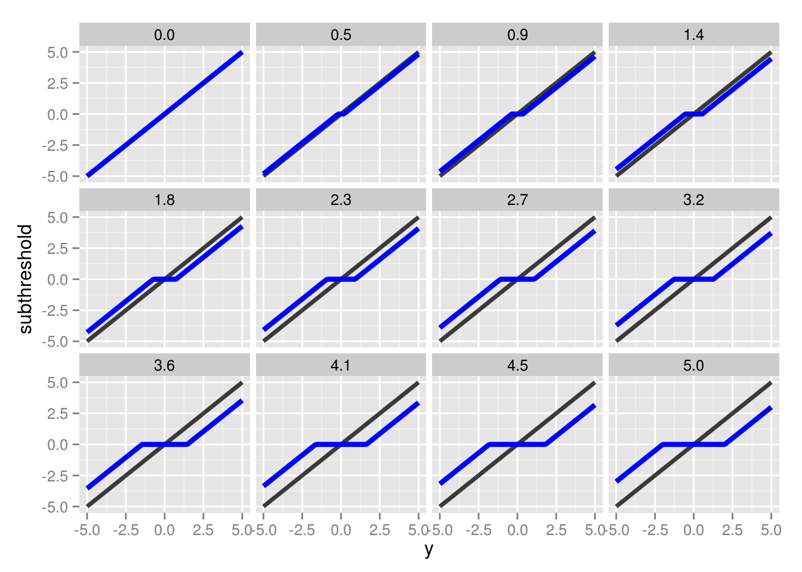

The value of $y_j$ is represented by the black lines, whereas the subthresholding transformation is represented by the blue lines. For values outside of the $|y_j|$ interval, the function essentially drives $y_j$ closer to 0. Once it's within that interval, $y_j$ is *set* to zero. The size of this interval is determined by $\lambda$, with larger values producing a larger interval, and consequently, a more sparse solution.

## Multivariate Lasso Regression

In the multivariate case, the lasso problem becomes $$\underset{\beta}{\mathrm{min}} \frac{1}{2} ||y-X\beta||_2^2 + \lambda ||\beta||_1$$, which can only be solved explicitly if $X^TX=I$, a case that isn't met when $p>n$. Coordinate descent provides a solution for the multivariate regression problem. Here, the subthresholding function becomes:

\[
  \hat \beta_j = \left\{\def\arraystretch{1.2}%
  \begin{array}{@{}c@{\quad}l@{}}
    c_j - p\lambda/a_j & \text{if $c_j > p\lambda$}\\
    c_j + p\lambda/a_j & \text{if $c_j < - p\lambda$}\\
    0                  & \text{if $|c_j| \le p\lambda$}\\
  \end{array}\right.
\]

where p is the dimensionality of the feature vector. Because it's easier to optimize each $jth$ coefficient individually, instead of solving for the entire feature vector simultaneously, we solve for the $jth$ coefficient while holding all others fixed. This results in $c_j = X_{\cdot,j}^T(y - X_{\cdot,-j}\beta_{-j})$ and $a_j = \sum_{i=1}^n x_{i,-j}$. This is often performed sequentially, i.e., for each iteration each $\beta$ is updated, one-by-one. This is called the shooting algorithm. A slight adjustment allows for easy parallel implementation.

## Parallel Coordinate Descent

Unlike before where each $\beta_j$ is updated during each iteration until convergence, an alternative strategy is to randomly sample index $j$ to update during each iteration. While this method would require more iterations, each iteration will be faster, and it will still ultimately converge. Because the $jth$ index is now being sampled, an obvious extension is to simply distribute a randomly sampled index to each of m processors on a cluster. Each processor can than update its respective $\beta_j$ independently, resulting in m simultaneous updates per iteration.

This requires a rather simple implementation via MPI. Set vector **B** of length p to 0. Given m processors, m indexes are drawn from a uniform distribution ranging 1 to m. This index vector is then sent to each processor via MPI_Scatter. Each processor independently updates $a_j$, $c_j$, and ultimately $\beta_j$. The updated $\beta_j$s are then returned to the head node using MPI_gather, where the original vector **B** is then updated and then distributed across all processes with MPI_bcast for future iterations. This is repeated until convergence -- i.e., when two sequential iterations result in a change of the objective function less than a predetermined tolerance value. The objective function function is defined as $$\frac{1}{2m} ||y-X\beta||_2^2 + \lambda \sum_{i=1}^n |\beta|$$.

## Simulations

All matrices were generated as follows: X, a $m \times n$ matrix, and k $\beta$ values were sampled from a normal distribution (0,1). The k $\beta$ values were set to k randomly sampled indexes sampled from a uniform distribution (1,n) in a $m \times 1$ vector \beta. All other values were set to 0. Finally, y was calculated via $y = X^T b$.

### $50 \times 1000$ Matrix | 5 Target Coefficients

Before any analysis of the results was performed, there seemed to be numerical issues when performing the algorithm on small $\lambda$ values ($<.05$). The objective and all $\beta$ coefficients would increase exponentially after every update. Only with larger $\lambda$ values would the algorithm converge (and note it would always converge to the correct values). It turned out this was unrelated to the code; there were no errors. Instead, it was a function of the number of cores set. All initial runs were performed with 64 cores, resulting in the numerical issue for small $\lambda$ values. Note that this is neither an MPI problem nor a problem inherent to the cluster. The issue lies in selecting more simultaneous updates than there is data (rows in matrix X), which, in this simulation, there are 50. See the figure below:

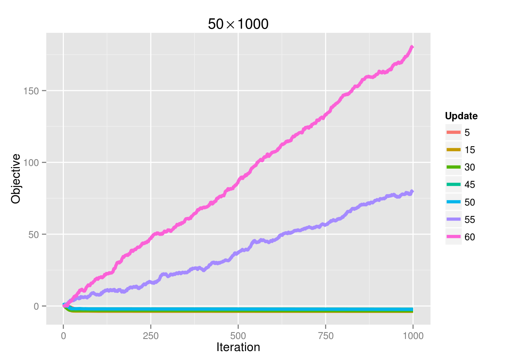

If we increase the sample size to 100, then the convergence problem is gone:

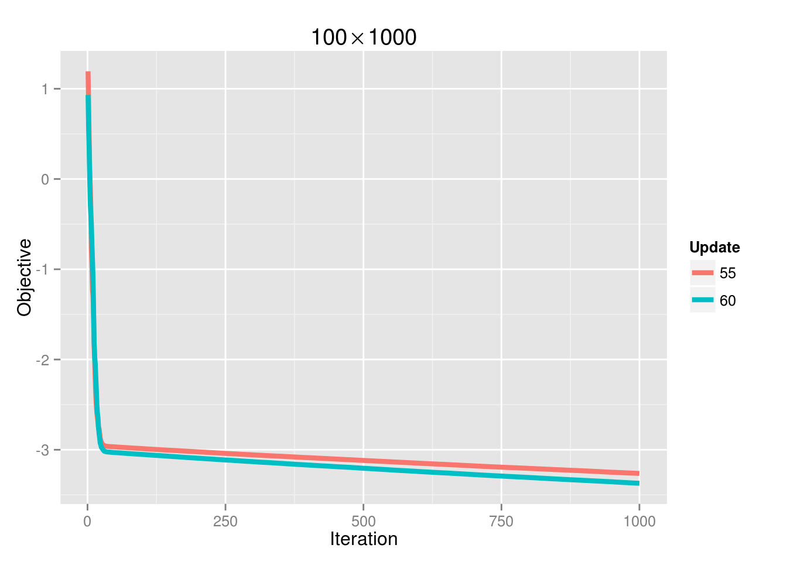

And the ability to achieve convergence as a function of processors is also dictated by $\lambda$:

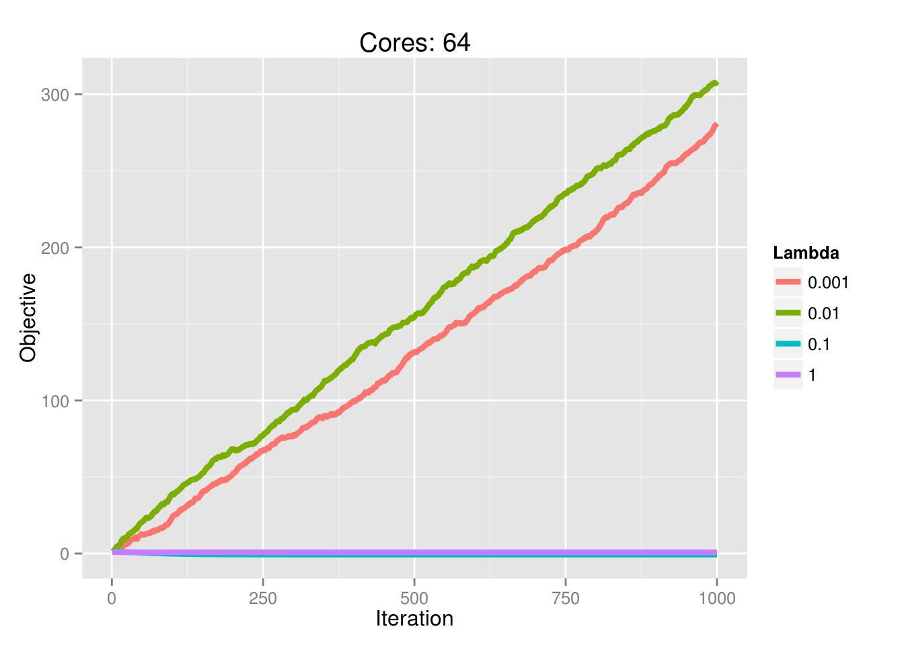

Here are the lasso traces for 10 independent samples for the above parameter settings

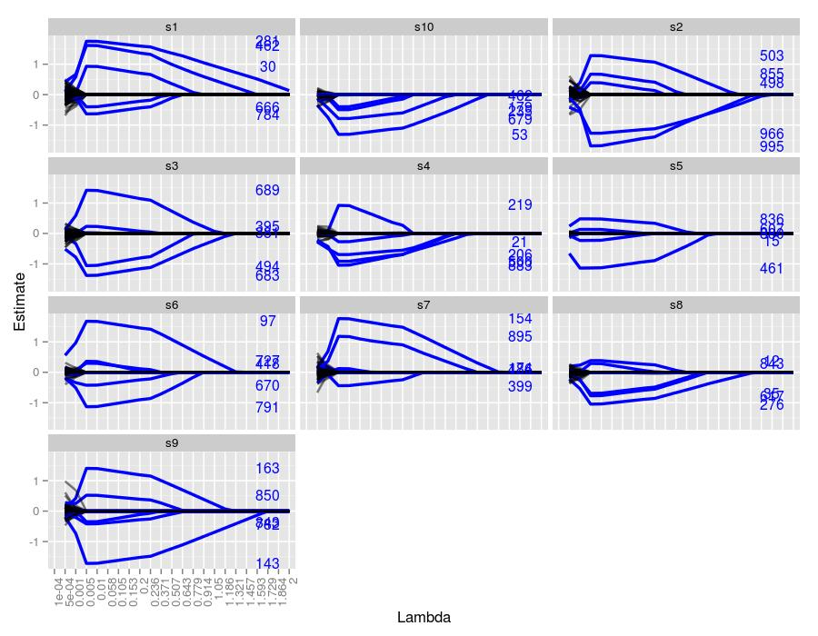

The text on the right hand side represents the indexes of the true coefficients used to generate the system for each sample. Their height represents their true value. We can easily see which traces correspond to which index, and moreover, we can see the $\lambda$ value in which the traces achieve the correct value. Every sample managed to both identify and estimate the correct index and its coefficient at some point throughout the trace. The figures seem to suggest that $\lambda=-.005$ did the best job at estimating the true values. Coefficients with larger values were more robust to smaller $\lambda$ values. For example, in sample 7, coefficients 154 and 895 were nonzero for $\lambda$ values well over 1. Coefficient 399 was driven to zero around $\lambda=.5$, whereas the remaining two coefficients were set to 0 much sooner.

Here is the error at each $\lambda$ averaged across samples:

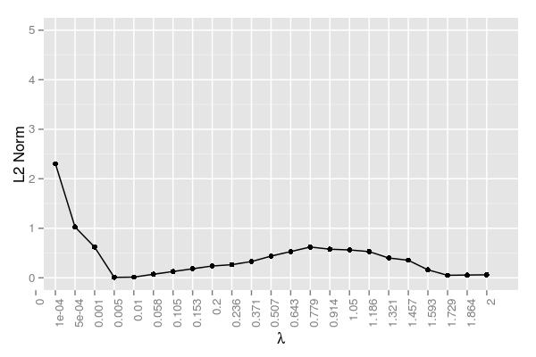

The error term here is measured as the following: $$\mathrm{Error}=\frac{||\hat x - x||_2}{||x||_2}$$. This figure confirms $\lambda=.005$ performing the best. It should be noted that there was an iteration cap, so the very small $\lambda$ values likely just failed to reach a reasonable approximation. While they clearly were converging and hence approaching a reasonable solution, it simply would have taken too long and these values were the result of 20,000 iterations using 48 cores. The error began to rise somewhat around $\lambda=.779$ The hump in this region and the subsequent decline can be attributed to the variability regarding when certain coefficients are driven to 0. Samples 1 and 2 have a few relatively robust coefficients that help decrease the error, whereas the coefficients in sample 4 are probably key contributors in the hump around $\lambda=.779$.

### $50 \times 10000$ Matrix | 5 Target Coefficients

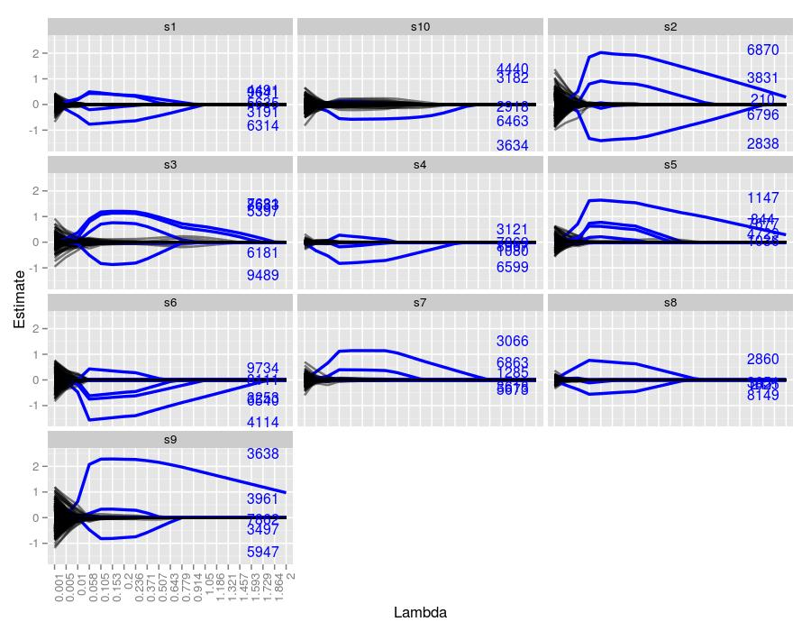

Now we are dealing with 10 times more unwanted coefficients, and the figures make it quite obvious that lasso is having more trouble than the $50 \times 1000$ case. Sample 10 managed to capture only 1 coefficient for a prolonged stretch, and it also had quite a few false positives for moderate $\lambda$ values. Sample 3 also had quite a few false positives, but farther along than sample 10. Samples 7 and 8 detected only 2 of the 5 coefficients. Like the previous simulation, larger true coefficients were more robust at being detected across $\lambda$ values, exemplified quite well by sample 2.

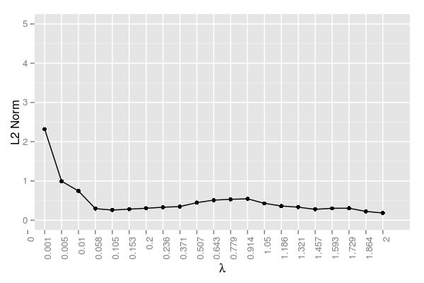

Unlike the last simulation, $\lambda=.005$ performed poorly. The best value seemed to be around $\lambda=.058$, although each value ranging from .058 to .371 did quite well. Still, even for .058, the error was larger (approximately .300) than .005 (.009) for the last simulation

### $200 \times 10000$ Matrix | 5 Target Coefficients

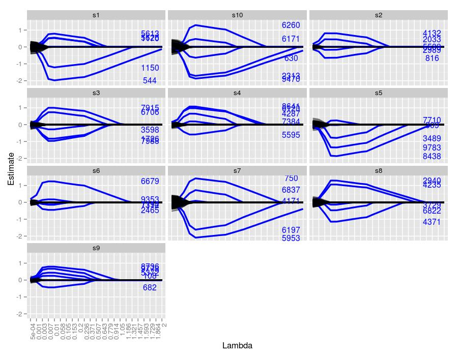

By increasing the number of data points from 50 to 200, there seems to be a return to the behavior we saw in the $50 \times 1000$ simulation. Notwithstanding sample 6, all of the samples managed to estimate at least 4 of the 5 coefficients. Again, if the coefficient was truly large, then it behaved robustly across all $\lambda$ values.

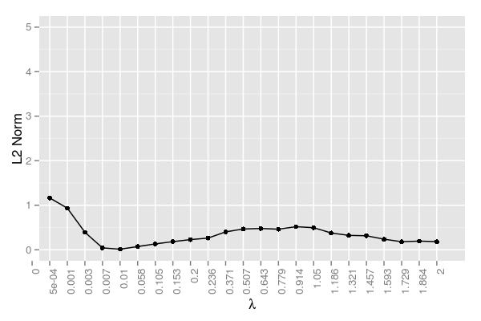

The error too seems similar to the $50 \times 1000$ simulation. The minimum ended up being at $\lambda=0.007$, analogous to the minimum of .005 we saw in the smaller system. The error managed to stay low even for a slightly larger $\lambda$ (.01). Like all of the simulations so far, there is a hump at the moderate $\lambda$ values. 

Based on the last 3 simulations, there seems to be a trade-off between the amount of data (i.e., the number of rows in $X$) and the number of coefficients (i.e., the columns in $X$). More coefficients gives lasso problems, but given more data, then lasso returns to form. Let's see how lasso does at estimating more coefficients.

### $50 \times 10000$ Matrix | 15 Target Coefficients

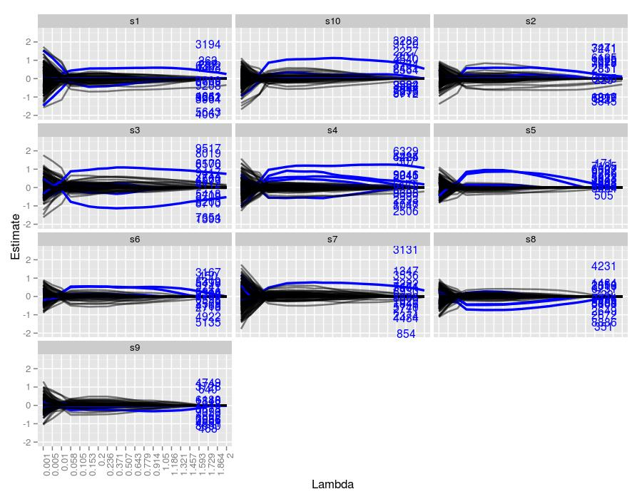

Now lasso seems to be struggling to find the true coefficients. Other than sample 4, which managed to only capture about 6 of the 15 coefficients, all of the samples performed poorly. Other than a few large coefficients, most traces were lost in false positives. Also, unlike the systems with only 5 true coefficients, this simulation resulted in many incorrect traces of similar magnitude to the true coefficients, represented by the black lines. It's surprising that lasso even failed to capture the larger coefficients (see the labels far from the x-axis). The fact that there are quite a few coefficients not much larger than 0 in terms of magnitude (recall they are sampled from a normal distribution (0,1)) gives lasso problems setting any potentially non-zero coefficient to zero. This may be remedied by a smaller tolerance, but most likely, it won't make a difference. For example, with $\lambda=2.$ (sample 4), the tolerance level was reached after only 1999 iterations, managing only to capture 4 coefficients, all of which are far smaller in magnitude than their true counterparts. A smaller $\lambda$ of 0.01 (sample 10) reached the iteration cap of 20,000, but ended up with 317 coefficients, far more than the target 15. A more moderate value, $\lambda=1.05$ (sample 1), broke after 5499 iterations, ending with 21 coefficients, which is closer to 15, but nevertheless failed to capture any of the true estimates of the larger coefficients since no trace reaches the required height.


Note the gap in the plot was due to the aforementioned convergence/core issue; hence, those $\lambda$ values were omitted. The error here essentially reaches a plateau for the majority of the $\lambda$ values. The error drops at the end, but this is not due to improved estimation, but instead a result of driving many of the incorrect estimates to zero. 

Considering this situation, if one has a dataset with many potentially informative coefficients, unless some yield significantly large estimates relative to the majority, then lasso will likely have problems. Since this simulation dealt with true coefficients near 0, many false positives resulted. A noisy dataset probably requires the use of larger $\lambda$ values and the hope that the some coefficients are significantly more informative than the others.

### $50 \times 10000$ Matrix | 30 Target Coefficients

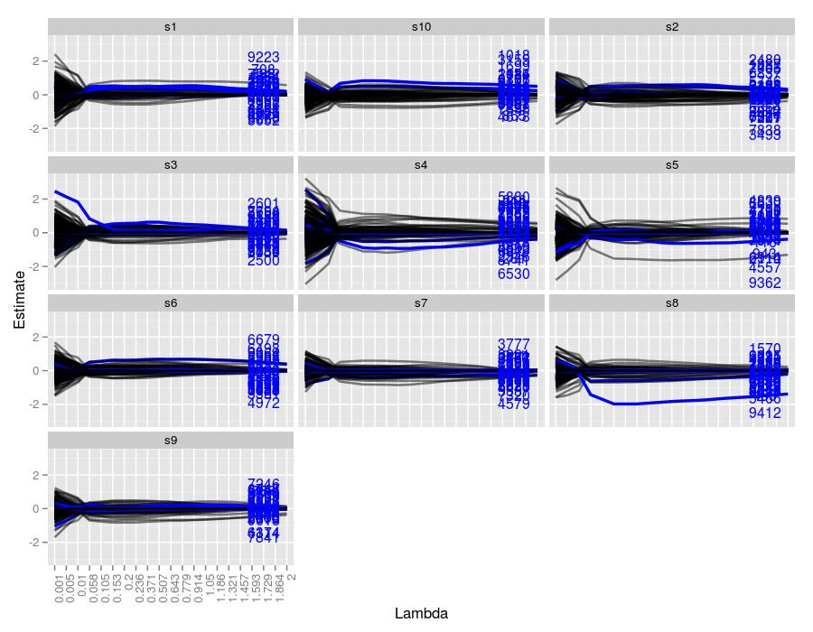

And here's an even noisier system, with 30 true coefficients. Only sample 8 was able to separate a coefficient from the crown. Driving $\lambda$ up further for this sample would likely isolate it. Sample 5 also had a large robust estimate, but it was a false positive. Clearly the conclusion reached in the last simulation can only be confirmed here.

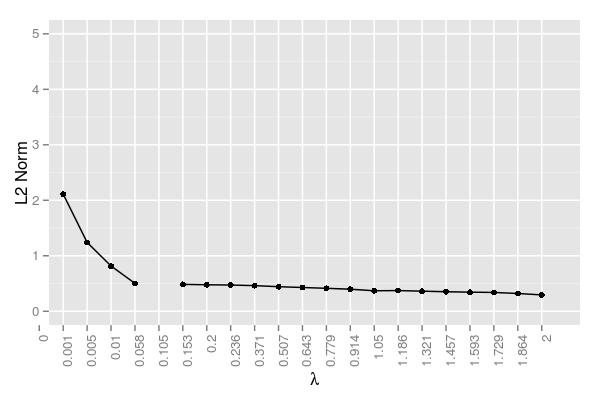

The trend here is similar to the system with 15 true values. If we increase $\lambda$ further, we would likely see the same drop in error we see before since we'd be driving the many incorrect estimates to zero.

### Scaling the coeficients

It seems plausible that as we increase the number of false coefficients, we decrease the chance of identifying true coefficients unless those coefficients are much different than the majority -- i.e., more informative. Instead of increasing the sampling size this time, let's increase the magnitude of the true coefficients by scaling them 10-fold. Using a *very* large $50 \times 100000$ matrix, we get the following:

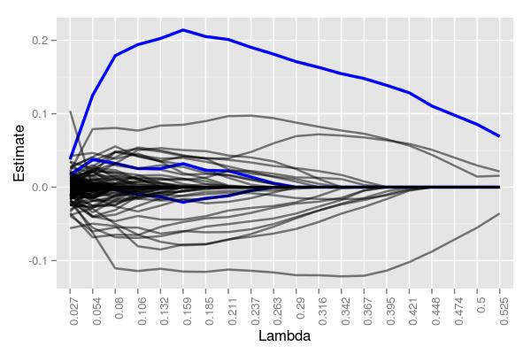

Even with 100,000 potential coefficients to work with, lasso managed to cleanly identify one of the five targets. Moreover, while there are quite a few false positives around $\lambda=.211$ (30), there are *far* less than 100,000, and 3 total true coefficients were still detectable. At $\lambda=.525$, 4 coefficients were returned, albeit only 1 being correct. Had we used larger $\lambda$ values, we likely would have ended with at most 1 true and 1 false coefficient. Note that the 5 starting coefficients had values of -4.79, 9.88, 3.12, 1.22, and 7.02. That robust coefficient was, to no one's surprise, the coefficient with the largest value in magnitude of the 5, 9.88. 

### Comparison 

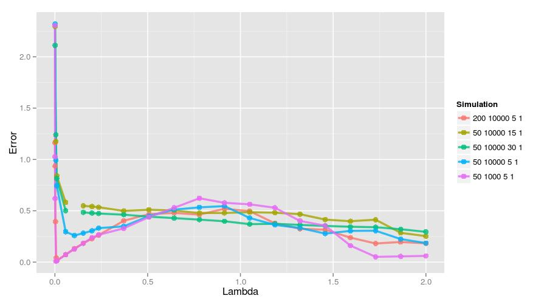

Here is a figure showing all of the error traces. The small system ($50 \times 1000$) and the large system with more data ($200 \times 10000$) performed the best assuming a small $\lambda$ was used. Interestingly, if only uses a larger $\lambda$, then that small system tends to perform the worst. Still, it's quite clear that identifying informative features is a function of the amount of data, the number of features, the number of true coefficients, and their size.

## Conclusion

A parallelized implementation of the coordinate descent algorithm for lasso clearly works well for large datasets. The issue with cores and the number of rows is an interesting quirk, but nevertheless easily avoidable. Once that was accounted for, no numerical issues resulted, and estimates were consistent with the predetermined values designed for the simulations.

```{r}
y <- Boston$medv # median housing value
X <- as.matrix(Boston[,-14]) # all other predictors

y <- scale(y,center=TRUE,scale=FALSE)
X <- scale(X,center = TRUE,scale = FALSE)

B <- rep(0,ncol(X))
lambda <- 2
tol <- 1e-8
m <- length(y)

iter <- 1000

obj <- numeric(iter + 1)
B.list <- lapply(1:(iter + 1), function(x) x)
B.list[[1]] <- B

for (j in 1:iter) {
  
  k <- sample(1:length(B),1)
  
  # 0 for B0 but centered so 0
  # calculate Bj for for all j not in k

  cj <- (X[,k] %*% (y - X[,-k] %*% B[-k])) # *2
  aj <- sum(X[,k]^2)  # *2
  
  # shrink
  Bj <- 0
  if (cj < -lambda*m) Bj <- (cj + lambda*m)/aj
  if (cj > lambda*m) Bj <- (cj - lambda*m)/aj

  B[k] <- Bj
  
  B.list[[(j + 1)]] <- B
  obj[j] <- (1/2)*(1/m)*norm(y - X %*% B,"F")^2 + lambda*sum(abs(B))
  
  #if (sqrt(sum((B.list[[j]] - B.list[[j+1]])^2)) < tol) break
} 

g <- (1/m)*t(X) %*% (y - X %*% B)
if (any(abs(g[which(B == 0)]) > lambda + tol)) print("No minimum")
if (any(g[which(B != 0)] > tol + lambda*sign(B[which(B != 0)]))) print("No minimum")

B
```

## Code: Lasso

```{r}
y <- Boston$medv # median housing value
X <- as.matrix(Boston[,-14]) # all other predictors

y <- scale(y,center=TRUE,scale=FALSE)
X <- scale(X,center = TRUE,scale = FALSE)

B <- rep(0,ncol(X))
lambda <- 2
tol <- 1e-8
m <- length(y)

iter <- 1000

obj <- numeric(iter + 1)
B.list <- lapply(1:(iter + 1), function(x) x)
B.list[[1]] <- B

for (j in 1:iter) {
  
  k <- sample(1:length(B),1)
  
  # 0 for B0 but centered so 0
  # calculate Bj for for all j not in k

  cj <- (X[,k] %*% (y - X[,-k] %*% B[-k])) # *2
  aj <- sum(X[,k]^2)  # *2
  
  # shrink
  Bj <- 0
  if (cj < -lambda*m) Bj <- (cj + lambda*m)/aj
  if (cj > lambda*m) Bj <- (cj - lambda*m)/aj

  B[k] <- Bj
  
  B.list[[(j + 1)]] <- B
  obj[j] <- (1/2)*(1/m)*norm(y - X %*% B,"F")^2 + lambda*sum(abs(B))
  
  #if (sqrt(sum((B.list[[j]] - B.list[[j+1]])^2)) < tol) break
} 

g <- (1/m)*t(X) %*% (y - X %*% B)
if (any(abs(g[which(B == 0)]) > lambda + tol)) print("No min")
if (any(g[which(B != 0)] > tol + lambda*sign(B[which(B != 0)]))) print("No min")

B
```

## Code: Lasso via cyclic gradient descent

```{r}
y <- Boston$medv # median housing value
X <- as.matrix(Boston[,-14]) # all other predictors

y <- scale(y,center=TRUE,scale=FALSE)
X <- scale(X,center = TRUE,scale = FALSE)

B <- rep(0,ncol(X))
lambda <- 2
tol <- 1e-8
m <- length(y)

iter <- 500

obj <- numeric(iter + 1)
B.list <- lapply(1:(iter + 1), function(x) x)
B.list[[1]] <- B

# cyclic gradient descent
for (j in 1:iter) {
  
  k <- sample(1:length(B),2)
  kk <- k[1]
  k <- k[2]
  
  # 0 for B0 but centered so 0
  # calculate Bj for for all j not in k
  
  cj <- (X[,k] %*% (y - X[,-k] %*% B[-k])) # *2
  aj <- sum(X[,k]^2)  # *2
  Bj <- 0
  if (cj < -lambda*m) Bj <- (cj + lambda*m)/aj
  if (cj > lambda*m) Bj <- (cj - lambda*m)/aj
  B[k] <- Bj
  
  cj <- (X[,kk] %*% (y - X[,-kk] %*% B[-kk])) # *2
  aj <- sum(X[,kk]^2)  # *2
  Bj <- 0
  if (cj < -lambda*m) Bj <- (cj + lambda*m)/aj
  if (cj > lambda*m) Bj <- (cj - lambda*m)/aj
  B[kk] <- Bj
  
  #B.list[[(j + 1)]] <- B
  #obj[j] <- (1/2)*(1/m)*norm(y - X %*% B,"F")^2 + lambda*sum(abs(B))
  
  #if (sqrt(sum((B.list[[j]] - B.list[[j+1]])^2)) < tol) break
} 

g <- (1/m)*t(X) %*% (y - X %*% B)
if (any(abs(g[which(B == 0)]) > lambda + tol)) print("No min")
if (any(g[which(B != 0)] > tol + lambda*sign(B[which(B != 0)]))) print("No min")

B
```

## Code: Parallel lasso


```{c,eval=FALSE}
#include <petscsys.h>
#include <petscis.h>
#include <petscvec.h>
#include <petscmat.h>
#include <petscmath.h>
#include <stdio.h>

float coord_descent(PetscScalar *y_array, float *beta_array, int rend, int cend, Mat matrix, int idx, float lambda){

	int col,row,ncols;
	const PetscInt *cols;
	const PetscScalar *vals;
	float cj = 0, aj = 0,rsum = 0;

	for (row=0; row<rend; row++){
		MatGetRow(matrix,row,&ncols,&cols,&vals);
		for (col=0; col<cend; col++){
			if (col != idx){
				rsum += vals[col]*beta_array[col];
			}else{	
				aj += vals[idx]*vals[idx];
			}
		}
		cj += vals[idx]*(y_array[row] - rsum);
		rsum = 0;
    MatRestoreRow(matrix,row,&ncols,&cols,&vals);
	}

	float Bj = 0.0;
	if (cj < -lambda*rend) Bj = (cj + lambda*rend)/aj;
	if (cj >  lambda*rend) Bj = (cj - lambda*rend)/aj;

	return Bj;
}

float objective(PetscScalar *y_array, float *beta_array, int rend, int cend, Mat matrix, float lambda){

        int col,row,ncols;
        const PetscInt *cols;
        const PetscScalar *vals;
        float cj = 0, Bj = 0,rsum = 0;

        for (row=0; row<rend; row++){
                MatGetRow(matrix,row,&ncols,&cols,&vals);
                for (col=0; col<cend; col++){
                                rsum += vals[col]*beta_array[col];
                }
                cj += (y_array[row] - rsum) * (y_array[row] - rsum);
                rsum = 0;
                MatRestoreRow(matrix,row,&ncols,&cols,&vals);
        }

	for (col=0;col<cend;col++){
		Bj += PetscAbsReal(beta_array[col]);
	}
        
	return .5 * (1/(float)rend) * PetscSqrtReal(cj) * PetscSqrtReal(cj) + lambda * Bj;
}


int main(int argc,char **argv){
	
	Mat X;
	Vec y;
	PetscInt i,j,k,it,rstart,rend,row,cstart,cend,col,N,save_step=100,iter=10000;
	PetscScalar rcounter,ind,tol=1e-6,L=.15,obj_last=1e10; 
	PetscRandom rng;
	PetscViewer viewer;
	PetscScalar *y_array;
	PetscInt rank,size;

	PetscInitialize(&argc,&argv,NULL,NULL);
	MPI_Comm_rank(PETSC_COMM_WORLD,&rank);
	MPI_Comm_size(PETSC_COMM_WORLD,&size);

	int sendind[size];
	int getind[size];

	PetscRandomCreate(PETSC_COMM_WORLD, &rng);
#if defined(PETSC_HAVE_DRAND48)
        PetscRandomSetType(rng, PETSCRAND48);
#elif defined(PETSC_HAVE_RAND)
        PetscRandomSetType(rng, PETSCRAND);
#endif
        PetscRandomSetFromOptions(rng);
	
	PetscOptionsGetInt(NULL,"-i",&iter,NULL);
	PetscOptionsGetInt(NULL,"-s",&save_step,NULL);
	PetscOptionsGetReal(NULL,"-l",&L,NULL);

	PetscViewerBinaryOpen(PETSC_COMM_SELF,"/home/sw424/NumComp/lasso/datafinal/lasso_50_10000_5_1/samp_1/X.bin",FILE_MODE_READ,&viewer);
	//PetscViewerBinaryOpen(PETSC_COMM_SELF,"data/X.bin",FILE_MODE_READ,&viewer);
	MatCreate(PETSC_COMM_SELF,&X);
	MatSetType(X,MATSEQDENSE);
	MatLoad(X,viewer);
	PetscViewerDestroy(&viewer);

	MatGetOwnershipRange(X,&rstart,&rend);
	MatGetOwnershipRangeColumn(X,&cstart,&cend);
	
	PetscViewerBinaryOpen(PETSC_COMM_SELF,"/home/sw424/NumComp/lasso/datafinal/lasso_50_10000_5_1/samp_1/y.bin",FILE_MODE_READ,&viewer);
	//PetscViewerBinaryOpen(PETSC_COMM_SELF,"data/y.bin",FILE_MODE_READ,&viewer);
	VecCreate(PETSC_COMM_SELF,&y);
	VecSetType(y,VECSEQ); // new
	//VecSetSizes(y,PETSC_DECIDE,rend);
	VecLoad(y,viewer);
	//VecView(y,PETSC_VIEWER_STDOUT_WORLD);
	PetscViewerDestroy(&viewer);

	float B[cend];
	memset(B,0,sizeof B);	

	PetscPrintf(PETSC_COMM_WORLD,"Lambda = %f\n\n",L);
	PetscPrintf(PETSC_COMM_WORLD,"Iter\tObj\n");

for (it=0;it<iter;it++){
	for (i=0;i<size;i++){
		PetscRandomSetInterval(rng,0,cend);
        	PetscRandomGetValueReal(rng,&ind);
        	sendind[i] = PetscFloorReal(ind);
		//PetscPrintf(PETSC_COMM_WORLD,"Iter %i | Rank %i | Rand %i: %i\n",it,rank,i,sendind[i]);
	}

	MPI_Scatter(sendind,1,MPI_INT,
			getind,1,MPI_INT,
			0,PETSC_COMM_WORLD);

	
	
	VecGetArray(y,&y_array);
	float Bj = coord_descent(y_array,B,rend,cend,X,getind[0],L);
	double obj = objective(y_array,B,rend,cend,X,L); // maybe better precision
	//float obj = objective(y_array,B,rend,cend,X,L); 
	VecRestoreArray(y,&y_array);

	//PetscPrintf(PETSC_COMM_SELF,"Iter %i | Rank: %i | B: %f\n",it,rank,Bj);
	
	float *Bnew = (float *)malloc(sizeof(float)*size);
	
	MPI_Gather(&Bj,1,MPI_FLOAT,Bnew,1,MPI_FLOAT,0,PETSC_COMM_WORLD);
	
	for (i=0;i<size;i++){
		B[sendind[i]] = Bnew[i]; 
		//PetscPrintf(PETSC_COMM_WORLD,"Iter %i | Rank %i | Rand %i: %i | B: %f\n",it,rank,i,sendind[i],Bnew[i]);
	}
	

	MPI_Bcast(B,cend,MPI_FLOAT,0,PETSC_COMM_WORLD);
	

	if((it+1) % save_step == 0){
		PetscPrintf(PETSC_COMM_WORLD,"%i\t%f\t",it,obj);
		//for (i=0;i<cend;i++){
		//	PetscPrintf(PETSC_COMM_WORLD,"%f\t",B[i]);
		//}
		PetscPrintf(PETSC_COMM_WORLD,"\n");
	
    //if(obj_last-obj < tol){
    if(PetscAbsReal(obj_last-obj) < tol){
		  break;
	  }
	  obj_last = obj;
	}

	
}
	
	PetscPrintf(PETSC_COMM_WORLD,"\n\nBroke after %i iterations\n",it);
	PetscPrintf(PETSC_COMM_WORLD,"\n\nFinal Beta Coefficients:\n");
	for (i=0;i<cend;i++){
    if (B[i] != 0){
		  PetscPrintf(PETSC_COMM_WORLD,"%i: %f\n",i,B[i]);
    }
	}
	PetscPrintf(PETSC_COMM_WORLD,"\n");
	

	PetscRandomDestroy(&rng);
	MatDestroy(&X);
	
	PetscFinalize();
	return 0;
}
```

## References

* Parallel Coordinate Descent for L1-Regularized Loss Minimization. Bradley J. K., Kyrola, A., Bickson, D., and Guestrin, C. 2011. Proceedings of the 28th International Conference on Machine Learning.
* Machine Learning: A Probabilistic Perspective. Murphy, K. P., 2012. MIT Press, 1st ed.
* The Elements of Statistical Learning: Data Mining, Inference, and Prediction. Hastie, T., Tibshirani, R., and Friedman, J. 2003. Springer. 3rd ed.
