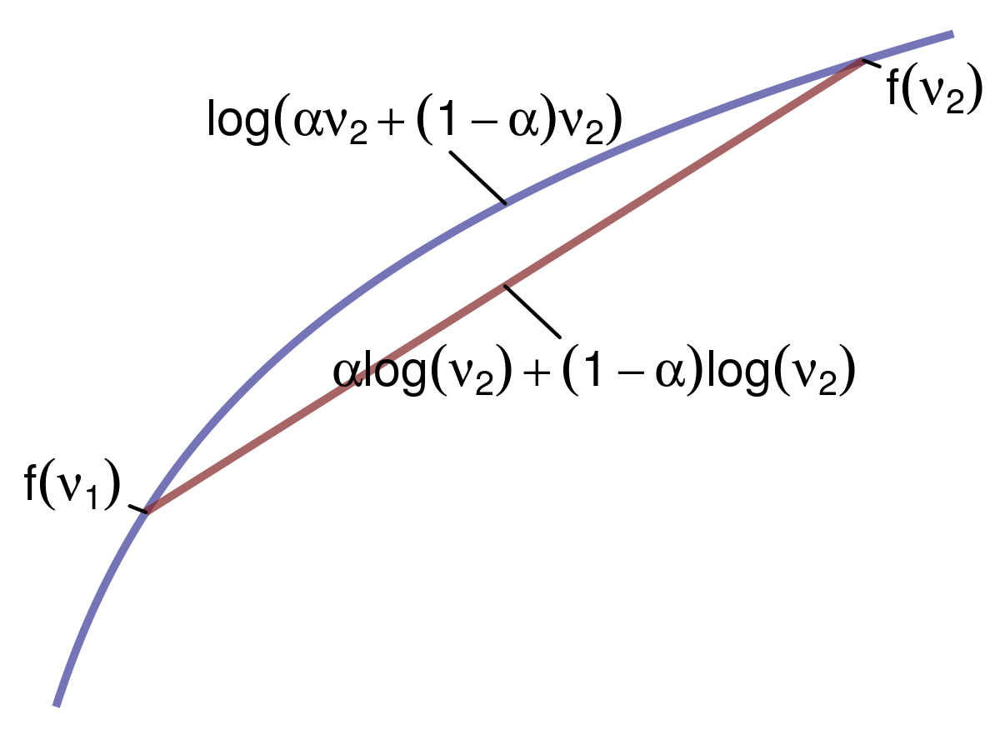

# Topic Models {#tm}

\newcommand{\Var}{\text{Var}}
\newcommand{\tr}{\text{tr}}

## Variational Inference

### Evidence Lower Bound (ELBO)

We first want to create a variational distribution, which is a distribution over all latent variables parameterized by variational parameters: $q(z_{1:m}|\nu)$. We want to choose $\nu$ that makes q as cloase as possible to our posterior $p$. If $q=p$, then we have typical expectation maximization. The whole put of variational inference, however, is to choose a $q$ that is easier (or *possible*) to compute.

One thing that we're going to exploit is Jensen's Inequality:

 

We can apply this inequality to concave functions. If we have two points (say $v_1$ and $v_2$), and we average the function $f$ that is *concave* at those two points; it will be less than the function $f$ applied to the average of those two points -- that is, $f(\mathbb{E}[X]) \geq \mathbb{E}[f(X)]$. Let's assume that $f(v)=\log{v}$. The weighted average between two points would therefore be $\log{[\alpha v_1 + (1-\alpha)v_2]}$, and the average of the function at those two points would be $\alpha \log{v_1} + (1-\alpha)\log{v_2}$. This gives us the following inequality: $\log{[\alpha v_1 + (1-\alpha)v_2]} \ge \alpha \log{v_1} + (1-\alpha)\log{v_2}$.

We're going to exploit the use of this inequality to calculate the evidence lower bound (ELBO) for our variational inference procedure. Given the log probability of our data $\log{p(x)}$, let's also consider all possible latent variables $z$. To do this, we'll marginalize out $z$: 

\[
\log{p(x)} = \log{\int_z p(x,z)}
\]

To introduce our distribution $q$, we'll multiply by 1:

\[
\begin{aligned}
\log{p(x)} &= \log{\int_z p(x,z) \frac{q(z)}{q(z)}}\\
			&= \log{\int_z \frac{p(x,z)}{q(z)} q(z)}\\
			&= \log{\mathbb{E}_q [\frac{p(x,z)}{q(z)}]}
\end{aligned}
\]

Now we can apply Jensen's Inequality. We just derived the function applied to the expectation, which was the left term of the inequality. Now, the right term is the expectation of function, giving us:

\[
\begin{aligned}
\log{p(x)} = \log{\mathbb{E}_q [\frac{p(x,z)}{q(z)}]}
&\ge \mathbb{E}_q [\log{\frac{p(x,z)}{q(z)}}]\\
										&= \mathbb{E}_q [\log p(x,z)] - \mathbb{E}_q [\log q(z)]
\end{aligned}
\]

Turning the log of a quotient into a difference has a useful side effect: $\mathbb{E}_q [\log q(z)]$ is simply the entropy of the variational distribution $q$. We cannot optimize this part of the equation; however, we *can* maximize $\mathbb{E}_q [\log p(x,z)]$. By doing so, we will drive the equation closer and closer to $\log {p(x)}$, and ideally as far as the entropy term will allow. This term we aim to maximize is the ELBO, and it will give us a tight lower bound of $\log{p(x)}$.

### ELBO and KL Divergence

Maximizing the ELBO is equivalent to minimizing the KL divergence. To see this, let's rewrite out joint probability distribution of our data $x$ and latent parameters $z$ as

\[
p(z|x) = \frac{p(x,x)}{p(x)}\\
\]

Now, let's take the KL divergence between this distribution and the variational distribution $q$:

\[
\begin{aligned}
\text{KL}(q(z) || p(z|x)) &= \mathbb{E}_q [\log{\frac{q(z)}{p(z|x)}}]\\
						&= \mathbb{E}_q [\log{q(z)} - \log{q(z)}]\\
						&= \mathbb{E}_q [\log{q(z)}] - \mathbb{E}_q [\log{p(z|x)}]\\
						&= \mathbb{E}_q [\log{q(z)}] - \mathbb{E}_q [\log{\frac{p(x,z)}{p(x)}}]\\
						&= \mathbb{E}_q [\log{q(z)}] - \mathbb{E}_q [\log{p(x,z)} - \log{p(x)}]\\
						&= \mathbb{E}_q [\log{q(z)}] - \mathbb{E}_q [\log{p(x,z)}] + \log{p(x)}
\end{aligned}
\]

When we optimize, the log probability of our data $\log{p(x)}$ will vanish because it's a constant, so we can rewrite this as

\[
\begin{aligned}
\text{KL}(q(z) || p(z|x)) &= \mathbb{E}_q [\log{q(z)}] - \mathbb{E}_q [\log{p(x,z)}]\\
						&= -(\mathbb{E}_q [\log{p(x,z)}] - \mathbb{E}_q [\log{q(z)}])
\end{aligned}
\]

Thus, minimizing the KL divergence is the same as maximizing the ELBO.

### Mean Field Method

One way of writing our variational distribution is via the mean field method where we fully factorize our latent variables such that we assume that they are completely independent of one another. For our variational distribution $q$ over latent parameters $z$ we have

\[
q(z_1,\dots,z_N) = \prod_{i=1}^N q(z_i)
\]

It should be obvious that, given this assumption, $p \neq q$ because in $p$, the latent variables are dependent upon one another. This mean field method is a good starting point for deriving a variational distribution, but sometimes it doesn't work, so other strategies to forming the variational distribution would be required.

## LDA

LDA follows the following generative process:

 

The joint distribution over all latent variables $\theta$ and $z$ and observed data $w$ is then

\[
p(\theta,z,w|\alpha,\beta) = \prod_d p(\theta_d|\alpha) \prod_n p(w_{d,n}|z_{d,n},\beta) p(z_{d,n}|\theta_d)
\]

where

\[
\begin{aligned}
&p(\theta_d|\alpha) = \frac{\Gamma (\sum_i \alpha_i)}{\prod_i \Gamma (\alpha_i)} \prod_i \theta_{d,k}^{\alpha_i -1} \text{, (Dirichlet)}\\
&p(z_{d,n}|\theta_d) = \prod_n \prod_i \theta_i^{1[z_n=i]} \text{, (Multinomial)}\\
&p(w_{d,n}|z_{d,n},\beta) = \prod_v \prod_i \beta_{i,v}^{1[w_{d,n}=v,z_{d,n}=i]} \text{, (Multinomial)}
\end{aligned}
\]

Now, our variational distribution for LDA will be a mean field distribution where we assume complete independence between each $\theta$ and between all topic assignments $z$, i.e., a fully factored form:

\[
q(\theta,z|\gamma,\phi) = \prod_d q(\theta_d|\gamma_d) \prod_n q(z_{d,n}|\phi_{d,n})
\]

where $\gamma \thicksim \text{Dirichlet}$ and $\phi \thicksim \text{Multinomial}$ are our variational parameters. $\theta_d$ will be a length $K$ non-negative vector representing the distribution over topics $\gamma_d$ for document $d$. Note that each vector does *not* sum to 1. $z_{d,n}$ will also be a length $K$ vector, but instead is a distribution over topic assignments $\phi_{d,n}$ for each token $z_{d,n}$. Each vector \text{does} sum to 1.

Recall that the ELBO is $\mathbb{E}_q [\log p(x,z)] - \mathbb{E}_q [\log q(z)]$, where $x$ is our observed data and $z$ are our latent variables. In LDA, $w$ is our observed data, and $\theta$ and $z$ are our latent variables. Using the joint distribution over latent variables shown above, we have

\[
\begin{aligned}
\log p&(w|\alpha,\beta) \geq L(\gamma,\phi|\alpha,\beta) \\
	&= \mathbb{E}_q [\log  p(\theta,z,w|\alpha,\beta)] - \mathbb{E}_q [\log q(\theta,z)] \\
	&= \mathbb{E}_q [\log p(\theta|\alpha)p(z|\theta)p(w|z,\beta)] - \mathbb{E}_q [\log q(\theta)q(z)]\\
	&= \mathbb{E}_q [\log p(\theta|\alpha) + \log p(z|\theta) + \log p(w|z,\beta)] - \mathbb{E}_q [\log q(\theta) + \log q(z)]\\
	&= \mathbb{E}_q [\log p(\theta|\alpha)] + \mathbb{E}_q [\log p(z|\theta)] + \mathbb{E}_q [\log p(w|z,\beta)] - \mathbb{E}_q [\log q(\theta)] - \mathbb{E}_q[\log q(z)]\\
	&= \mathbb{E}_q [\log p(\theta|\alpha)] + \mathbb{E}_q [\log p(z|\theta)] + \mathbb{E}_q [\log p(w|z,\beta)] + \mathbb{H}_q [\gamma] + \mathbb{H}_q[\phi]
\end{aligned} 
\]

Before we continue, note that $\mathbb{E}_q$ means the expectation with respect to all parameters in our variational distribution $q$, so $\theta$ and $z$.

### Expectation of p($\theta|\alpha)$

To calculate $\mathbb{E}[\log p(\theta | \alpha)]$, where $\theta$ is our variational parameter, let's first recall that it is a Dirichlet distribution; therefore, we have

\[
\begin{aligned}
\mathbb{E}_q [\log p(\theta | \alpha)] &= \mathbb{E}_q \log{[\frac{\Gamma (\sum_i \alpha_i)}{\prod_i \Gamma (\alpha_i)} \prod_i \theta_{d,k}^{\alpha_i -1}]}\\
		&=  \mathbb{E}_q \log \Gamma (\sum_i^k \alpha_i) - \mathbb{E}_q \sum_i^k \log \Gamma (\alpha_i) + \mathbb{E}_q \sum_i^k (\alpha_i -1) \log \theta \\
		&= \log \Gamma (\sum_i^k \alpha_i) - \sum_i^k \log \Gamma (\alpha_i) + \sum_i^k (\alpha_i -1) \mathbb{E}_q \log \theta \\
\end{aligned}
\]

Note that $\mathbb{E}_q [f(\alpha)] = f(\alpha)$ because $\alpha$ is not one of the latent parameters in our variational distribution $q$. Now we have to calculate $\mathbb{E}_q \log \theta$ where $\theta \thicksim \text{Dirichlet}$. We must first convert this Dirichlet to its exponential form (given the fact that it belongs to the exponential family). First, we exponentiate the log of $p(\theta | \alpha)$:

\[
\exp{[\log \Gamma (\sum_i^k \alpha_i) - \sum_i^k \log \Gamma (\alpha_i) + (\sum_i^k (\alpha_i -1) \log \theta)]}
\]

A pdf belonging to the exponential family has the form

\[
p(x|\theta) = h(x) \exp{[\theta^T \phi (x) - A(\theta)]}
\]

where $\theta$ are the natural or canonical parameters, $\phi (x)$ is a vector of sufficient statistics, $h (x)$ is a scaling constant that is often equal to 1, and $A (\theta)$ is the log partition function. If we make one slight adjustment to the Dirichlet in exponential family form, we can these components more easily:

\[
\exp{[(\sum_i^k (\alpha_i -1) \log \theta) - (\sum_i^k \log \Gamma (\alpha_i) + \log \Gamma (\sum_i^k \alpha_i))]}
\]

where $\sum_i^k (\alpha_i -1)$ are the natural parameters, $\log \theta$ is the vector of sufficient statistics, and $\sum_i^k \log \Gamma (\alpha_i) + \log \Gamma (\sum_i^k \alpha_i)$ is the log partition function. Taking the derivative of the log partition function with respect to the natural parameters results in the expectation of the sufficient statistic. Recall that we are working with $q(\theta_d|\gamma_d)$ there, our variational distribution, and not $p(\theta_d|\alpha)$:

\[
\begin{aligned}
\mathbb{E}_q[\log \theta] &= \frac{\partial}{\partial \gamma_i} (\log \Gamma (\gamma_i) + \log \Gamma (\sum_j^k \gamma_j)) \\
									&= \Psi (\gamma_i) - \Psi (\sum_j^k \gamma_j)
\end{aligned}
\]

And so we have

\[
\begin{aligned}
\mathbb{E}_q [\log p(\theta | \alpha)] &= \log \Gamma (\sum_i^k \alpha_i) - \sum_i^k \log \Gamma (\alpha_i) + \sum_i^k (\alpha_i -1) (\Psi (\gamma_i) - \Psi (\sum_j^k \gamma_j)) \\
\end{aligned}
\]

### Expectation of p($z|\theta)$

For this expectation, we do the following:

\[
\begin{aligned}
\mathbb{E}_q [\log p(z|\theta)] &= \mathbb{E}_q \log [\prod_n \prod_i \theta_i^{1[z_n=i]}]\\
					&= \mathbb{E}_q [\sum_n \sum_i \log \theta_i^{1[z_n=i]}]\\
					&= \sum_n \sum_i \mathbb{E}_q [\log \theta_i^{1[z_n=i]}]\\
					&= \sum_n \sum_i \mathbb{E}_q [1[z_n=i] \log \theta_i]
\end{aligned}
\]

Recall that $1[z_n=i]$ is an indicator of whether a particular word's topic assignment $z_n$ is equal to topic $i$. If so, then we add the probability $\theta_{d,i}$ of this topic in document $d$ to the summation. Because in our variational distribution $q$ we assume that $\theta$ and $z$ are independent, we can do the following:

\[
\begin{aligned}
\mathbb{E}_q [\log p(z|\theta)] &= \sum_n \sum_i \mathbb{E}_q [1[z_n=i] \log \theta_i]\\
					&= \sum_n \sum_i \mathbb{E}_q 1[z_n=i] \mathbb{E}_q \log \theta_i\\
\end{aligned}
\]

The expectation of this indicator function is just a measure of how much a particular token $n$ takes on a topic assignment $i$, which we'll call $\phi_{n,i}$:

\[
\begin{aligned}
\mathbb{E}_q [\log p(z|\theta)] &= \sum_n \sum_i \phi_{n,i} \mathbb{E}_q \log \theta_i\\
					&= \sum_n \sum_i \phi_{n,i} (\Psi (\gamma_i) - \Psi (\sum_j^k \gamma_j))
\end{aligned}
\]

### Expectation of p($w|z,\beta)$

Here we are simply looking up the probability $\beta$ of a topic assignment $z_{d,n}$ for the word $w_{d,n}$.

\[
\begin{aligned}
\mathbb{E}_q [\log p(w|z,\beta)] &= \mathbb{E}_q [\log \prod_v \prod_i \beta_{i,v}^{1[w_{d,n}=v,z_{d,n}=i]}] \\
								&= \mathbb{E}_q [\sum_v \sum_i \log \beta_{i,v}^{1[w_{d,n}=v,z_{d,n}=i]}] \\
								&= \sum_v \sum_i \mathbb{E}_q [\log \beta_{i,v}^{1[w_{d,n}=v,z_{d,n}=i]}] \\
								&= \sum_v \sum_i \mathbb{E}_q [1[w_{d,n}=v,z_{d,n}=i] \log \beta_{i,v}] \\
								&= \sum_v \sum_i \mathbb{E}_q [1[w_{d,n}=v,z_{d,n}=i]] \log \beta_{i,v} \\
								&= \sum_v \sum_i \mathbb{E}_q [1[w_{d,n}=v]1[z_{d,n}=i]] \log \beta_{i,v} \\
								&= \sum_v \sum_i 1[w_{d,n}=v] \mathbb{E}_q [1[z_{d,n}=i]] \log \beta_{i,v} \\
\end{aligned}
\]

Recall that we already defined $\mathbb{E}_q 1[z_n=i] = \phi_{n,i}$, leaving us with

\[
\begin{aligned}
\mathbb{E}_q [\log p(w|z,\beta)] &= \sum_v \sum_i 1[w_{d,n}=v] \phi_{n,i} \log \beta_{i,v}
\end{aligned}
\]

### Entropy of $\gamma$ and $\phi$

We can simply look up the entropy of a Dirichlet for $\gamma$ and the entropy of a multinomial for $\phi_{d,n}$, giving us

\[
\begin{aligned}
\mathbb{H}_q [\gamma] &= -\log \Gamma (\sum_j \gamma_j) + \sum_i \log \Gamma(\gamma_i) - \sum_i (\gamma_i -1) (\Psi (\gamma_i) - \Psi (\sum_j^k \gamma_j))\\
\mathbb{H}_q [\phi_{d,n}] &= -\sum_i \phi_{d,n,i} \log \phi_{d,n,i}
\end{aligned}
\]

### Complete Objective Function

Now that we calculated the expectations and entropies we need, we can fill in our original equation:

\[
\begin{aligned}
\mathbb{E}_q &[\log  p(\theta,z,w|\alpha,\beta)] - \mathbb{E}_q [\log q(\theta,z)] \\
	&= \mathbb{E}_q [\log p(\theta|\alpha)] + \mathbb{E}_q [\log p(z|\theta)] + \mathbb{E}_q [\log p(w|z,\beta)] + \mathbb{H}_q [\gamma] + \mathbb{H}_q[\phi_{d,n}] \\
\end{aligned} 
\]

Giving us

\[
\begin{aligned}
	\mathbb{E}_q &[\log  p(\theta,z,w|\alpha,\beta)] - \mathbb{E}_q [\log q(\theta,z)] = \\
				&\log \Gamma (\sum_i \alpha_j) - \sum_i \log \Gamma (\alpha_i) + \sum_i^k (\alpha_i -1) (\Psi (\gamma_i) - \Psi (\sum_j^k \gamma_j)) \\
				&+ \sum_n \sum_i \phi_{n,i} (\Psi (\gamma_i) - \Psi (\sum_j^k \gamma_j)) \\
				&+ \sum_n \sum_i \sum_v 1[w_n=v] \phi_{n,i} \log \beta_{i,v} \\
				&- \log \Gamma (\sum_j \gamma_j) + \sum_i \log \Gamma(\gamma_i) - \sum_i (\gamma_i -1) (\Psi (\gamma_i) - \Psi (\sum_j^k \gamma_j)) \\
				&- \sum_n \sum_i \phi_{n,i} \log \phi_{n,i}
\end{aligned} 
\]

### Parameter Optimization

To derive our parameter updates for variational EM, we need to maximize the objective function above with respect to our target parameter.

#### Optimization for $\phi$

Using the objective function above, we'll isolate every term that is a function of $phi$, and using the constraint $\sum_i \phi_{n,i}=1$, we'll perform the following optimization:

\[
\begin{aligned}
\frac{\partial L}{\partial \phi_{n,i}} &= \frac{\partial}{\partial \phi_{n,i}}[\phi_{n,i} (\Psi(\gamma_i) - \Psi(\sum_j \gamma_j)) + \sum_j 1[w_n = v] \phi_{n,i} \log \beta_{i,v} \\ 
&\qquad- \phi_{n,i} \log \phi_{n,i} + \lambda_n (\phi_{n,i} - 1)]\\
	&=\Psi ' (\gamma) - \Psi ' (\sum_j \gamma_j) + 1[w_n = v] \log \beta_{i,v} - \log \phi_{n,i} - 1 + \lambda
\end{aligned}
\]

Then, setting to this to zero, we get

\[
\begin{aligned}
  0 &=\Psi ' (\gamma) - \Psi ' (\sum_j \gamma_j) + 1[w_n = v] \log \beta_{i,v} - \log \phi_{n,i} - 1 + \lambda\\
  \log \phi_{n,i} &= \Psi ' (\gamma) - \Psi ' (\sum_j \gamma_j) + 1[w_n = v] \log \beta_{i,v} - 1 + \lambda \\
  \phi_{n,i} &= \exp [\Psi ' (\gamma) - \Psi ' (\sum_j \gamma_j) + 1[w_n = v] \log \beta_{i,v} - 1 + \lambda]\\
	  &= \beta_{i,v}^{1[w_n = v]} \exp [\Psi ' (\gamma) - \Psi ' (\sum_j \gamma_j)] \exp [- 1 + \lambda]\\
	  &= c_{n,i} \beta_{i,v}^{1[w_n = v]} \exp [\Psi ' (\gamma) - \Psi ' (\sum_j \gamma_j)]
\end{aligned}
\]

where $c_{n,i}=\exp [\lambda - 1]$. Because we don't know $\lambda$, we will simply calculate the unnormalized $\phi_{n,i}$ and then normalize to enforce the constraint that $\sum_i \phi_{n,i}=1$. Therefore, we have

\[
\begin{aligned}
\phi_{n,i} &\propto \beta_{i,v}^{1[w_n = v]} \exp [\Psi ' (\gamma) - \Psi ' (\sum_j \gamma_j)]
\end{aligned}
\]

#### Optimization for $\gamma_i$

Now we'll take all terms that are a function of $\gamma_i$:

\[
\begin{aligned}
\frac{\partial L}{\partial \gamma_i} &= \frac{\partial}{\partial \gamma_i}[(\alpha_i -1) (\Psi (\gamma_i) - \Psi (\sum_j \gamma_j)) \\
				&\qquad + \sum_n \phi_{n,i} (\Psi (\gamma_i) - \Psi (\sum_j \gamma_j)) \\
				&\qquad - \log \Gamma (\sum_j \gamma_j) + \log \Gamma(\gamma_i) \\
				&\qquad - (\gamma_i -1) (\Psi (\gamma_i) - \Psi (\sum_j \gamma_j))] \\
				&= \frac{\partial}{\partial \gamma_i} [\alpha_i \Psi (\gamma_i) - \alpha_i \Psi (\sum_j \gamma_j) - \Psi (\gamma_i) + \Psi (\sum_j \gamma_j)\\
				&\qquad + \sum_n \phi_{n,i} \Psi (\gamma_i) - \sum_n \phi_{n,i} \Psi (\sum_j \gamma_j)\\
				&\qquad - \log \Gamma (\sum_j \gamma_j) + \log \Gamma (\gamma_i) \\
				&\qquad - \gamma_i \Psi (\gamma_i) + \gamma_i \Psi (\sum_j \gamma_j) + \Psi (\gamma_i) - \Psi(\sum_j \gamma_j)]\\
				&= \alpha_i \Psi' (\gamma_i) - \alpha_i \Psi' (\sum_j \gamma_j) - \Psi' (\gamma_i) + \Psi' (\sum_j \gamma_j)\\
				&\qquad + \sum_n \phi_{n,i} \Psi' (\gamma_i) - \sum_n \phi_{n,i} \Psi' (\sum_j \gamma_j)\\
				&\qquad - \Psi (\sum_j \gamma_j) + \Psi (\gamma_i) \\
				&\qquad - \gamma_i \Psi' (\gamma_i) - \Psi (\gamma_i) + \gamma_i \Psi' (\sum_j \gamma_j) + \Psi (\sum_j \gamma_j) + \Psi' (\gamma_i) - \Psi' (\sum_j \gamma_j)\\
				&= \alpha_i \Psi' (\gamma_i) - \alpha_i \Psi' (\sum_j \gamma_j) - \Psi' (\gamma_i) + \Psi' (\sum_j \gamma_j)\\
				&\qquad + \sum_n \phi_{n,i} \Psi' (\gamma_i) - \sum_n \phi_{n,i} \Psi' (\sum_j \gamma_j)\\
				&\qquad - \gamma_i \Psi' (\gamma_i) + \gamma_i \Psi' (\sum_j \gamma_j) + \Psi' (\gamma_i) - \Psi' (\sum_j \gamma_j)
\end{aligned}
\]

Now combine terms:

\[
\begin{aligned}
\Psi' (\gamma_i)(\alpha_i - 1 + \sum_n \phi_{n,i} - \gamma_i + 1) &= \Psi' (\sum_j \gamma_j)(\alpha_i + \sum_n \phi_{n,i} - \gamma_j)\\
\Psi' (\gamma_i)(\alpha_i + \sum_n \phi_{n,i} - \gamma_i) &= \Psi' (\sum_j \gamma_j)(\alpha_i + \sum_n \phi_{n,i} - \gamma_j)\\
\end{aligned}
\]

Then set this to zero:

\[
\begin{aligned}
0 &= \Psi' (\gamma_i)(\alpha_i + \sum_n \phi_{n,i} - \gamma_i) - \Psi' (\sum_j \gamma_j)(\alpha_i + \sum_n \phi_{n,i} - \gamma_j)\\
\end{aligned}
\]

Leaving us with

\[
\begin{aligned}
\gamma_i &= \alpha_i + \sum_n \phi_{n,i}
\end{aligned}
\]

#### Optimization for $\beta$

Now, we'll extract all terms that are a function of $\beta$ and add the constrain $\sum_v \beta_{i,v} = 1$:

\[
\begin{aligned}
\frac{\partial L}{\partial \beta} &= \frac{\partial}{\partial \beta}[\sum_n \sum_i \sum_v 1[w_n=v]\phi_{n,i} \log \beta_{i,v} + \sum_i \lambda_i (\sum_v \beta_{i,v} - 1)]\\
				&=\sum_n \sum_i \sum_v \frac{1[w_n=v]\phi_{n,i}}{\beta_{i,v}} + \sum_i \lambda_i\\
\end{aligned}
\]

Setting this to 0 results in

\[
\begin{aligned}
0 &=\sum_n \sum_i \sum_v \frac{1[w_n=v]\phi_{n,i}}{\beta_{i,v}} + \sum_i \lambda_i\\
- \beta_{i,v} \sum_i \lambda_i &=\sum_n \sum_i \sum_v 1[w_n=v]\phi_{n,i}\\
\beta_{i,v} &= c_{i,v} \sum_n \sum_i \sum_v 1[w_n=v]\phi_{n,i}^{(k)}
\end{aligned}
\]

where $c_{i,v} = -\frac{1}{\sum_i \lambda_i}$. Like what we did for $\phi$, we will calculate unnormalized $\beta$ and then normalize to satisfy the constraint. Our final update is the following:

\[
\begin{aligned}
\beta_{i,v} &\propto \sum_n \sum_i \sum_v 1[w_n=v]\phi_{n,i}
\end{aligned}
\]

```{r,eval=FALSE}
library(tidyverse)

vocab <- c("river","stream","bank","money","loan")
topic1 <- c(.333,.333,.333,0,0)
topic2 <- c(0,0,.333,.333,.333)
topics <- topic1 + topic2
K <- 2
V <- length(vocab)
N <- 16
corpus <- 	rbind(matrix(rep(sample(vocab,N,topic1,replace=T),7),7,N),
                 matrix(rep(sample(vocab,N,topics,replace=T),10),10,N),
                 matrix(rep(sample(vocab,N,topic2,replace=T),5),5,N))
M <- nrow(corpus)

start <- t(apply(corpus, 1, function(x) c(sum(x==vocab[1]),sum(x==vocab[2]),sum(x==vocab[3]),sum(x==vocab[4]),sum(x==vocab[5]))))
docnames <- paste("D",1:M,sep="")
rownames(start) <- docnames
colnames(start) <- vocab

topicassign <- matrix(sample(c(0,1),M*N,replace=T),M,N,byrow=T)

df <- NULL
for(i in 1:M){
  df <- rbind(df,cbind(corpus[i,],rep(docnames[i]),topicassign[i,]))
}
df <- data.frame(df)
names(df) <- c('word','doc','topic')
df_original <- df

nu <- .25
alpha <- .5

for (iter in 1:100){
  
  cat("i=",iter,"\n",sep="")
  print(xtabs(~ word+topic,df))
  cat("\n",sep="")
  
  for (i in 1:nrow(df)){
    
    w <- as.vector(df[i,1])
    d <- as.vector(df[i,2])
    
    civk <- df[-i,] %>%
      group_by(word,doc,topic) %>%
      summarise(civk=n())
    cik <- df[-i,] %>%
      group_by(doc,topic) %>%
      summarise(cik=n())
    cvk <- df[-i,] %>%
      group_by(word,topic) %>%
      summarise(cvk=n())
    niv <- df[-i,] %>%
      group_by(word,doc) %>%
      summarise(niv=n())
    ck <- df[-i,] %>%
      group_by(topic) %>%
      summarise(words=n())
    Li <- df[-i,] %>%
      group_by(doc) %>%
      summarise(words=n())
    
    a <- unlist((cvk[cvk$word==w,3] + nu))/unlist((ck[,2] + V*nu))
    b <- unlist((cik[cik$doc==d,3] + alpha))/unlist((Li[Li$doc==d,2] + K*alpha))
    pqilk <- unlist((a*b)/sum(a*b))
    df[i,3] <- sample(c(0,1),size=1,prob=pqilk)
  }
}

est_alpha <- TRUE
alpha <- rep(50/K,K)
beta <- rdirichlet(K,rep(1,V))
for (m_step in 1:50){
  
  gamma <- matrix(alpha + N/K,M,K,byrow=TRUE)
  phi <- array(1/K,c(M,N,K))
  
  ## E step
  for (d in 1:M){
    conv <- Inf
    tol <- 1e-6
    while (tol < conv){
      phi0 <- phi
      gamma0 <- gamma
      for (n in 1:N){
        for (i in 1:K){
          phi[d,n,i] <- beta[i,corpus[d,n]==vocab] * exp(digamma(gamma[d,i]) - digamma(sum(gamma[d,])))
        }
        phi[d,n,] <- phi[d,n,]/sum(phi[d,n,])
      }
      gamma[d,] <- alpha + colSums(phi[d,,])
      conv <- max(c(max(abs(phi-phi0)),max(abs(gamma[d,]-gamma0[d,]))))
    }
  }
  
  ## M step
  for (i in 1:K){
    for (j in 1:V){
      w_dnj <- corpus == vocab[j]
      beta[i,j] <- ifelse(any(w_dnj),sum(phi[,,i][w_dnj]),1e-20)
    }
    beta[i,] <- beta[i,]/sum(beta[i,])
  }
  
  ## alpha
  if (est_alpha == TRUE){
    conv <- Inf
    tol <- 1e-3
    iter <- 1
    alpha_init <- 100
    alpha <- alpha_init
    while (tol < conv | iter < 100){
      if (any(is.na(alpha))){
        alpha_init <- alpha_init*10
        alpha <- alpha_init
      }
      alpha0 <- alpha
      d1alpha <- M*(K*digamma(K*alpha) - K*digamma(alpha)) + colSums(digamma(gamma) - K*digamma(rowSums(gamma)))
      d2alpha <- M*(K * K * trigamma(K*alpha) - K*trigamma(alpha)) # note sure how to use the Kronecker-delta function here
      log_alpha <- log(alpha) - d1alpha/(d2alpha*alpha + d1alpha) 
      alpha <- exp(log_alpha)
      conv <- max(abs(alpha-alpha0))
      iter <- iter + 1
    }
  }
  
  # Check
  word_counter <- matrix(0,V,K)
  for (d in 1:M){
    for (n in 1:N){
      word <- corpus[d,n] == vocab
      topic <- sample(c(1,2),1,prob=beta[,word])
      word_counter[word,topic] <- word_counter[word,topic] + 1
    }
  }
  
  print(word_counter)
}
```

## Supervised LDA

For sLDA, we have the following generative model


This has a similar joint distribution to LDA, but note $\eta$, $\sigma^2$, and another observed variable $y$. These are the regression coefficients, model noise, and document labels, respectively:

\[
p(\theta,z,w,y|\eta,\alpha,\beta,\sigma^2) = \prod_d p(\theta_d|\alpha) p(y_d|z_{d,n},\eta,\sigma^2) \prod_n p(z_{d,n}|\theta_d)p(w_{d,n}|z_{d,n},\beta)
\]

where

\[
\begin{aligned}
&p(\theta_d|\alpha) = \frac{\Gamma (\sum_i \alpha_i)}{\prod_i \Gamma (\alpha_i)} \prod_i \theta_{d,k}^{\alpha_i -1} \text{, (Dirichlet)}\\
&p(z_{d,n}|\theta_d) = \prod_n \prod_i \theta_i^{1[z_n=i]} \text{, (Multinomial)}\\
&p(w_{d,n}|z_{d,n},\beta) = \prod_v \prod_i \beta_{i,v}^{1[w_{d,n}=v,z_{d,n}=i]} \text{, (Multinomial)}\\
&p(y_d|z_{d,n},\eta,\sigma^2) = \frac{1}{\sqrt{2 \pi \sigma^2}} \exp [-\frac{(y-\bar Z \eta)^2}{2\sigma^2}] \text{, (Normal)}
\end{aligned}
\]

where $\bar Z$ is an $K \times D$ matrix of topic proportions such that $\bar Z_{i,d}$ is the proportion topic $i$ is represented out of all topics for document $d$. Note that $\sum_i \bar Z_{i,d}=1$.


We'll again use the mean field method, giving us a fully factored form of the latent variables $\theta$ and $z$:

\[
q(\theta,z|\gamma,\phi) = \prod_d q(\theta_d | \gamma_d) \prod_n q(z_{d,n}|\phi_{d,n})
\]

which allows us to derive our variational objective function

\[
\begin{aligned}
\log p&(w|\alpha,\beta,\eta,\sigma^2) \geq L(\gamma,\phi|\alpha,\beta,\eta,\sigma^2) \\
	&= \mathbb{E}_q [\log  p(\theta,z,w,y|\eta,\alpha,\beta,\sigma^2)] - \mathbb{E}_q [\log q(\theta,z)] \\
	&= \mathbb{E}_q [\log p(\theta|\alpha)p(y|z,\eta,\sigma^2)p(z|\theta)p(w|z,\beta)] - \mathbb{E}_q [\log q(\theta)q(z)]\\
	&= \mathbb{E}_q [\log p(\theta|\alpha) + \log p(y|z,\eta,\sigma^2) + \log p(z|\theta) + \log p(w|z,\beta)] \\
	&\qquad - \mathbb{E}_q [\log q(\theta) + \log q(z)]\\
	&= \mathbb{E}_q [\log p(\theta|\alpha)] + \mathbb{E}_q[\log p(y|z,\eta,\sigma^2)] + \mathbb{E}_q [\log p(z|\theta)] + \mathbb{E}_q[ \log p(w|z,\beta)] \\
	&\qquad - \mathbb{E}_q [\log q(\theta)] - \mathbb{E}_q [\log q(z)]\\
	&= \mathbb{E}_q [\log p(\theta|\alpha)] + \mathbb{E}_q[\log p(y|z,\eta,\sigma^2)] + \mathbb{E}_q [\log p(z|\theta)] + \mathbb{E}_q[ \log p(w|z,\beta)] \\
	&\qquad + \mathbb{H}_q [\gamma] + \mathbb{H}_q [\phi]
\end{aligned} 
\]

### Expectations of $p(\theta|\alpha)$, $p(z|\theta)$, and $p(w|z,\beta)$

These are identical to what we ended up with for LDA:

\[
\begin{aligned}
\mathbb{E}_q [\log p(\theta | \alpha)] &= \log \Gamma (\sum_i^k \alpha_i) - \sum_i^k \log \Gamma (\alpha_i) + \sum_i^k (\alpha_i -1) (\Psi (\gamma_i) - \Psi (\sum_j^k \gamma_j)) \\
\mathbb{E}_q  [\log p(z|\theta)] &= \sum_n \sum_i \phi_{n,i} (\Psi (\gamma_i) - \Psi (\sum_j^k \gamma_j))\\
\mathbb{E}_q [\log p(w|z,\beta)] &= \sum_v \sum_i 1[w_{d,n}=v] \phi_{n,i} \log \beta_{i,v}
\end{aligned}
\]

### Expectation of $p(y|z,\eta,\sigma^2)$

First, keep in mind that we are tackling this expectation for a single document $d$.

\[
\begin{aligned}
\mathbb{E}_q [\log p(y|z,\eta,\sigma^2)] &= \mathbb{E}_q [\log 1 + \log (2 \pi \sigma^2)^{-\frac{1}{2}} - \frac{(y-\bar Z \eta)^2}{2\sigma^2}]\\
	&= \mathbb{E}_q [-\frac{1}{2} \log (2 \pi \sigma^2) - \frac{y^2 - 2y\bar Z \eta + \bar Z \eta \bar Z^T \eta}{2\sigma^2}]\\
	&= -\frac{1}{2} \log (2 \pi \sigma^2) - \frac{y^2 - 2y\eta^T \mathbb{E}_q [\bar Z] + \eta^T \mathbb{E}_q [\bar Z \bar Z^T] \eta}{2\sigma^2}
\end{aligned}
\]

To determine $\mathbb{E}_q [\bar Z$], recall that it is a $K \times D$ matrix representing the topic frequencies across documents. Because we are focusing on only one document, we are dealing with a K-vector. Recall $z_n$. If we wrote this in vector form, then for a document $d$ and word $n$, we'd have a K-vector of indicator values where 1 corresponds to the topic assignment, with all other topics receiving a 0. (If we were to store z, it would be a 3-dimensional array.) Now, we already defined $\mathbb{E}_q 1[z_n=i] = \phi_{n,i}$, where $\phi$ is an $N \times K$ matrix of word occurrences across topics and it accounts for every document. The mean frequency of topic assignments would be column means of this matrix $\phi$, which would be a K-vector we'll call $\bar \phi$:

\[
\mathbb{E}_q [\bar Z] = \bar \phi := \frac{1}{N}\sum_n \phi_{n}
\]

For $\mathbb{E}_q [\bar Z \bar Z^T]$, first we'll exploit the fact that our variational distribution is fully factorized, allowing us to assume independence between latent variables. For the case where $n \neq m$, we get $\mathbb{E}_q [ z_n z_m^T] = \mathbb{E}_q [z_n] \mathbb{E}_q [ z_m^T] = \phi_n \phi_m^T$, thanks to the full factorization. When $n = m$, we have $\mathbb{E}_q [z_n z_n^T]$, but recall that $z_n$ is just an indicator vector of length $K$, consisting of zeros or ones, where $z_n z_n^T$ results in a $K \times K$ matrix, where there will be a $1$ somewhere on the diagonal corresponding to the topic assignment for word $n$. Therefore, $z_n z_n^T = \text{diag}(z_n)$. Now we have $\mathbb{E}_q [z_n z_n^T] = \text{diag}(\mathbb{E}_q[z_n])$. The expectation $\mathbb{E}_q [z_n]$ is simply the topic frequencies for word $n$; that is, $\text{diag}(\mathbb{E}_q[z_n]) = \text{diag}(\phi_n)$. Now that we have $\mathbb{E}_q [ z_n z_m^T]$ when $n \neq m$ and $\mathbb{E}_q [ z_n z_n^T]$ when $n = m$, we can add them together and divide by $N^2$:

\[
\mathbb{E}_q [\bar Z \bar Z^T] = \frac{1}{N^2} (\sum_n \sum_{n \neq m} \phi_n \phi_m^T + \sum_n \text{diag}(\phi_n))
\]

Now, we can write the complete expectation:

\[
\begin{aligned}
\mathbb{E}_q [\log p(&y|z,\eta,\sigma^2)] \\
	&= -\frac{1}{2} \log (2 \pi \sigma^2) \\
	&\qquad - (\frac{y^2 - \frac{2}{N}y\eta^T \sum_n \phi_{n} + \frac{1}{N^2} \eta^T (\sum_n \sum_{n \neq m} \phi_n \phi_m^T + \sum_n \text{diag}(\phi_n)) \eta}{2\sigma^2})
\end{aligned}
\]

### Entropy of $\gamma$ and $\phi$

These will be the same as LDA:

\[
\begin{aligned}
\mathbb{H}_q [\gamma] &= -\log \Gamma (\sum_j \gamma_j) + \sum_i \log \Gamma(\gamma_i) - \sum_i (\gamma_i -1) (\Psi (\gamma_i) - \Psi (\sum_j^k \gamma_j))\\
\mathbb{H}_q [\phi_{d,n}] &= -\sum_i \phi_{d,n,i} \log \phi_{d,n,i}
\end{aligned}
\]

### Complete Objective Function

Let's fill in the ELBO:

\[
\begin{aligned}
\mathbb{E}_q &[\log  p(\theta,z,w,y|\eta,\alpha,\beta,\sigma^2)] - \mathbb{E}_q [\log q(\theta,z)] \\
	&= \mathbb{E}_q [\log p(\theta|\alpha)] + \mathbb{E}_q[\log p(y|z,\eta,\sigma^2)] + \mathbb{E}_q [\log p(z|\theta)] + \mathbb{E}_q[ \log p(w|z,\beta)] \\
	&\qquad + \mathbb{H}_q [\gamma] + \mathbb{H}_q [\phi]\\
	&= \log \Gamma (\sum_i^k \alpha_i) - \sum_i^k \log \Gamma (\alpha_i) + \sum_i^k (\alpha_i -1) (\Psi (\gamma_i) - \Psi (\sum_j^k \gamma_j)) \\
	&\qquad -\frac{1}{2} \log (2 \pi \sigma^2) \\
	&\qquad - \frac{y^2}{2\sigma^2} + \frac{y\eta^T \sum_n \phi_{n}}{N\sigma^2} - \frac{\eta^T (\sum_n \sum_{n \neq m} \phi_n \phi_m^T + \sum_n \text{diag}(\phi_n)) \eta}{2N^2 \sigma^2} \\
	&\qquad + \sum_n \sum_i \phi_{n,i} (\Psi (\gamma_i) - \Psi (\sum_j^k \gamma_j)) \\
	&\qquad + \sum_n \sum_v \sum_i 1[w_{d,n}=v] \phi_{n,i} \log \beta_{i,v} \\
	&\qquad -\log \Gamma (\sum_j \gamma_j) + \sum_i \log \Gamma(\gamma_i) - \sum_i (\gamma_i -1) (\Psi (\gamma_i) - \Psi (\sum_j^k \gamma_j)) \\
	&\qquad - \sum_n \sum_i \phi_{d,n,i} \log \phi_{d,n,i}
\end{aligned} 
\]

### Parameter Optimization

#### Optimization for $\gamma_i$ and $\beta$

These are the same as LDA since they don't involve $y$:

\[
\begin{aligned}
\gamma_i &= \alpha_i + \sum_n \phi_{n,i}\\
\beta_{i,v} &\propto \sum_n \sum_i \sum_v 1[w_n=v]\phi_{n,i}
\end{aligned}
\]

#### Optimization for $\phi$

This will be somewhat similar to LDA, but we have to account for all of the terms associated with $y$. First, let's take all of the terms in the objective functions associated with $\phi$:

\[
\begin{aligned}
\frac{\partial L}{\partial \phi_{n,i}} &= \frac{\partial}{\partial \phi_{n,i}}[\frac{y\eta^T \sum_n \phi_{n}}{N\sigma^2} - \frac{\eta^T (\sum_n \sum_{n \neq m} \phi_n \phi_m^T + \sum_n \text{diag}(\phi_n)) \eta}{2N^2 \sigma^2} \\
&\qquad + \sum_n \sum_i \phi_{n,i} (\Psi (\gamma_i) - \Psi (\sum_j^k \gamma_j)) + \sum_n \sum_v \sum_i 1[w_{d,n}=v] \phi_{n,i} \log \beta_{i,v} \\
&\qquad - \sum_n \sum_i \phi_{d,n,i} \log \phi_{d,n,i}]\\
&= \frac{\partial}{\partial \phi_{n,i}}[\frac{y\eta^T \sum_n \phi_{n}}{N\sigma^2} - \frac{\eta^T (\sum_n \sum_{n \neq m} \phi_n \phi_m^T + \sum_n \text{diag}(\phi_n)) \eta}{2N^2 \sigma^2}] \\
&\qquad + \Psi ' (\gamma) - \Psi ' (\sum_j \gamma_j) + 1[w_n = v] \log \beta_{i,v} - \log \phi_{n,i} - 1 + \lambda
\end{aligned} 
\]

So we easily optimized the terms we had to deal with for LDA, leaving us with our new terms that are associated with $y$. The first terms is easy, so we'll get it out of the way:

\[
\begin{aligned}
\frac{\partial L}{\partial \phi_{n,i}} &= \frac{y\eta}{N\sigma^2} - \frac{1}{2N^2 \sigma^2} \frac{\partial}{\partial \phi_{n,i}}[\eta^T (\sum_n \sum_{n \neq m} \phi_n \phi_m^T + \sum_n \text{diag}(\phi_n)) \eta] \\
&\qquad + \Psi ' (\gamma) - \Psi ' (\sum_j \gamma_j) + 1[w_n = v] \log \beta_{i,v} - \log \phi_{n,i} - 1 + \lambda
\end{aligned} 
\]

We should stop here and talk about this remaining unoptimized term. If we are dealing with $y \thicksim \text{Normal}(\mu,\sigma^2)$ or $y \thicksim \text{Poisson}(\lambda)$, then we can solve this and obtain and exact update for coordinate descent. Other types of labels will require a gradient optimization procedure, which would be the more generalized version of this variational EM strategy.

To calculate this partial derivative, we'll focus on $\phi_n$ that corresponds to a single word $n$, This is a vector of length $K$. We'll call this $\phi_j$. This allows us to rewrite $\eta^T (\sum_n \sum_{n \neq m} \phi_n \phi_m^T + \sum_n \text{diag}(\phi_n)) \eta$ as 

\[
\begin{aligned}
f(\phi_j) &= \eta^T [\phi_j \phi_{-j}^T + \phi_{-j} \phi_j^T + \text{diag}(\phi_j)] \eta + \text{const}\\
		&= \eta^T \phi_j \phi_{-j}^T \eta + \eta^T \phi_{-j} \phi_j^T \eta + \eta^T \text{diag}(\phi_j) \eta + \text{const}
\end{aligned}
\]

First, notice that $\eta^T \phi_j = \phi_j^T \eta$ because they are both scalars (i.e., $1 \times 1$). The same is true for $\phi_{-j}^T \eta = \eta^T \phi_{-j}$. Therefore, we can rewrite $f$ as

\[
\begin{aligned}
f(\phi_j) &= 2 \eta^T \phi_{-j} \eta^T \phi_j + \eta^T \text{diag}(\phi_j) \eta + \text{const}
\end{aligned}
\]

Second, $\eta^T \text{diag}(\phi_j) \eta$ is also a scalar. It's worth making some vectors in R and testing this, but $\eta^T \text{diag}(\phi_j)$ simply multiplies each element in $\eta$ with each element in $\phi$ and then returns a row vector of length $K$. Then we calculate its dot product with $\eta$, giving us a scalar. This is exactly the same as doing $(\eta \circ \eta)^T \phi$; therefore, we have the following:

\[
\begin{aligned}
f(\phi_j) &= 2 \eta^T \phi_{-j} \eta^T \phi_j + (\eta \circ \eta)^T \phi_j + \text{const}
\end{aligned}
\]

Now, in this form, we can easily compute the gradient:

\[
\begin{aligned}
\frac{\partial f}{\partial \phi_j} &= \frac{\partial}{\partial \phi_l} [2\eta^T \phi_{-j} \eta^T \phi_j + (\eta \circ \eta)^T \phi_j + \text{const}]\\
			&= 2\eta^T \phi_{-j} \eta + (\eta \circ \eta)
\end{aligned}
\]

Substituting this into our original equation, we get

\[
\begin{aligned}
\frac{\partial L}{\partial \phi_{n,i}} &= \frac{y\eta}{N\sigma^2} - \frac{2\eta^T \phi_{-j} \eta + (\eta \circ \eta)}{2N^2 \sigma^2} \\
&\qquad + \Psi ' (\gamma) - \Psi ' (\sum_j \gamma_j) + 1[w_n = v] \log \beta_{i,v} - \log \phi_{n,i} - 1 + \lambda
\end{aligned}
\]

And then we set this equal to $0$ and solve:

\[
\begin{aligned}
0 &= \frac{y\eta}{N\sigma^2} - \frac{2\eta^T \phi_{-j} \eta + (\eta \circ \eta)}{2N^2 \sigma^2} \\
&\qquad + \Psi ' (\gamma) - \Psi ' (\sum_j \gamma_j) + 1[w_n = v] \log \beta_{i,v} - \log \phi_{n,i} - 1 + \lambda\\
\log \phi_{n,i} &= \frac{y\eta}{N\sigma^2} - \frac{2\eta^T \phi_{-j} \eta + (\eta \circ \eta)}{2N^2 \sigma^2} \\
&\qquad + \Psi ' (\gamma) - \Psi ' (\sum_j \gamma_j) + 1[w_n = v] \log \beta_{i,v} - 1 + \lambda\\
\phi_{n,i} &= \exp[\frac{y\eta}{N\sigma^2} - \frac{2\eta^T \phi_{-j} \eta + (\eta \circ \eta)}{2N^2 \sigma^2} \\
&\qquad + \Psi ' (\gamma) - \Psi ' (\sum_j \gamma_j) + 1[w_n = v] \log \beta_{i,v} - 1 + \lambda]\\
&= \exp[- 1 + \lambda]\exp[\frac{y\eta}{N\sigma^2} - \frac{2\eta^T \phi_{-j} \eta + (\eta \circ \eta)}{2N^2 \sigma^2} \\
&\qquad + \Psi ' (\gamma) - \Psi ' (\sum_j \gamma_j) + 1[w_n = v] \log \beta_{i,v}]\\
&= c_{n,i}\exp[\frac{y\eta}{N\sigma^2} - \frac{2\eta^T \phi_{-j} \eta + (\eta \circ \eta)}{2N^2 \sigma^2} \\
&\qquad + \Psi ' (\gamma) - \Psi ' (\sum_j \gamma_j) + 1[w_n = v] \log \beta_{i,v}]\\
&\propto \exp[\frac{y\eta}{N\sigma^2} - \frac{2\eta^T \phi_{-j} \eta + (\eta \circ \eta)}{2N^2 \sigma^2} 
+ \Psi ' (\gamma) - \Psi ' (\sum_j \gamma_j) + 1[w_n = v] \log \beta_{i,v}]
\end{aligned}
\]

#### Optimization for $\eta$

Again, we'll isolate the terms involving $\eta$, but let's first recall that the only expectation that had $\eta$ terms was $\mathbb{E}_q [\log p(y|z,\eta,\sigma^2]$. Also recall that $\eta$ are regression coefficients where $p(y_d | z_{d,n},\eta,\sigma^2) \thicksim \text{Normal}(\bar Z \eta, \sigma^2)$, which is the familiar regression model. This should make our lives easier, so let's use this, which we'll call $g$ for now:

\[
\begin{aligned}
g(y) &= \mathbb{E}_q [-\frac{1}{2} \log (2 \pi \sigma^2) - \frac{(y-\bar Z \eta)^2}{2\sigma^2}]
\end{aligned}
\]
Now we'll rewrite it for all documents (remember that for our previous derivations, we assumed only one document):

\[
\begin{aligned}
g(y_{1:D}) &= \mathbb{E}_q [\sum_d [-\frac{1}{2} \log (2 \pi \sigma^2) - \frac{(y_d-\bar Z \eta)^2}{2\sigma^2}]]\\
	&= \mathbb{E}_q [\sum_d [-\frac{1}{2} \log (2 \pi \sigma^2)] - \sum_d [\frac{(y_d-\bar Z \eta)^2}{2\sigma^2}]]\\
	&= \mathbb{E}_q [-\frac{D}{2} \log (2 \pi \sigma^2) - \frac{\sum_d(y_d-\bar Z \eta)^2}{2\sigma^2}]\\
	&= \mathbb{E}_q [-\frac{D}{2} \log (2 \pi \sigma^2) - \frac{\sum_d(y_d-\bar Z \eta)(y_d-\bar Z \eta)}{2\sigma^2}]\\
	&= \mathbb{E}_q [-\frac{D}{2} \log (2 \pi \sigma^2) - \frac{\sum_d(y_d-\bar Z \eta)(y_d-\bar Z \eta)}{2\sigma^2}]
\end{aligned}
\]

Let's rewrite this in matrix form where $y_{1:D}= y$:

\[
\begin{aligned}
g( y) &= \mathbb{E}_q [-\frac{D}{2} \log (2 \pi \sigma^2) - \frac{( y-\bar Z \eta)^T( y-\bar Z \eta)}{2\sigma^2}]\\
&= -\frac{D}{2} \log (2 \pi \sigma^2) - \frac{1}{2\sigma^2}\mathbb{E}_q [( y-\bar Z \eta)^T( y-\bar Z \eta)]
\end{aligned}
\]

Finally, using $g$, let's take the partial with respect to $\eta$ and maximize. This is completely analogous to finding the MLE in a linear regression model:

\[
\begin{aligned}
\frac{\partial g}{\partial \eta} &= \frac{\partial}{\partial \eta} [-\frac{D}{2} \log (2 \pi \sigma^2) - \frac{1}{2\sigma^2}\mathbb{E}_q( y-\bar Z \eta)^T( y-\bar Z \eta)]\\
&= \frac{\partial}{\partial \eta} [ - \frac{1}{2\sigma^2}\mathbb{E}_q( y-\bar Z \eta)^T( y-\bar Z \eta)]\\
&= -\frac{1}{2\sigma^2}\mathbb{E}_q[\frac{\partial}{\partial \eta} ( y-\bar Z \eta)^T( y-\bar Z \eta)]\\
&= -\frac{1}{2\sigma^2}\mathbb{E}_q[( y - \bar Z \eta)^T (-\bar Z) + ( y - \bar Z \eta)^T (-\bar Z)]\\
&= -\frac{1}{2\sigma^2}\mathbb{E}_q[-2( y - \bar Z \eta)^T \bar Z]\\
&= \frac{1}{\sigma^2}\mathbb{E}_q[( y - \bar Z \eta)^T \bar Z]\\
&= \frac{1}{\sigma^2}\mathbb{E}_q[( y^T - (\bar Z \eta)^T) \bar Z]\\
&= \frac{1}{\sigma^2}\mathbb{E}_q[( y^T - \eta^T \bar Z^T) \bar Z]\\
&= \frac{1}{\sigma^2}\mathbb{E}_q[( y^T \bar Z - \eta^T \bar Z^T \bar Z)]\\
&= \frac{1}{\sigma^2}( y^T \mathbb{E}_q[\bar Z] - \eta^T\mathbb{E}_q[\bar Z^T \bar Z])
\end{aligned}
\]

Setting this equal to zero, we have

\[
\begin{aligned}
0 &= \frac{1}{\sigma^2}( y^T \mathbb{E}_q[\bar Z] - \eta^T\mathbb{E}_q[\bar Z^T \bar Z])\\
0 &=  y^T \mathbb{E}_q[\bar Z] - \eta^T\mathbb{E}_q[\bar Z^T \bar Z]\\
\eta^T\mathbb{E}_q[\bar Z^T \bar Z] &=  y^T \mathbb{E}_q[\bar Z]\\
\eta^T &=  y^T \mathbb{E}_q[\bar Z] (\mathbb{E}_q[\bar Z^T \bar Z])^{-1}\\
\eta &= ( y^T \mathbb{E}_q[\bar Z] (\mathbb{E}_q[\bar Z^T \bar Z])^{-1})^T\\
\eta &= ( y^T \mathbb{E}_q[\bar Z])^T ((\mathbb{E}_q[\bar Z^T \bar Z])^{-1})^T\\
\eta &= \mathbb{E}_q[\bar Z^T \bar Z]^{-1} \mathbb{E}_q[\bar Z]^T  y\\
&= (\frac{1}{N^2} (\sum_n \sum_{n \neq m} \phi_n \phi_m^T + \sum_n \text{diag}(\phi_n)))^{-1} (\frac{1}{N} \sum_n \phi_n)^T  y
\end{aligned}
\]

#### Optimization for $\sigma^2$

For the dispersion parameter, since it's only related to the regression part of our model, we'll reuse our $g( y)$ function, but we'll define $\delta := \sigma^2$ just so notation is easier to follow.

\[
\begin{aligned}
\frac{\partial g}{\partial \delta} &= \frac{\partial}{\partial \delta} [-\frac{D}{2} \log (2 \pi \delta) - \frac{1}{2\delta}\mathbb{E}_q( y-\bar Z \eta)^T( y-\bar Z \eta)]\\
&= -\frac{D}{2\delta} + \frac{1}{2\delta^2}\mathbb{E}_q( y-\bar Z \eta)^T( y-\bar Z \eta)
\end{aligned}
\]

Setting this equal to zero, we get

\[
\begin{aligned}
0 &= -\frac{D}{2\delta} + \frac{1}{2\delta^2}\mathbb{E}_q( y-\bar Z \eta)^T( y-\bar Z \eta)\\
&= \frac{1}{2}[-\frac{D}{\delta} + \frac{1}{\delta^2}\mathbb{E}_q( y-\bar Z \eta)^T( y-\bar Z \eta)]\\
&= -\frac{D}{\delta} + \frac{1}{\delta^2}\mathbb{E}_q( y-\bar Z \eta)^T( y-\bar Z \eta)\\
\frac{D}{\delta} &= \frac{1}{\delta^2}\mathbb{E}_q( y-\bar Z \eta)^T( y-\bar Z \eta)\\
D &= \frac{1}{\delta}\mathbb{E}_q( y-\bar Z \eta)^T( y-\bar Z \eta)\\
\delta &= \frac{1}{D}\mathbb{E}_q( y-\bar Z \eta)^T( y-\bar Z \eta)
\end{aligned}
\]

And now we'll expand.

\[
\begin{aligned}
\delta &= \frac{1}{D}\mathbb{E}_q[( y-\bar Z \eta)^T( y-\bar Z \eta)]\\
&= \frac{1}{D}\mathbb{E}_q[ y^T  y -  y^T \bar Z \eta - \eta^T \bar Z^T  y + \eta^T \bar Z^T \bar Z \eta]\\
&= \frac{1}{D}( y^T  y -  y^T \mathbb{E}_q[\bar Z] \eta - \eta^T \mathbb{E}_q[\bar Z^T]  y + \eta^T \mathbb{E}_q[\bar Z^T \bar Z] \eta)
\end{aligned}
\]

Now, in our optimization for $\eta$, we saw:

\[
\eta^T\mathbb{E}_q[\bar Z^T \bar Z] =  y^T \mathbb{E}_q[\bar Z]
\]

Which can be rewritten as

\[
\begin{aligned}
\eta^T\mathbb{E}_q[\bar Z^T \bar Z] &=  y^T \mathbb{E}_q[\bar Z]\\
(\eta^T\mathbb{E}_q[\bar Z^T \bar Z])^T &= ( y^T \mathbb{E}_q[\bar Z])^T\\
\mathbb{E}_q[\bar Z^T \bar Z] \eta &= \mathbb{E}_q[\bar Z]^T  y
\end{aligned}
\]

Now let's substitute this into our equation for $\delta$

\[
\begin{aligned}
\delta &= \frac{1}{D}( y^T  y -  y^T \mathbb{E}_q[\bar Z] \eta - \eta^T \mathbb{E}_q[\bar Z^T]  y + \eta^T \mathbb{E}_q[\bar Z^T \bar Z] \eta)\\
&= \frac{1}{D}( y^T  y -  y^T \mathbb{E}_q[\bar Z] \eta - \eta^T \mathbb{E}_q[\bar Z^T]  y + \eta^T \mathbb{E}_q[\bar Z]^T  y)\\
&= \frac{1}{D}( y^T  y -  y^T \mathbb{E}_q[\bar Z] \eta)
\end{aligned}
\]

We know that $\eta = \mathbb{E}_q[\bar Z^T \bar Z]^{-1} \mathbb{E}_q[\bar Z]^T  y$, giving us

\[
\begin{aligned}
\delta &= \frac{1}{D}( y^T  y -  y^T \mathbb{E}_q[\bar Z] \eta)\\
&= \frac{1}{D}( y^T  y -  y^T \mathbb{E}_q[\bar Z] \mathbb{E}_q[\bar Z^T \bar Z]^{-1} \mathbb{E}_q[\bar Z]^T  y)
\end{aligned}
\]

Finally, we'll replace $\delta$ with $\sigma^2$:

\[
\begin{aligned}
\sigma^2 &= \frac{1}{D}( y^T  y -  y^T \mathbb{E}_q[\bar Z] \mathbb{E}_q[\bar Z^T \bar Z]^{-1} \mathbb{E}_q[\bar Z]^T  y)\\
&= \frac{1}{D}( y^T  y -  y^T (\frac{1}{N} \sum_n \phi_n) (\sum_n \sum_{n \neq m} \phi_n \phi_m^T + \sum_n \text{diag}(\phi_n)))^{-1} (\frac{1}{N} \sum_n \phi_n)^T  y)
\end{aligned}
\]

## The Correlated Topic Model

This model is similar to LDA, except we replace the Dirichlet distribution of topics over documents with a logistic Normal distribution with parameters $\mu$ and $\Sigma$ of length $K$ and dimensions $K \times K$, respectively. The generative model is the following:


The joint distribution over all latent variables $\theta$ and $z$ and observed data $w$ is then

\[
p(\theta,z,w|\alpha,\beta) = \prod_d p(\eta_d|\mu,\Sigma) \prod_n p(w_{d,n}|z_{d,n},\beta) p(z_{d,n}|\eta_d)
\]

where

\[
\begin{aligned}
&p(\eta_d|\mu,\Sigma) = \frac{1}{\sqrt{(2\pi)^k |\Sigma|}} \exp [-\frac{1}{2}(\eta - \mu)^T \Sigma^{-1} (\eta - \mu)] \text{, (Multivariate Normal)}\\
&p(z_{d,n}|\eta_d) = \prod_n \prod_i \theta_i^{1[z_n=i]} \text{, (Multinomial)}\\
&p(w_{d,n}|z_{d,n},\beta) = \prod_v \prod_i \beta_{i,v}^{1[w_{d,n}=v,z_{d,n}=i]} \text{, (Multinomial)}
\end{aligned}
\]

### Multinomial Distribution in Exponential Form

Let's convert this multinomial $p(z|\eta)$ into its natural parameter form by exploiting the fact that it belongs to the exponential family. The game is that we need to express this distribution in the form $p(x|\eta) = h(z) \exp [\eta^T \phi (x) - A(\eta)]$. Note, we'll work with only one word $n$ to simplify things, so

\[
\begin{aligned}
p(z|\theta) &= \prod_i^K \theta_i^{1[z_n=i]}\\
	&= \prod_i^K \exp [\log \theta_i^{1[z_n=i]}]\\
	&= \exp [\sum_i^K \log \theta_i^{1[z_n=i]}]\\
	&= \exp [\sum_i^K 1[z_n=i] \log \theta_i]
\end{aligned}
\]

Now we'll split the sum from all $\sum_i^K$ to $\sum_i^{K-1} + 1-\sum_i^{K-1}$:

\[
\begin{aligned}
p(z|\theta) &= \exp [\sum_i 1[z_n=i] \log \theta_i]\\
	&= \exp [\sum_i^{K-1} 1[z_n=i] \log \theta_i + (1-\sum_i^{K-1} 1[z_n=i]) \log (1-\sum_i^{K-1}\theta_i)]
\end{aligned}
\]

Then we expand and group terms:

\[
\begin{aligned}
p(z|\theta) &= \exp [\sum_i^{K-1} 1[z_n=i] \log \theta_i + \log (1-\sum_i^{K-1}\theta_i) -\sum_i^{K-1} 1[z_n=i] \log (1-\sum_i^{K-1}\theta_i)]\\
	&= \exp [\sum_i^{K-1} 1[z_n=i] (\log \theta_i - \log (1-\sum_i^{K-1}\theta_i)) + \log (1-\sum_i^{K-1}\theta_i)]\\
	&= \exp [\sum_i^{K-1} 1[z_n=i] \log (\frac{\theta_i}{1-\sum_j^{K-1}\theta_j}) + \log (1-\sum_i^{K-1}\theta_i)]\\
\end{aligned}
\]

We can finally see the exponential form taking shape where 

\[
\eta_i = \log(\frac{\theta_i}{1-\sum_j^{K-1}\theta_j}) = \log(\frac{\theta_i}{\theta_i})
\]

Now we can determine $\theta_i$ by expressing this equation in terms of $\eta_i$:

\[
\begin{aligned}
\eta_i &= \log (\frac{\theta_i}{\theta_i})\\
\exp [\eta_i] &= \frac{\theta_i}{\theta_i}\\
\theta_i &= \theta_i \exp [\eta_i]\\
 &= (1-\sum_j^{K-1}\theta_j) \exp [\eta_i]\\
 &= \frac{1}{\frac{1}{(1-\sum_j^{K-1}\theta_j)}} \exp [\eta_i]
\end{aligned}
\]

For convenience, we'll assume $\theta_i=$, so $\sum_i^{K-1}\theta_i = \sum_i^{K-1}\theta_i + \theta_i = \sum_i^{K-1}\theta_i + 0 = \sum_i^{K}\theta_i$.

\[
\begin{aligned}
\theta_i &= \frac{1}{\frac{1}{(1-\sum_j^{K-1}\theta_j)}} \exp [\eta_i]\\
&= \frac{1}{\frac{1}{(1-\sum_j^{K}\theta_j)}} \exp [\eta_i]
\end{aligned}
\]

Then we can take advantage of the following constraint: $\sum_j^K \theta_j = 1$, so

\[
\begin{aligned}
\theta_i &= \frac{1}{\frac{1}{(1-\sum_j^{K}\theta_j)}} \exp [\eta_i]\\
&= \frac{1}{\frac{\sum_j^K \theta_j}{(1-\sum_j^{K}\theta_j)}} \exp [\eta_i]\\
&= \frac{1}{\sum_j^K\frac{ \theta_j}{(1-\sum_j^{K}\theta_j)}} \exp [\eta_i]\\
&= \frac{1}{\sum_j^K \exp[\log \frac{ \theta_j}{(1-\sum_j^{K}\theta_j)}]} \exp [\eta_i]\\
&= \frac{1}{\sum_j^K \exp[\log \frac{ \theta_j}{\theta_i}]} \exp [\eta_i]\\
&= \frac{\exp [\eta_i]}{\sum_j^K \exp[\eta_j]}\\
\end{aligned}
\]

which is the softmax function. Now we can extract our natural parameters:

\[
\begin{aligned}
h(z) &= 1\\
\phi(x) &= [1[z_n=1], ..., 1[z_n=K-1]]\\
\eta &= [\log(\frac{\theta_1}{1-\sum_j^{K-1}\theta_j}), ..., \log(\frac{\theta_{K-1}}{1-\sum_j^{K-1}\theta_j}),0]\\
	&= [\log(\frac{\theta_1}{\theta^K}),...,\log(\frac{\theta_{K-1}}{\theta^K}),0]
\end{aligned}
\]

We'll use the following notation $\phi (x) := z$. For the cumulant, let's again use $\eta_i = \log (\frac{\theta_i}{\theta_i})$:

\[
\begin{aligned}
\eta_i &= \log (\frac{\theta_i}{\theta_i})\\
\theta_i &= \theta_i \exp [\eta_i]\\
\sum_i^{K-1} \theta_i &= \theta_i \sum_i^{K-1} \exp [\eta_i]\\
1-(1-\sum_i^{K-1} \theta_i) &= \theta_i \sum_i^{K-1} \exp [\eta_i]\\
1-\theta_i &= \theta_i \sum_i^{K-1} \exp [\eta_i]\\
1 &= \theta_i (1+\sum_i^{K-1} \exp [\eta_i]\\
\theta_i &= \frac{1}{1+\sum_i^{K-1} \exp [\eta_i]}\\
1-\sum_i^{K-1} \theta_i &= \frac{1}{1+\sum_i^{K-1} \exp [\eta_i]}
\end{aligned}
\]

Therefore

\[
\begin{aligned}
A(\eta) &= -\log (1-\sum_i^{K-1} \theta_i)\\
&= -\log (\frac{1}{1+\sum_i^{K-1} \exp [\eta_i]})\\
&= \log (1+\sum_i^{K-1} \exp [\eta_i])\\
\end{aligned}
\]

And if we assume that $\theta_i = 0$, we have 

\[
\begin{aligned}
A(\eta) &= \log (1+\sum_i^{K-1} \exp [\eta_i])\\
&= \log (\sum_i^{K} \exp [\eta_i])\\
\end{aligned}
\]

Thus, $p(z|\eta)$ in its natural paramterization is 

\[
\begin{aligned}
p(z_n|\eta) &= 1 \times \exp [\eta^T z_n - A(\eta)]\\
			&= \exp [\eta^T z_n - \log (\sum_i^{K} \exp [\eta_i])]
\end{aligned}
\]

### Variational EM

Now, our variational distribution for CTM will be a again be a mean field distribution where we assume complete independence between each $\eta$ and between all topic assignments $z$, i.e., a fully factored form. Note, unlike before, we're showing the variational distribution for only one document:

\[
q(\eta,z|\lambda,\nu,\phi) = \prod_i q(\eta_i|\lambda_i,\nu_i^2) \prod_n q(z_n|\phi_n)
\]

where $\phi$ is $K \times N$, as before, and $\eta_i \thicksim \text{Normal}(\gamma_i,\nu_i)$ -- that is, each $\eta_i$ is distributed by its own *univariate* Gaussian. 

For the joint distribution over latent variables, we have

\[
\begin{aligned}
\log p&(w|\mu, \Sigma, \beta) \geq L(\gamma,\nu,\phi|\mu, \Sigma, \beta) \\
	&= \mathbb{E}_q [\log  p(\eta,z,w|\mu, \Sigma, \beta)] - \mathbb{E}_q [\log q(\eta,z)] \\
	&= \mathbb{E}_q [\log p(\eta|\mu,\Sigma)p(z|\theta)p(w|z,\beta)] - \mathbb{E}_q [\log q(\eta)q(z)]\\
	&= \mathbb{E}_q [\log p(\eta|\mu,\Sigma) + \log p(z|\eta) + \log p(w|z,\beta)] - \mathbb{E}_q [\log q(\eta) + \log q(z)]\\
	&= \mathbb{E}_q [\log p(\eta|\mu,\Sigma)] + \mathbb{E}_q [\log p(z|\eta)] + \mathbb{E}_q [\log p(w|z,\beta)] \\
	&\qquad - \mathbb{E}_q [\log q(\eta)] - \mathbb{E}_q[\log q(z)]\\
	&= \mathbb{E}_q [\log p(\eta|\mu,\Sigma)] + \mathbb{E}_q [\log p(z|\eta)] + \mathbb{E}_q [\log p(w|z,\beta)] + \mathbb{H}_q [\lambda,\nu^2] + \mathbb{H}_q[\phi]
\end{aligned} 
\]

### Expectation of $p(w|z,\beta)$

This is analogous to LDA:

\[
\mathbb{E}_q [\log p(w|z,\beta)] = \sum_v \sum_i 1[w_{d,n}=v] \phi_{n,i} \log \beta_{i,v}
\]

### Expectation of $p(z|\eta)$

In LDA, working with $p(z|\theta)$ was simple because of the conjugacy between Multinomial and Dirichlet distributions, respectively. Now, however, we are working with a Normal prior, which is *not* conjugate with the Multinomial. Similar to before, $z_n \thicksim \text{Multinomial}(f(\eta))$. Now recall that $\eta_i \thicksim \text{Normal}(\gamma_i,\nu_i)$ and then mapped onto the simplex via $f(\eta_i)= \exp \eta_i / \sum_j \exp \eta_j$. You can see this relationship by returning to the natural parameterization of the Multinomial distribution $p(z|\eta)$: 

\[
\begin{aligned}
\log p(z|\eta) &= \log \exp [\eta^T z_n - \log (\sum_i^{K} \exp [\eta_i])]\\
	&= \eta^T z_n - \log (\sum_i^{K} \exp [\eta_i])\\
	&= \log \exp [\eta^T z_n] - \log (\sum_i^{K} \exp [\eta_i])\\
	&= \log [\frac{\exp [\eta^T z_n]}{\sum_i^{K} \exp [\eta_i]}]\\
\end{aligned}
\]

which shows $\eta$ being mapped to the simplex. Now, let's derive the expectation:

\[
\begin{aligned}
\mathbb{E}_q [\log p(z_n|\eta)] &= \mathbb{E}_q [\log \exp [\eta^T z_n - \log(\sum_i^{K} \exp [\eta_i])]] \\ 
	&= \mathbb{E}_q [\eta^T z_n - \log(\sum_i^{K} \exp [\eta_i])] \\ 
	&= \mathbb{E}_q [\eta^T z_n] - \mathbb{E}_q [\log(\sum_i^{K} \exp [\eta_i])] \\ 
\end{aligned}
\]

The left side is easy. Recall that $z_n$ are simply indicator functions for a particular topic assignment, so for a given document and word $n$, $z_n$ is a K-vector of indicator values where the topic $k$ is equal to $1$ and all other topics are $0$. Its expectation is the corresponding variational parameter $\phi_{n,i}$, which is simply a matrix of values that reflects the frequency in which a token $n$ takes on the topic assignment $i$. Because $\eta_i$ is a Gaussian with mean $\lambda_i$ that corresponds to topic $i$, its expectation is simply $\lambda$. Thus, the expectation of $\eta^T z_n$ is simply the sum across tokens of the product between the average prior value $\lambda_i$ for token $i$ and the number of times token $n$ was assigned to topic $i$:

\[
\begin{aligned}
\mathbb{E}_q [\eta^T z_n] = \sum_n \sum_i \lambda_i \phi_{n,i} \\ 
\end{aligned}
\]

Giving us

\[
\begin{aligned}
\mathbb{E}_q [\log p(z_n|\eta)] &= \mathbb{E}_q [\eta^T z_n] - \mathbb{E}_q [\log(\sum_i^{K} \exp [\eta_i])]\\
	&= \sum_n \sum_i \lambda_i \phi_{n,i} - \mathbb{E}_q [\log(\sum_i^{K} \exp [\eta_i])] 
\end{aligned}
\]

The right side, on the other hand, is intractable, but we can introduce an upper bound to $\mathbb{E}_q [\log(\sum_i^{K} \exp [\eta_i])]$. Think about it like this. For variational inference, we are maximizing a lower bound of the log probability of our model. The term we are focusing on is $\mathbb{E}_q [\eta^T z_n] - \mathbb{E}_q [\log(\sum_i^{K} \exp [\eta_i])]$, which we'll rewrite as $\mathbb{E}_q [A - B]$. We need to ensure that our lower bound from the variational distribution remains the lower bound. Therefore, our approximation of $\mathbb{E}_q [A - B]$ must be smaller, which would give us a smaller approximated lower bound and hence smaller than the true lower bound. Since $B$ is the part that is intractable, we only need to approximate it, and not the left term. If we increase $B$, we'll consequently decrease our approximation of $\mathbb{E}_q [\log p(z_n|\eta)]$, giving us an approximated lower bound that's smaller than the true lower bound, which is what we want. Therefore, we need to find $C$ such that $\mathbb{E}_q [A - B] \leq C$.

To find "$C$", we do the following. We'll approximate the intractable sum as $\log x \approx x-1$, which is the case when $x$ is around $1$. Also, $\log x$ is never greater than $x-1$ and hence $x-1$ serves as a tight upper bound:


We will also introduce a new variational parameter $\xi$.

\[
\begin{aligned}
\mathbb{E}_q [\log(\sum_i^{K} \exp [\eta_i])] &=  \mathbb{E}_q [\log(\xi \xi^{-1} \sum_i^{K} \exp [\eta_i])]\\
	&= \mathbb{E}_q [\log \xi + \log (\xi^{-1} \sum_i^{K} \exp [\eta_i])]\\
	&= \log \xi + \mathbb{E}_q [\log (\xi^{-1} \sum_i^{K} \exp [\eta_i])]\\
	&\leq \log \xi + \mathbb{E}_q [\xi^{-1} \sum_i^{K} \exp [\eta_i] - 1]\\
	&\leq \log \xi + \xi^{-1} \sum_i^{K} \mathbb{E}_q [\exp [\eta_i]] - 1\\
\end{aligned}
\]

And so we have our almost final form for this expectation:

\[
\begin{aligned}
\mathbb{E}_q [\log p(z_n|\eta)] &= \sum_n (\sum_i \lambda_i \phi_{n,i} - \mathbb{E}_q [\log(\sum_i^{K} \exp [\eta_i])])\\
	&=\sum_n (\sum_i \lambda_i \phi_{n,i} - \log \xi + \mathbb{E}_q [\log (\xi^{-1} \sum_i^{K} \exp [\eta_i])])\\
	&\geq \sum_n (\sum_i \lambda_i \phi_{n,i} - (\log \xi + \xi^{-1} \sum_i^{K} \mathbb{E}_q [\exp [\eta_i]] - 1))
\end{aligned}
\]

Now, because $\eta_i \thicksim \text{Normal} (\lambda_i,\nu_i^2)$, $\mathbb{E}_q [\exp [\eta_i]] = \exp [\lambda_i + \nu_i^2 /2]$, which allows us to write our final form:

\[
\begin{aligned}
\mathbb{E}_q [\log p(z_n|\eta)] &\geq \sum_n (\sum_i \lambda_i \phi_{n,i} - (\log \xi + \xi^{-1} \sum_i^{K} \mathbb{E}_q [\exp [\eta_i]] - 1))\\
&\geq \sum_n (\sum_i \lambda_i \phi_{n,i} - (\log \xi + \xi^{-1} \sum_i^{K} \exp [\lambda_i + \frac{\nu_i^2}{2}] - 1))\\
&\geq \sum_n (\sum_i \lambda_i \phi_{n,i} - \log \xi - \xi^{-1} \sum_i^{K} \exp [\lambda_i + \frac{\nu_i^2}{2}] + 1)
\end{aligned}
\]

### Expectation of $p(\eta|\mu,\sigma)$

We know that $p(\eta|\mu,\Sigma) \thicksim \text{Normal}_i (\mu,\Sigma)$, so

\[
\begin{aligned}
\log p(\eta|\mu,\Sigma) &= \frac{1}{2} \log |\Sigma^{-1}| - \frac{K}{2} \log 2\pi - \frac{1}{2} \mathbb{E}_q [(\eta - \mu)^T \Sigma^{-1} (\eta - \mu)] 
\end{aligned}
\]

We can rewrite $(\eta - \mu)^T \Sigma^{-1} (\eta - \mu)$ in a more manageable form. Using $x^T A x = \tr(x^T A x) = \tr(A x^T x)$, we have the following:

\[
\begin{aligned}
(\eta - \mu)^T \Sigma^{-1} (\eta - \mu) &= \tr(\Sigma^{-1}  (\eta - \mu)^T (\eta - \mu))\\
	&= \tr(\Sigma^{-1}  \sum_i (\eta_i - \mu) (\eta_i - \mu))\\
	&= \tr(\Sigma^{-1}  \sum_i (\eta_i + (\lambda_i - \lambda_i) - \mu) (\eta_i + (\lambda_i - \lambda_i) - \mu))\\
	&= \tr(\Sigma^{-1}  \sum_i (\eta_i + \lambda_i - \lambda_i - \mu) (\eta_i + \lambda_i - \lambda_i - \mu))\\
	&= \tr(\Sigma^{-1}  (\sum_i (\eta_i - \lambda_i)(\eta_i - \lambda_i ) + \sum_i (\lambda_i - \mu)(\lambda_i - \mu)))\\
	&= \tr(\Sigma^{-1}\sum_i (\eta_i - \lambda_i)(\eta_i - \lambda_i ) + \Sigma^{-1}\sum_i (\lambda_i - \mu)(\lambda_i - \mu))\\
	&= \tr(\Sigma^{-1}\sum_i (\eta_i - \lambda_i)(\eta_i - \lambda_i )) + \tr(\Sigma^{-1}\sum_i (\lambda_i - \mu)(\lambda_i - \mu))\\
	&= \tr(\Sigma^{-1}\sum_i (\eta_i - \lambda_i)^2) + \tr(\Sigma^{-1}(\lambda - \mu)(\lambda - \mu)^T)\\
	&= \tr(\Sigma^{-1}\sum_i (\eta_i - \lambda_i)^2) + (\lambda - \mu)^T\Sigma^{-1}(\lambda - \mu)
\end{aligned}
\]

Now, let's take the expectation:

\[
\begin{aligned}
\mathbb{E}_q [(\eta - \mu)^T &\Sigma^{-1} (\eta - \mu)] \\
	&= \mathbb{E}_q [\tr(\Sigma^{-1}\sum_i (\eta_i - \lambda_i)^2) + (\lambda - \mu)^T\Sigma^{-1}(\lambda - \mu)] \\
	&= \tr(\Sigma^{-1} \mathbb{E}_q[\sum_i (\eta_i - \lambda_i)^2]) + (\lambda - \mu)^T\Sigma^{-1}(\lambda - \mu) 
\end{aligned}
\]

where $\mathbb{E}_q[\sum_i (\eta_i - \lambda_i)^2]$ is simply the variance of $eta$ -- i.e., $\nu^2$ -- which we'll place on the diagonal of a square matrix.

\[
\begin{aligned}
\mathbb{E}_q [(\eta - \mu)^T &\Sigma^{-1} (\eta - \mu)] \\
	&= \tr(\Sigma^{-1} \mathbb{E}_q[\sum_i (\eta_i - \lambda_i)^2]) + (\lambda - \mu)^T\Sigma^{-1}(\lambda - \mu) \\
	&= \tr(\text{diag}(\nu^2)\Sigma^{-1}) + (\lambda - \mu)^T\Sigma^{-1}(\lambda - \mu)
\end{aligned}
\]

Therefore,

\[
\begin{aligned}
\log p(\eta|\mu,\Sigma) &= \frac{1}{2} \log |\Sigma^{-1}| - \frac{K}{2} \log 2\pi - \frac{1}{2} \mathbb{E}_q [(\eta - \mu)^T \Sigma^{-1} (\eta - \mu)] \\
&= \frac{1}{2} \log |\Sigma^{-1}| - \frac{K}{2} \log 2\pi - \frac{1}{2} (\tr(\text{diag}(\nu^2)\Sigma^{-1}) + (\lambda - \mu)^T\Sigma^{-1}(\lambda - \mu))\\
&= \frac{1}{2} \log |\Sigma^{-1}| - \frac{K}{2} \log 2\pi - \frac{1}{2} (\tr(\text{diag}(\nu^2)\Sigma^{-1}) + (\lambda - \mu)^T\Sigma^{-1}(\lambda - \mu))\\
&= \frac{1}{2} \log |\Sigma^{-1}| - \frac{K}{2} \log 2\pi - \frac{1}{2} \tr(\text{diag}(\nu^2)\Sigma^{-1}) - \frac{1}{2}(\lambda - \mu)^T\Sigma^{-1}(\lambda - \mu)
\end{aligned}
\]

### Entropy of $\lambda$, $\nu$, and $\phi$

Again, we can look these up.

\[
\begin{aligned}
\mathbb{H}_q [\lambda,\nu^2] &= \frac{1}{2} \sum_i \log[2 \pi e \nu_i^2] \\
		&= \frac{1}{2} \sum_i  (\log 2\pi + 1 + \log \nu_i^2)\\
\mathbb{H}_q [\phi_{d,n}] &= -\sum_i \phi_{d,n,i} \log \phi_{d,n,i}
\end{aligned} 
\]

### Complete Objective Function

Our objective function is then

\[
\begin{aligned}
\mathbb{E}_q &[\log  p(\eta,z,w|\mu, \Sigma, \beta)] - \mathbb{E}_q [\log q(\eta,z)] \\
	&= \mathbb{E}_q [\log p(\eta|\mu,\Sigma)] + \mathbb{E}_q [\log p(z|\eta)] + \mathbb{E}_q [\log p(w|z,\beta)] + \mathbb{H}_q [\lambda,\nu^2] + \mathbb{H}_q[\phi] \\
	&= \frac{1}{2} \log |\Sigma^{-1}| - \frac{K}{2} \log 2\pi - \frac{1}{2} \tr(\text{diag}(\nu^2)\Sigma^{-1}) - \frac{1}{2}(\lambda - \mu)^T\Sigma^{-1}(\lambda - \mu) \\
	&\qquad + \sum_n (\sum_i \lambda_i \phi_{n,i} - \log \xi - \xi^{-1} \sum_i^{K} \exp [\lambda_i + \frac{\nu_i^2}{2}] + 1) \\
	&\qquad + \sum_v \sum_i 1[w_{d,n}=v] \phi_{n,i} \log \beta_{i,v} \\
	&\qquad + \frac{1}{2} \sum_i  (\log 2\pi + 1 + \log \nu_i^2) - \sum_i \phi_{d,n,i} \log \phi_{d,n,i}
\end{aligned} 
\]

### Parameter Optimization

#### Optimization for $\beta$

This is the same as LDA:

\[
\beta_{i,v} \propto \sum_n \sum_i \sum_v 1[w_n = v] \phi_{n,i}
\]

#### Optimization for $\mu$}

Extracting the terms involving $\mu$, we have

\[
\begin{aligned}
\frac{\partial L}{\partial \mu} &= \frac{\partial}{\partial \mu}[- \frac{1}{2} \sum_d (\lambda_d - \mu)^T\Sigma^{-1}(\lambda_d - \mu)] \\
	&= \frac{\partial}{\partial \mu}[- \frac{1}{2}\sum_d (\lambda_d - \mu)^T\Sigma^{-1}(\lambda_d - \mu)] \\
	&= (-\frac{1}{2})(-2) \Sigma^{-1}\sum_d(\lambda_d-\mu)\\
	&= \Sigma^{-1}\sum_d(\lambda_d-\mu)
\end{aligned} 
\]

Set it to zero.

\[
\begin{aligned}
0 &= \Sigma^{-1}\sum_d(\lambda_d-\mu)\\
	&= \sum_d \lambda_d - \sum_d \mu \\
	&= \sum_d \lambda_d - D \mu \\
D \mu &= \sum_d \lambda_d \\
\mu &= \frac{1}{D} \sum_d \lambda_d
\end{aligned} 
\]

#### Optimization for $\Sigma$

Let's repeat the process, but for terms associated with $\Sigma$:

\[
\begin{aligned}
\frac{\partial L}{\partial \Sigma} &= \frac{\partial}{\partial \Sigma}[\sum_d(-\frac{1}{2} \log |\Sigma| - \frac{1}{2} \tr(\text{diag}(\nu_d^2)\Sigma^{-1}) - \frac{1}{2}(\lambda_d - \mu)^T\Sigma^{-1}(\lambda_d - \mu))] \\
&= -\frac{1}{2}\frac{\partial}{\partial \Sigma} [\sum_d (\log |\Sigma| + \tr(\text{diag}(\nu_d^2)\Sigma^{-1}) + (\lambda_d - \mu)^T\Sigma^{-1}(\lambda_d - \mu))] \\
&= -\frac{1}{2}\frac{\partial}{\partial \Sigma} [D \log |\Sigma| + \tr(\sum_d\text{diag}(\nu_d^2)\Sigma^{-1}) + \sum_d(\lambda_d - \mu)^T\Sigma^{-1}(\lambda_d - \mu)] \\
&= -\frac{1}{2}(D \frac{\partial}{\partial \Sigma}[\log |\Sigma|] + \frac{\partial}{\partial \Sigma}[\tr(\sum_d\text{diag}(\nu_d^2)\Sigma^{-1})] \\
&\qquad + \frac{\partial}{\partial \Sigma}[\sum_d(\lambda_d - \mu)^T\Sigma^{-1}(\lambda_d - \mu)]) 
\end{aligned} 
\]

Let's first focus on $\frac{\partial}{\partial \Sigma} [\sum_d(\lambda_d - \mu)^T\Sigma^{-1}(\lambda_d - \mu)]$. We can use the trace trick we saw above to make this derivative easier to work with:

\[
\begin{aligned}
\frac{\partial}{\partial \Sigma} &[\sum_d(\lambda_d - \mu)^T\Sigma^{-1}(\lambda_d - \mu)] \\
&= \frac{\partial}{\partial \Sigma} [\tr(\sum_d(\lambda_d - \mu)^T\Sigma^{-1}(\lambda_d - \mu))]\\
&= \frac{\partial}{\partial \Sigma} [\tr(\sum_d(\lambda_d - \mu)(\lambda_d - \mu)^T\Sigma^{-1})]\\
&= \tr(\sum_d(\lambda_d - \mu)(\lambda_d - \mu)^T\frac{\partial}{\partial \Sigma}\Sigma^{-1})\\
&= \tr(\sum_d(\lambda_d - \mu)(\lambda_d - \mu)^T (-\Sigma^{-1}\partial \Sigma \Sigma^{-1} ))\\
&= \tr(-\sum_d(\lambda_d - \mu)(\lambda_d - \mu)^T \Sigma^{-1}\partial \Sigma \Sigma^{-1})
\end{aligned}
\]

Now, let's deal with $\frac{\partial}{\partial \Sigma}[\log |\Sigma|]$.

\[
\begin{aligned}
\frac{\partial}{\partial \Sigma}[\log |\Sigma|] &= \tr(\Sigma^{-1} \partial \Sigma)
\end{aligned}
\]

And finally, $\frac{\partial}{\partial \Sigma}[\tr(\sum_d\text{diag}(\nu_d^2)\Sigma^{-1})]$.

\[
\begin{aligned}
\frac{\partial}{\partial \Sigma}[\tr(\sum_d\text{diag}(\nu_d^2)\Sigma^{-1})] &= \tr(\sum_d\text{diag}(\nu_d^2) (-\Sigma^{-1}\partial \Sigma \Sigma^{-1} ))\\
&= \tr(-\sum_d\text{diag}(\nu_d^2) (\Sigma^{-1}\partial \Sigma \Sigma^{-1} ))
\end{aligned}
\]

Now let's replace these derivatives in our original equation.

\[
\begin{aligned}
\frac{\partial L}{\partial \Sigma} &= -\frac{1}{2}(D \frac{\partial}{\partial \Sigma}[\log |\Sigma|] + \frac{\partial}{\partial \Sigma}[\tr(\sum_d\text{diag}(\nu_d^2)\Sigma^{-1})] \\
&\qquad + \frac{\partial}{\partial \Sigma}[\sum_d(\lambda_d - \mu)^T\Sigma^{-1}(\lambda_d - \mu)])\\
&= -\frac{1}{2}(D \tr(\Sigma^{-1} \partial \Sigma) + \tr(-\sum_d\text{diag}(\nu_d^2) (\Sigma^{-1}\partial \Sigma \Sigma^{-1} )) \\
&\qquad + \tr(-\sum_d(\lambda_d - \mu)(\lambda_d - \mu)^T \Sigma^{-1}\partial \Sigma \Sigma^{-1}))\\
&= -\frac{1}{2}(\tr(D\Sigma^{-1} \partial \Sigma) + \tr(-\sum_d\text{diag}(\nu_d^2) (\Sigma^{-1}\partial \Sigma \Sigma^{-1} )) \\
&\qquad + \tr(-\sum_d(\lambda_d - \mu)(\lambda_d - \mu)^T \Sigma^{-1}\partial \Sigma \Sigma^{-1}))\\
&= -\frac{1}{2}(\tr(D\Sigma^{-1} \partial \Sigma - \sum_d\text{diag}(\nu_d^2) \Sigma^{-1}\partial \Sigma \Sigma^{-1}  \\
&\qquad - \sum_d(\lambda_d - \mu)(\lambda_d - \mu)^T \Sigma^{-1}\partial \Sigma \Sigma^{-1}))\\
\end{aligned} 
\]

Then we set this to zero and solve.

\[
\begin{aligned}
0 &= -\frac{1}{2}(\tr(D\Sigma^{-1} \partial \Sigma - \sum_d\text{diag}(\nu_d^2) \Sigma^{-1}\partial \Sigma \Sigma^{-1}  \\
&\qquad - \sum_d(\lambda_d - \mu)(\lambda_d - \mu)^T \Sigma^{-1}\partial \Sigma \Sigma^{-1}))\\
&= \tr(D\Sigma^{-1} \partial \Sigma - \sum_d\text{diag}(\nu_d^2) \Sigma^{-1}\partial \Sigma \Sigma^{-1}  \\
&\qquad - \sum_d(\lambda_d - \mu)(\lambda_d - \mu)^T \Sigma^{-1}\partial \Sigma \Sigma^{-1})\\
&= \tr(D\Sigma^{-1} \partial \Sigma) - \tr(\sum_d\text{diag}(\nu_d^2) \Sigma^{-1}\partial \Sigma \Sigma^{-1})  \\
&\qquad - \tr(\sum_d(\lambda_d - \mu)(\lambda_d - \mu)^T \Sigma^{-1}\partial \Sigma \Sigma^{-1})\\
&= \tr(D\Sigma^{-1} \partial \Sigma) - \tr(\sum_d\text{diag}(\nu_d^2) \Sigma^{-1}\partial \Sigma \Sigma^{-1})  \\
&\qquad - \tr(\sum_d(\lambda_d - \mu)(\lambda_d - \mu)^T \Sigma^{-1}\partial \Sigma \Sigma^{-1})\\
\end{aligned} 
\]

Then we exploit $\tr(ABCD) = \tr(DABC)$.

\[
\begin{aligned}
\tr(D\Sigma^{-1} \partial \Sigma) &= \tr(\sum_d\text{diag}(\nu_d^2) \Sigma^{-1}\partial \Sigma \Sigma^{-1}) + \tr(\sum_d(\lambda_d + \mu)(\lambda_d - \mu)^T \Sigma^{-1}\partial \Sigma \Sigma^{-1})\\
&= \tr(\sum_d \Sigma^{-1}) \text{diag}(\nu_d^2) \Sigma^{-1}\partial \Sigma  + \tr(\sum_d \Sigma^{-1} (\lambda_d + \mu)(\lambda_d - \mu)^T \Sigma^{-1}\partial \Sigma)\\
D\Sigma^{-1} \partial \Sigma &= \sum_d \Sigma^{-1} \text{diag}(\nu_d^2) \Sigma^{-1}\partial \Sigma  + \sum_d \Sigma^{-1} (\lambda_d + \mu)(\lambda_d - \mu)^T \Sigma^{-1}\partial \Sigma\\
D\Sigma^{-1} \partial \Sigma &= (\sum_d \Sigma^{-1} \text{diag}(\nu_d^2) \Sigma^{-1}  + \sum_d \Sigma^{-1} (\lambda_d + \mu)(\lambda_d - \mu)^T \Sigma^{-1})\partial \Sigma\\
D\Sigma^{-1} &= \sum_d \Sigma^{-1} \text{diag}(\nu_d^2) \Sigma^{-1}  + \sum_d \Sigma^{-1} (\lambda_d + \mu)(\lambda_d - \mu)^T \Sigma^{-1}\\
D &= \sum_d \Sigma^{-1} \text{diag}(\nu_d^2)  + \sum_d \Sigma^{-1} (\lambda_d + \mu)(\lambda_d - \mu)^T\\
\Sigma D &= \sum_d \text{diag}(\nu_d^2)  + \sum_d (\lambda_d + \mu)(\lambda_d - \mu)^T\\
\Sigma &= \frac{1}{D}(\sum_d \text{diag}(\nu_d^2)  + (\lambda_d + \mu)(\lambda_d - \mu)^T)
\end{aligned}
\]

#### Optimization for $\xi$

Isolating terms, we get

\[
\begin{aligned}
\frac{\partial L}{\partial \xi} &= \frac{\partial}{\partial \xi}[ - \log \xi - \xi^{-1} \sum_i^{K} \exp [\lambda_i + \frac{\nu_i^2}{2}]]\\
&= - \frac{1}{\xi} + \frac{1}{\xi^{2}} \sum_i^{K} \exp [\lambda_i + \frac{\nu_i^2}{2}]
\end{aligned}
\]

Then we set this equal to zero:

\[
\begin{aligned}
0 &= - \frac{1}{\xi} + \frac{1}{\xi^{2}} \sum_i^{K} \exp [\lambda_i + \frac{\nu_i^2}{2}]\\
\frac{1}{\xi} &= \frac{1}{\xi^{2}} \sum_i^{K} \exp [\lambda_i + \frac{\nu_i^2}{2}]\\
\xi &=  \sum_i^{K} \exp [\lambda_i + \frac{\nu_i^2}{2}]
\end{aligned}
\]

#### Optimization for $\phi$

Again, isolating terms and adding the constraint $\sum_n \phi_{n,i} = 1$, we get

\[
\begin{aligned}
\frac{\partial L}{\partial \phi_{n,i}} &= \frac{\partial}{\partial \phi_{n,i}}[\gamma_i \phi_{n,i} + \sum_v 1[w_{n}=v]\phi_{n,i} \log \beta_{i,v} -\phi_{n,i} \log \phi_{n,i} + \zeta(\sum_n \phi_{n,i}-1)]\\
&= \gamma_i + \sum_v 1[w_{n}=v]\log \beta_{i,v} - \log \phi_{n,i} - 1 + \zeta
\end{aligned}
\]

which we set to zero

\[
\begin{aligned}
0 &= \gamma_i + \sum_v 1[w_{n}=v]\log \beta_{i,v} - \log \phi_{n,i} - 1 + \zeta\\
\log \phi_{n,i} &= \gamma_i + \sum_v 1[w_{n}=v]\log \beta_{i,v} - 1 + \zeta\\
\phi_{n,i} &= \exp[\gamma_i]\exp[\log \beta_{i,v}^{1[w_{n}=v]}]\exp[ - 1 + \zeta]\\
&= \exp[\gamma_i]\beta_{i,v}^{1[w_{n}=v]}\exp[ - 1 + \zeta]\\
&= \exp[ - 1 + \zeta]\beta_{i,v}^{1[w_{n}=v]}\exp[\gamma_i]\\
&= c_{n,i}\beta_{i,v}^{1[w_{n}=v]}\exp[\gamma_i]\\
&\propto \beta_{i,v}^{1[w_{n}=v]}\exp[\gamma_i]
\end{aligned}
\]

where $c_{n,i}=\exp[ - 1 + \zeta]$. As in LDA, we will calculate $\phi$ and then normalize to satisfy this constraint.

#### Optimization for $\lambda$

Isolating terms and rewriting some of the sums as vectors, we get the following expression.

\[
\begin{aligned}
\frac{\partial L}{\partial \lambda} &= \frac{\partial}{\partial \lambda}[- \frac{1}{2}(\lambda - \mu)^T\Sigma^{-1}(\lambda - \mu) + \sum_n \sum_i \lambda_i \phi_{n,i} - \xi^{-1} \sum_n \sum_i^{K} \exp [\lambda_i + \frac{\nu_i^2}{2}]]\\
&= \frac{\partial}{\partial \lambda}[- \frac{1}{2}(\lambda - \mu)^T\Sigma^{-1}(\lambda - \mu) + \sum_n \lambda \phi_{n,\cdot} - \xi^{-1} \sum_n \exp [\lambda + \frac{\nu^2}{2}]]\\
&= \frac{\partial}{\partial \lambda}[- \frac{1}{2}(\lambda - \mu)^T\Sigma^{-1}(\lambda - \mu) + \sum_n \lambda \phi_{n,\cdot} - \frac{N}{\xi} \exp [\lambda + \frac{\nu^2}{2}]]\\
\end{aligned} 
\]

Now, let's compute the derivative:

\[
\begin{aligned}
\frac{\partial L}{\partial \lambda} &= \frac{\partial}{\partial \lambda}[- \frac{1}{2}(\lambda - \mu)^T\Sigma^{-1}(\lambda - \mu) + \sum_n \lambda \phi_{n,\cdot} - \frac{N}{\xi} \exp [\lambda + \frac{\nu^2}{2}]]\\
&= - \frac{1}{2}(2\Sigma^{-1}(\lambda - \mu)) + \sum_n \phi_{n,\cdot} - \frac{N}{\xi} \exp [\lambda + \frac{\nu^2}{2}]\\
&= - \Sigma^{-1}(\lambda - \mu) + \sum_n \phi_{n,\cdot} - \frac{N}{\xi} \exp [\lambda + \frac{\nu^2}{2}]
\end{aligned} 
\]

This cannot be solved analytically, but we can apply gradient descent.

#### Optimization for $\nu^2$

For our last optimization, we'll again isolate terms. Let's rewrite $\nu_i^2$ as $\delta_i := \nu_i^2$ to prevent confusion.

\[
\begin{aligned}
\frac{\partial L}{\partial \delta} 	&= \frac{\partial}{\partial \delta_i}[- \frac{1}{2} \delta_i\Sigma_{ii}^{-1} 
	- \xi^{-1} \sum_n \exp [\lambda_i + \frac{\delta_i}{2}] + \frac{1}{2} \log \delta_i ]\\
	&= \frac{\partial}{\partial \delta_i}[- \frac{1}{2} \delta_i\Sigma_{ii}^{-1}
	- \frac{N}{\xi}\exp [\lambda_i + \frac{\delta_i}{2}] + \frac{1}{2} \log \delta_i ]\\
	&= -\frac{1}{2}\Sigma_{ii}^{-1}	- \frac{N}{2\xi}\exp [\lambda_i + \frac{\delta_i}{2}] + \frac{1}{2\delta}\\
\end{aligned} 
\]

which, in terms of $\nu^2$, is

\[
\begin{aligned}
\frac{\partial L}{\partial \nu^2} &= -\frac{1}{2}\Sigma_{ii}^{-1}	- \frac{N}{2\xi}\exp [\lambda_i + \frac{\nu^2}{2}] + \frac{1}{2 \nu^2}\\
\end{aligned} 
\]

Like $\frac{\partial L}{\partial \lambda}$, this cannot be solved analytically. We can use Newton's method, but we first need to solve for the Hessian:

\[
\begin{aligned}
\frac{\partial^2 L}{\partial \delta^2} 	&= \frac{\partial}{\partial \delta_i}[-\frac{1}{2}\Sigma_{ii}^{-1}	- \frac{N}{2\xi}\exp [\lambda_i + \frac{\delta_i}{2}] + \frac{1}{2\delta}]\\
&= - \frac{N}{4\xi}\exp [\lambda_i + \frac{\delta_i}{2}] - \frac{1}{2\delta^2}\\
\end{aligned} 
\]

which in terms of $\nu^2$ is

\[
\begin{aligned}
\frac{\partial^2 L}{\partial (\nu^2)^2} &= - \frac{N}{4\xi}\exp [\lambda_i + \frac{\nu^2}{2}] - \frac{1}{2(\nu^2)^2}\\
\end{aligned} 
\]

## Dirichlet Distribution

```{r, message=F, warning=F,echo=F}
library(tidyverse)
library(ggtern)
library(gtools)
library(cowplot)
```

```{r}
dsim <- function(alpha=c(1,1,1),draws){
  
  if (length(alpha)==1) alpha <- rep(alpha,3)
  
  elements <- length(alpha)
  
  dis <- rdirichlet(draws, alpha)
  disz <- ddirichlet(dis, alpha)
  triangle <- data.frame(cbind(dis,disz))
  names(triangle) <- c("A","B","C","d")
  
  df <- data.frame("Atom"=as.factor(rep(LETTERS[1:elements], each=draws)),
                   "Probability"=matrix(dis,ncol=1),
                   "Draw"=as.factor(rep(1:draws,elements)))
  
  p <- 	ggplot(subset(df,Draw %in% 1:15), aes(x=Atom,y=Probability,ymin=0,ymax=Probability)) +
    geom_linerange(colour="Blue",size=1.5) +
    geom_point(colour="Blue",size=4) +
    scale_y_continuous(lim=c(0,1)) +
    facet_wrap(~Draw,ncol=5) +
    theme(panel.background = element_rect(),
          title=element_text(size=20),
          strip.text=element_text(size=13),
          axis.text=element_text(size=13),
          axis.title=element_text(size=18,face="bold")) +
    ggtitle(bquote(alpha == (.(paste(alpha,collapse=" ")))))
  
  if (elements==3){
    q <-	ggtern(data=triangle,aes(x=C,y=A,z=B)) +
      geom_density_tern(aes(weight=d,color=..level..),size=1.2) +
      geom_point(color="black",size=4,alpha=.5) +
      scale_color_gradient(low="red",high="white") + 
      theme_rgbw() +
      theme(panel.background = element_rect(),
            tern.axis.arrow.text =element_text(size=28,face="bold"),
            tern.axis.text=element_text(size=18)
            ) +
      guides(color=FALSE)
    
    print(plot_grid(q,p,ncol=2))
  } else {
    print(p)
  }
}
```

```{r}
dsim(1,draws=100)
```

```{r}
dsim(c(1,10,1),draws=100)
```

```{r}
dsim(.05,draws=100)
```
