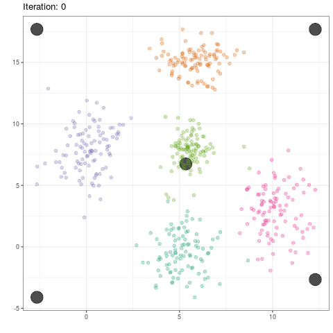
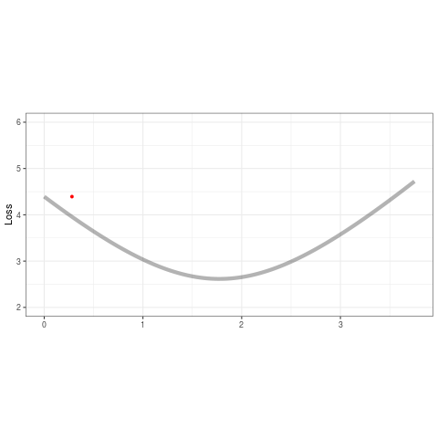

# Machine Learning {#ml}

## Cross Valdiation

### LOOCV

Proof that k-fold CV has less variance around the mean than LOOCV -- better for k-fold CV.

```{r}
N = 1000	# data size
p = .10	# probability of a misclassification

set.seed(100)
d1 <- rbinom(N,1,p)	# bernoulli sampling: sample 1, check if it's a match
mean(d1)
mean(d1)*(1-mean(d1))	# var
var(d1)
```

10-fold CV

```{r}
k = 10				# number of CV replications
n = N/k				# sample size for each k from data N
set.seed(100)
d2 <- rbinom(N,n,p)/n		# binomial sampling: from 1000, 
					# sample 100, sum number that are wrong of 100, 
					# divide by sample size to get error rate
mean(d2)
(k/N)*mean(d2)*(1-mean(d2))	# var
var(d2)
```

note that 10xCV var is < LOOCV var.

## Naive Bayes

```{r}
sex <- rep(c("M","F"),each=4)				# feature 1
h <- c(6,5.92,5.58,5.92,5,5.5,5.42,5.75)		# feature 2
w <- c(180,190,170,165,100,150,130,150)		# feature 3
f <- c(12,11,12,10,6,8,7,9)				# feature 4

df1 <- data.frame(sex,h,w,f)
uh <- tapply(df1$h,df1$sex,mean)
uf <- tapply(df1$f,df1$sex,mean)
uw <- tapply(df1$w,df1$sex,mean)
sh <- tapply(df1$h,df1$sex,sd)
sf <- tapply(df1$f,df1$sex,sd)
sw <- tapply(df1$w,df1$sex,sd)

new <- data.frame("h"=6,"w"=130,"f"=8)

ps <- table(df1$sex)/length(df1$sex)	# P(F) P(M)
phgs <- dnorm(new$h,uh,sh)			# P(h|F) P(h|M)
pwgs <- dnorm(new$w,uw,sw)			# P(h|F) P(h|M)
pfgs <- dnorm(new$f,uf,sf)			# P(h|F) P(h|M)

postf <- ps[1]*phgs[1]*pwgs[1]*pfgs[1]	# P(sex|h,w,f) = P(sex)*P(h|sex)*P(w|sex)*P(f|sex)
postm <- ps[2]*phgs[2]*pwgs[2]*pfgs[2]

if (postm > postf) "M" else "F"

```

## SVM

```{r, message=F, warning=F,echo=F}
library(kernlab)
```

```{r}
data(iris)
train <- iris
train$y <-ifelse(train[,5]=="setosa", 1, -1)

train <- train[order(train$y, decreasing=TRUE),]

X <- as.matrix(train[,c("Petal.Length", "Petal.Width")])
y <- as.matrix(train$y)
n <- dim(X)[1]
```

\[
\begin{aligned}
\max \alpha &W(\alpha) = \sum{\alpha_1} - -.5 \sum{y_i y_j \alpha_i \alpha_j x_i^T x_j}\\
             &\text{s.t.} \quad \alpha_i \ge 0\\
             &\text{s.t.} \quad \sum_{\alpha_i * y_i} = 0
\end{aligned}
\]

is equivalent to

\[
\begin{aligned}
\min \alpha - &\alpha + 0.5 \alpha^T * H * \alpha\\
             &\text{s.t.} \quad \alpha \ge 0\\
             &\text{s.t.} \quad A \alpha \le 0\\
             &\text{where} \quad H(i,j) = y_i y_j x_i^T x_j\\
             &\text{where} \quad A = y^T\\
             &\text{note} \quad \max z \equiv \min -z
\end{aligned}
\]

And ipop is

\[
\begin{aligned}
\min_\alpha c &\alpha + 0.5 x^T H x\\
             &\text{s.t.} \quad b \le A \alpha \le b + r\\
             &\text{s.t.} \quad l \le \alpha \le u\\
             &\text{thus} \quad c=-1\\
             &\text{thus} \quad u = \infty, l=0 \quad \text{but will set $u$ to a large number}\\
             &\text{thus} \quad b=0, r=0 \quad \text{to remove this contraint}
\end{aligned}
\]


```{r}
H <- matrix(NA,n,n)
for (i in 1:n){
  for (j in 1:n){
    H[i,j] <- y[i]*y[j]*t(X[i,])%*%X[j,]
  }
}

A <- t(y)
c <- matrix(rep(-1,n))
l <- matrix(rep(0,n))
b <- 0
u <- matrix(rep(1e5,n))
r <- 0

alpha <- primal(ipop(c,H,A,b,l,u,r))

nonzero <- which(abs(alpha) > 1e-5)
w <- matrix(NA,nrow=length(nonzero),ncol=ncol(X))
for (i in seq_along(nonzero)){
  w[i,]  <- alpha[nonzero[i]]*y[nonzero[i]]*X[nonzero[i],]
}
w <- colSums(w)

b0 <- -(max(sapply(1:sum(y==-1), function(i) matrix(w,ncol=2) %*% X[y==-1,][i,])) + min(sapply(1:sum(y==1), function(i) matrix(w,ncol=2) %*% X[y==1,][i,])))/2

slope <- -w[1]/w[2]
intercept <- -b0/w[2]

plot(X,pch=19,col=ifelse(1:n %in% nonzero,"green","black")) # green ~ support vectors
abline(intercept,slope,col="red")

sigma = 1
rbf <- rbfdot(sigma = sigma)
H_rbf <- kernelMatrix(rbf,X)
```

### Manual rbf kernal

```{r}
XtX <- X%*%t(X) # crossprod(t(X))
XX <- matrix(1, n) %*% diag(XtX)
D <- XX - 2 * XtX + t(XX)
H <- exp(-D/(2 * sigma))

alpha <- primal(ipop(c,H,A,b,l,u,r))

nonzero <- which(abs(alpha) > 1e-5)
w <- matrix(NA,nrow=length(nonzero),ncol=ncol(X))
for (i in seq_along(nonzero)){
  w[i,]  <- alpha[nonzero[i]]*y[nonzero[i]]*X[nonzero[i],]
}
w <- colSums(w)

b0 <- -(max(sapply(1:sum(y==-1), function(i) matrix(w,ncol=2) %*% X[y==-1,][i,])) + min(sapply(1:sum(y==1), function(i) matrix(w,ncol=2) %*% X[y==1,][i,])))/2

slope <- -w[1]/w[2]
intercept <- -b0/w[2]

plot(X)
abline(intercept,slope,col="red")
```

## K-means

```{r,eval=FALSE}
library(tidyverse)
library(gganimate)

distance <- function(x,c){
  d <- apply(c,1,function(y) sqrt((x[1]-y[1])^2 + (x[2]-y[2])^2))
  w <- which.min(d)
  return(w)
}

set.seed(123)

x1 <- rnorm(100,5,1)
y1 <- rnorm(100,0,2)
x2 <- rnorm(100,10,1)
y2 <- 3 + rnorm(100,0,2)
x3 <- rnorm(100,0,1)
y3 <- 8 + rnorm(100,0,2)
x4 <- rnorm(100,6,1)
y4 <- 15 + rnorm(100,0,1)
x5 <- rnorm(100,5.5,.5)
y5 <- 8 + rnorm(100,0,1)

data <- data.frame("x" = c(x1,x2,x3,x4,x5), "y" = c(y1,y2,y3,y4,y5), "class" = rep(1:5,each=length(x1)))
c <- matrix(c(min(data$x),max(data$x),min(data$x),max(data$x),mean(data$x),
              min(data$y),max(data$y),max(data$y),min(data$x),mean(data$y)),ncol=2)
data.means <- data.frame(cbind(c,0))
names(data.means) <- c("x","y","class")
print(true <- ggplot(data,aes(x,y,colour=factor(class),size=2)) + geom_point(alpha=.7) + 
        geom_point(data=data.means,colour="red") +
        geom_text(data=data.means,label="mean",vjust=2))
data$class <- 0

c.old <- 0

while (abs(sum(c-c.old)) != 0){
  data$class <- apply(data[,1:2],1,function(x) distance(x,c))
  
  c.old <- c
  c <- cbind(tapply(data$x,data$class,mean),tapply(data$y,data$class,mean))
  
  data.means <- data.frame(cbind(c,0))
  names(data.means) <- c("x","y","class")
}

group_means$iteration <- as.integer(group_means$iteration)
ggplot(data=group_means, aes(x,y)) +
  geom_point(color='black',alpha=.7,size=8) +
  geom_point(data=dat,aes(x,y,color=as.factor(class)),alpha=.3,size=2) +
  scale_color_brewer(type='qual',palette=2) +
  theme_bw() +
  theme(legend.position='none') +
  transition_time(iteration) +
  labs(title = 'Iteration: {frame_time}', x = '', y = '') +
  ease_aes('linear')
```

 

## Gaussian Mixtures

```{r,eval=FALSE}
library(tidyverse)

data <- c(rnorm(50,12,1),rnorm(50,4,1))
ua <- .19; sa <- .5
ub <- .65; sb <- .5

for (i in 1:1000){
  pda <- exp(-(data-ua)^2)
  pdb <- exp(-(data-ub)^2)
  
  pa <- pda/(pda+pdb)
  pb <- pdb/(pda+pdb)
  
  ua <- sum(pa*data)/sum(pa)
  sa <- sum(pa*(data-ua)^2)/sum(pa)
  
  ub <- sum(pb*data)/sum(pb)
  sb <- sum(pb*(data-ub)^2)/sum(pb)
  
  cat(ua,sa,"\n",ub,sb,"\n")
}
```

```{r}
set.seed(43)

N <- 500
p <- rbinom(500,1,.3)
y <- (1-p)*rnorm(N,4,1) + p*rnorm(N,-1,1)

mu1 <- rnorm(1)
mu2 <- rnorm(1)
p <- .5


for (t in 1:2500){
 
  gamma1 <- dnorm(y,mu1,1)
  gamma2 <- dnorm(y,mu2,1)
  
  gamma <- (p*gamma2)/((1-p)*gamma1 + p*gamma2)
  
  mu_hat1 <- sum((1-gamma)*y)/sum(1-gamma)
  mu_hat2 <- sum(gamma*y)/sum(gamma)
  
  mu1 <- mu_hat1
  mu2 <- mu_hat2
  
  p <- sum(gamma)/N
}

mu1
mu2
p
```

```{r, message=F, warning=F,echo=F}
library(tidyverse)
```

```{r}
iter <- 1000
mu1_vector <- vector(length=iter)
mu2_vector <- vector(length=iter)
p_vector <- vector(length=iter)
for (t in 1:iter){
  
  gamma1 <- dnorm(y,mu1,1)
  gamma2 <- dnorm(y,mu2,1)
  
  gamma <- (p*gamma2)/((1-p)*gamma1 + p*gamma2)
  delta <- rbinom(N,1,gamma)
  
  mu_hat1 <- sum((1-delta)*y)/sum(1-delta)
  mu_hat2 <- sum(delta*y)/sum(delta)
  
  mu1 <- rnorm(1,mu_hat1,1)
  mu2 <- rnorm(1,mu_hat2,1)
  p <- sum(gamma)/N
  
  mu1_vector[t] <- mu1
  mu2_vector[t] <- mu2
  p_vector[t] <- p
  
}

qplot(1:iter,mu1_vector,geom='line',colour=1) + geom_line(aes(1:iter,mu2_vector),colour=2) +
  theme(legend.position='none') + labs(title='mu',x='iteration',y='value')
qplot(1:iter,p_vector,geom='line',colour=3) +
  theme(legend.position='none') + labs(title='p',x='iteration',y='value')
```

## PCA

```{r}
set.seed(4131)

x <- 1:101
y1 <- x[1:25] + rnorm(25,0,20)
y2 <- x[26:50] + rnorm(25,-2,5)
y3 <- x[51:75] + rnorm(25,10,7)
y4 <- x[76:101] + rnorm(26,0,15)
x <- scale(x)
y <- scale(c(y1,y2,y3,y4))
x <- cbind(x,y)
x <- (x-mean(x))/sd(x)

df <- data.frame(cbind(data.frame(x),rep(LETTERS[1:4],c(25,25,25,26))))
names(df) <- c('x','y','group')
ggplot(df,aes(x=x,y=y,colour=group)) + geom_point()

evd <- eigen(cov(x))
pc1 <- evd$vectors[,1]
pc2 <- evd$vectors[,2]

proj1 <- x %*% pc1
proj2 <- x %*% pc2
vare <- sum(x[,1]*pc1[1])^2 + sum(x[,2]*pc1[2])^2 

df2 <- data.frame(cbind(proj1,0),df$group)
names(df2) <- c('x','y','group')
ggplot(df,aes(x=x,y=y,colour=group)) + geom_point(alpha=.3) + 
  geom_point(data=df2,alpha=1)

set.seed(4131)
x1 <- c(rnorm(100,68,5),rnorm(100,78,5),rnorm(100,63,4))
x2 <- c(rnorm(100,215,40),rnorm(100,200,20),rnorm(100,125,15))
x3 <- c(rnorm(100,280,50),rnorm(100,180,15),rnorm(100,95,15))

x1 <- scale(x1)
x2 <- scale(x2)
x3 <- scale(x3)

x <- cbind(x1,x2,x3)

df <- data.frame(cbind(data.frame(x),rep(c("Compact Guys","Lanky Guys","Women"),each=100)))
names(df) <- c('x1','x2','x3','group')

evd <- eigen(cov(x))
pc1 <- evd$vectors[,1]
pc2 <- evd$vectors[,2]
pc3 <- evd$vectors[,3]

proj1 <- x %*% pc1
proj2 <- x %*% pc2
proj3 <- x %*% pc3
vare <- sum(x[,1]*pc1[1])^2 + sum(x[,2]*pc1[2])^2 + sum(x[,3]*pc1[3])^2 

df2 <- data.frame(cbind(proj1,proj2),df$group)
names(df2) <- c('x','y','group')
ggplot(df2,aes(x=x,y=y,colour=group)) + geom_point(alpha=1)
```

## Viterbi Algorithm

```{r}
init <- log(c(.5,.5),2)
trans1 <- log(c(.5,.5),2)
trans2 <- log(c(.4,.6),2)
vis1 <- log(c(.2,.3,.3,.2),2)
vis2 <- log(c(.3,.2,.2,.3),2)

seq <- "GGCACTGAA"
dic <- c("A","C","G","T")

viterbi <- function(seq){
  if (nchar(seq) == 1){
    
    nt <- which(dic == seq)
    print(comp <- c(init[1] + vis1[nt], init[2] + vis2[nt]))
    return(c(comp))
    
  }else{
    
    nt <- which(dic == substr(seq,nchar(seq),nchar(seq)))
    past <- viterbi(substr(seq,1,nchar(seq)-1))
    if (past[1] > past[2]) ans <- 1 else ans <- 2
    print(ans)
    print(
      choice <- c(
        vis1[nt] + max(past[1] + trans1[1], past[2] + trans2[1]),
        vis2[nt] + max(past[1] + trans1[2], past[2] + trans2[2])
      )
    )
  }
}

init <- c(.5,.5)
trans1 <- c(.5,.5)
trans2 <- c(.4,.6)
vis1 <- c(.2,.3,.3,.2)
vis2 <- c(.3,.2,.2,.3)

path <- c(3,3,2,1)

latent1 <- 0
latent2 <- 0

prev1 <- init[1]*vis1[path[1]]
prev2 <- init[2]*vis2[path[1]]
for (i in 2:length(path)){

  prevtemp1 <- prev1*trans1[1]*vis1[path[i]] + prev2*trans2[1]*vis1[path[i]]
  prevtemp2 <- prev2*trans2[2]*vis2[path[i]] + prev1*trans1[2]*vis2[path[i]]
  
  prev1 <- prevtemp1
  prev2 <- prevtemp2
}
print(prev1 + prev2)
```

## Gradient Descent

```{r, eval=FALSE}
set.seed(12345) 

x <- sample(seq(from = 0, to = 2, by = 0.1), size = 50, replace = TRUE)
y <- 2 * x + rnorm(50)
x <- x - mean(x)
y <- y - mean(y)

X <- cbind(1,x)
y <- as.vector(y)

iter <- 5000
a <- 0.01
b <- rep(0,ncol(X)) # b0

loss <- matrix(0,nrow=iter,ncol=1)
B <- matrix(0,nrow=iter,ncol=1)
for (i in 1:iter){
  fb <- (1/2) * norm(y - X %*% b,"F")
  loss[i,] <- fb
  grad.fb <- -(t(X) %*% (y - X %*% b)) # flip sign to DESCEND
  b <- b - a*grad.fb
  B[i] <- b[2,]
}

out <- pretty(c(min(x)-2,max(x)+6),10000)
out2 <- sapply(1:length(out), function(x) (1/2) * norm(y - X %*% rbind(0,out)[,x],"F"))

ggplot(tibble(b=B,loss=loss,iteration=1:length(b)) %>% filter(iteration < 50),aes(b,loss)) + 
ggplot(tibble(b=B,loss=loss,iteration=1:length(b)) %>% filter(iteration < 50),aes(b,loss)) + 
  geom_line(data=tibble(x=out,y=out2),aes(x,y),alpha=.3,size=2) +
  geom_point(color='red',alpha=1,size=1.2) +
  geom_line(color='red',alpha=.8,size=.5) +
  transition_reveal(iteration,range=c(1L,25L)) + 
  ease_aes('quadratic-out') +
  theme_bw() +
  xlim(0,3.75) + ylim(2,6) + theme(aspect.ratio=.5) + 
  labs(title = '', x = '', y = 'Loss')
```



### Linear Regression

#### SGD

```{r}
N <- 50
X <- cbind(1,runif(N,-1,1),runif(N,-1,1))
k <- ncol(X)
theta <- rnorm(k)
y <- X %*% theta + rnorm(N)

th <- matrix(rep(0,k),nrow=k)
eta <- 0.01
for (i in 1:10000){
  grad <- matrix(rep(0,k),nrow=k)
  for (j in 1:N){
    grad <- grad - X[j,] %*% (y[j]-X[j,]%*%th)
  }
  th <- th - eta*grad
}

t(th)
coef(lm(y ~ X[,-1]))
```

#### Vectorized

```{r}
th <- matrix(rep(0,k),nrow=k)
eta <- 0.01
for (i in 1:10000){
  grad <- t(X) %*% (X %*% th - y)
  th <- th - eta*grad
}

t(th)
coef(lm(y ~ X[,-1]))
```

### Logistic Regression

```{r}
invlogit <- function(x) 1/(1+exp(-x))

N <- 500
X <- cbind(1,runif(N,-1,1))
k <- ncol(X)
theta <- rnorm(k)
y <- rbinom(N,1,invlogit(X %*% theta))


N <- 500
X <- cbind(runif(N,-1,1),runif(N,-1,1))
theta <- c(1.5,-3)
y <- 1+ifelse(X %*% theta + rnorm(N) < 0, 0, 1)
```

#### SGD

```{r}
th <- matrix(rep(0,k),nrow=k)
eta <- 0.25
for (i in 1:5000){
  g <- matrix(rep(0,k),nrow=k)
  for (j in 1:N){
    g <- g - X[j,] %*% (y[j]-invlogit(X[j,]%*%th))
  }
  th <- th - eta*g
}
scores <- X %*% th
pred <- ifelse(scores>0,1,0)

plot(X,col=y+1,pch=19)
plot(X,col=pred+1,pch=19)
```

#### Vectorized

```{r}
th <- matrix(rep(0,k),nrow=k)
eta <- .01
for (i in 1:10000){
  g <- t(X) %*% (invlogit(X %*% th)-y)
  th <- th - eta*g
}
scores <- X %*% th
pred <- ifelse(scores>0,1,0)

plot(X,col=y+1,pch=19)
plot(X,col=pred+1,pch=19)
```

#### Newtons

```{r}
th <- matrix(rep(0,k),nrow=k)
eta <- 1
for (i in 1:5000){
  p <- invlogit(X %*% th)
  S <- diag(c(p * (1-p)),N,N)
  H <- t(X) %*% S %*% X
  g <- t(X) %*% (p-y)
  th <- th - eta * solve(H) %*% g
}
scores <- X %*% th
pred <- ifelse(scores>0,1,0)

plot(X,col=y+1,pch=19)
plot(X,col=pred+1,pch=19)
```

### Softmax regression

```{r}
N <- 1000
X <- cbind(1,runif(N,0,100),runif(N,0,100))
theta <- rbind(c(100,-1,-1),c(100,0,-2))
y <- 1 + ifelse(X %*% theta[1,] + rnorm(N,0,10) < 0, 0,
              ifelse(X %*% theta[2,] + rnorm(N,0,10) < 0, 1, 2))
X[,-1] <- scale(X[,-1])
K <- ncol(X)
J <- length(unique(y))
```

#### SGD

```{r}
th <- matrix(rep(0,K*J),nrow=K,ncol=J)
g <- th
eta <- .5
for (i in 1:5000){
  a <- exp(X %*% th) # exp(thetak' * xi)
  a_sum <- rowSums(a) # SUMexp(thetaj' * xi)
  p <- t(sapply(1:N,function(n) a[n,]/a_sum[n])) # P(yi=k|xi,theta) = exp(thetak' * xi)/SUMexp(thetaj' * xi)
  
  # -SUM[xi * (1{yi=k} - P(yi=k|xi;theta))] = SUM[xi * (P(yi=k|xi;theta)) - 1{yi=k}]
  # therefore P(yi=k|xi;theta)) - 1{yi=k} is simply p-1 for all p where yi=k
  
  for (n in 1:N){
    p[n,y[n]] <- p[n,y[n]] - 1 # P(yi=k|xi;theta)) - 1{yi=k}
  }
  p <- p/N # this is not necessary but adjusts the size of the estimates to avoid very large values
  g <- t(X) %*% p # SUM[xi * (P(yi=k|xi;theta)) - 1{yi=k}]
  
  th <- th - eta*g
}

scores <- X %*% th 
pred <- apply(scores,1,which.max)

plot(X[,-1],col=y,pch=19)
plot(X[,-1],col=pred,pch=19)
```

#### SGD with bias term

```{r}
N <- 100
D <- 2
K <- 3
X <- matrix(0,N*K,D)
y <- matrix(0,N*K)
ind1 <- 0
ind2 <- 0
for (k in 1:K){
  r <- seq(0,1,length=N)
  t <- seq((k-1)*4,(k)*4,length=N) + rnorm(N)*0.2
  X[(1+ind1):(N+ind2),] <- cbind(r*sin(t), r*cos(t))
  y[(1+ind1):(N+ind2)] <- k
  ind1 <- ind1 + N
  ind2 <- ind2 + N
}

W <- matrix(0.01*rnorm(D*K),D,K)
b <- matrix(0,1,K)
step <- 1
reg <- 1e-3

for (i in 1:5000){
  a <- exp(X %*% W + rep(b,N*K))
  a_sum <- rowSums(a)
  p <- t(sapply(1:(N*K),function(n) a[n,]/a_sum[n]))
  
  for (n in 1:(N*K)){
    p[n,y[n]] <- p[n,y[n]] - 1
  }
  p <- p/(N*K)
  
  gW <- t(X) %*% p
  gb <- colSums(p)
  
  gW <- gW + reg*W
  W <- W + -step*gW
  b <- b + -step*gb
}

scores <- X %*% W + rep(b,N*K)
pred <- apply(scores,1,which.max)

plot(X,col=y,pch=19)
plot(X,col=pred,pch=19)
```

## Nonparametric Bayesian Processes

### Chinese Restaurant

```{r}
chinese_restaurant <- function(N, alpha){
  tables <- vector(length=N)
  tables[1] <- 1
  open <- 2
  for (i in 2:N){
    choice <- rbinom(1,1,alpha/(i+alpha))
    if (choice == 1){
      tables[open] <- tables[open] + 1
      open <- open + 1
    }else{
      occupied <- which(tables != 0)
      prob <- tables[occupied]/(i+alpha)
      seat <- sample(occupied,1,FALSE,prob)
      tables[seat] <- tables[seat] + 1
    }
  }
  return(tables)
}

chinese_restaurant(30,10)
```

### Polyas Urn

```{r}
polyas_urn <- function(N,alpha){
  balls <- NULL
  for (i in 1:N){
    choice <- rbinom(1,1,alpha/(length(balls)+alpha))
    if (choice == 1){
      ball <- rnorm(1)
      balls <- c(balls,ball)
    }else{
      ball <- balls[sample(1:length(balls),1)]
      balls <- c(balls,ball) 
    }
  }
  return(balls)
}

rep_polyas_urn <- function(N,alpha,R){
  out <- data.frame(replicate(R,polyas_urn(N,alpha)))
  colnames(out) <- 1:R
  out %>%
    gather(r,sample) %>%
    mutate(r=as.factor(r)) %>%
    ggplot(aes(x=sample,y = ..scaled..)) + 
      geom_density(colour="black",size=1,fill="darkgreen") + 
      facet_wrap(~r) + xlim(-3,3) + ylab("") + xlab("")
}

rep_polyas_urn(25,500,12)
```

### Stick Breaking

```{r}
stick_breaking <- function(N,alpha){
  p <- rbeta(N,1,alpha)
  len <- 1
  w <- p[1]
  for (i in 2:N){
    len <- len-w[i-1]
    w_new <- p[i]*(len)
    w <- c(w,w_new)
  }
  return(w)
}

rep_stick_breaking <- function(N,alpha,R){
  out <- data.frame(replicate(R,stick_breaking(N,alpha)),1:N)
  colnames(out) <- c(1:R,"Breaks")
  out %>%
    gather(r,Probability,-Breaks) %>%
    mutate(r=as.factor(r),Breaks=as.factor(Breaks)) %>%
    ggplot(aes(x=Breaks,y=Probability,ymin=0,ymax=Probability)) +
      geom_linerange(colour="Blue",size=1) +
      geom_point(colour="Blue",size=4) +
      scale_y_continuous(lim=c(0,1)) +
      facet_wrap(~r) +
      theme(panel.background = element_rect(),
            title=element_text(size=20),
            strip.text=element_text(size=13),
            axis.text=element_text(size=13),
            axis.title=element_text(size=18,face="bold")) +
    ggtitle(bquote(alpha == .(paste(alpha,collapse=" "))))
}

rep_stick_breaking(10,1,12)
```

## Iteratively Reweighted Least Squares

```{r}
inv_logit <- function(x) return(1/(1+exp(-x)))

N <- 100
k <- 1
X <- cbind(1,matrix(runif(N*k,-1,1)))
theta_true <- matrix(c(.25,-.75),ncol=1)
y <- rbinom(N,1,inv_logit(X %*% theta_true))
summary(glm(y ~ X[,-1], family=binomial(link="logit")))

irls <- function(X,y,tol=1e-6){
  k <- ncol(X)
  N <- nrow(X)
  theta <- matrix(rep(0,k),ncol=1)
  theta_new <- Inf
  
  while (max(abs(theta - theta_new)) > tol){
    a <- X %*% theta
    p <- inv_logit(a)
    s <- diag(c(p*(1-p)),N,N)
    xsx <- t(X) %*% s %*% X
    sxt <- s %*% X %*% theta
    
    theta_new <- theta
    theta <- solve(xsx) %*% t(X) %*% (sxt + y - p)
  }
  return(theta)
}
```

## Neural Network

```{python,eval=FALSE}
import numpy as np
import random
import cPickle
import gzip
import os
import sys

def load_data():
    f = gzip.open('mnist.pkl.gz', 'rb')
    training_data, validation_data, test_data = cPickle.load(f)
    f.close()
    return (training_data, validation_data, test_data)
    
def load_data_wrapper():
    tr_d, va_d, te_d = load_data()
    training_inputs = [np.reshape(x, (784, 1)) for x in tr_d[0]]
    training_results = [vectorized_result(y) for y in tr_d[1]]
    training_data = zip(training_inputs, training_results)
    validation_inputs = [np.reshape(x, (784, 1)) for x in va_d[0]]
    validation_data = zip(validation_inputs, va_d[1])
    test_inputs = [np.reshape(x, (784, 1)) for x in te_d[0]]
    test_data = zip(test_inputs, te_d[1])
    return (training_data, validation_data, test_data)
    
def vectorized_result(j):
    e = np.zeros((10, 1))
    e[j] = 1.0
    return e
    
def sigmoid(z):
    return 1.0/(1.0+np.exp(-z))
    
def sigmoid_prime(z):
    return sigmoid(z)*(1-sigmoid(z))

training_data, validation_data, test_data = load_data_wrapper()

sizes = [784, 30, 10]
num_layers = len(sizes)
eta = 3.0 # must be real, not integer (so not 3)
epochs = 30
n = len(training_data)
n_test = len(test_data)
mini_batch_size = 10

biases = [np.zeros((y, 1)) for y in sizes[1:]]
weights = [np.random.randn(y, x) for x, y in zip(sizes[:-1], sizes[1:])]
for j in xrange(epochs):
    
        random.shuffle(training_data)
        mini_batches = [training_data[k:k+mini_batch_size] for k in xrange(0, n, mini_batch_size)] # n/mini_batch_size
        # mini_batches is the result of breaking the training_data into length 25 batches, so 2000 mini_batches
for mini_batch in mini_batches:
        
            # start gradient at 0
            nabla_b = [np.zeros(b.shape) for b in biases]
            nabla_w = [np.zeros(w.shape) for w in weights]
    
            for x, y in mini_batch:
delta_nabla_b = [np.zeros(b.shape) for b in biases]
                delta_nabla_w = [np.zeros(w.shape) for w in weights]
# forward pass
                activation = x
                activations = [x] # list to store all the activations, layer by layer
                zs = [] # list to store all the z vectors, layer by layer
for b, w in zip(biases, weights):
                    z = np.dot(w, activation) + b
                    zs.append(z)
                    activation = sigmoid(z)
                    activations.append(activation)
                # dot product between w1 in layer 1-2 with activation=input, add b1 for layer 2, set output as activation1
                # dot product between w2 in layer 2-3 with activation=activation1, add b2 for layer 3, set output as activation2
# backward pass
                delta = (activations[-1]-y) * sigmoid_prime(zs[-1]) # dC/dz_lj = (a - y) * o'(z), cost wrt output layer
                delta_nabla_b[-1] = delta # dC/db_lj = delta_lj
                delta_nabla_w[-1] = np.dot(delta, activations[-2].transpose()) # dC/dw_ljk = a_(l-1)k * delta_lj
for l in xrange(2, num_layers):
                    delta = np.dot(weights[-l+1].transpose(), delta) * sigmoid_prime(zs[-l]) # dC/dz_lj
                    delta_nabla_b[-l] = delta # dC/db_lj
                    delta_nabla_w[-l] = np.dot(delta, activations[-l-1].transpose()) # dC/dw_ljk
nabla_b = [nb+dnb for nb, dnb in zip(nabla_b, delta_nabla_b)]
                nabla_w = [nw+dnw for nw, dnw in zip(nabla_w, delta_nabla_w)]
biases = [b-(eta/len(mini_batch))*nb for b, nb in zip(biases, nabla_b)]
            weights = [w-(eta/len(mini_batch))*nw for w, nw in zip(weights, nabla_w)]
test_results = [(np.argmax(feedforward(x,biases,weights)), y) for (x, y) in test_data]
        test_results = sum(int(x == y) for (x, y) in test_results)
        
        print "Epoch {0}: {1} / {2} | mean_w = {3} | mean_nabla_w = {4}".format(j, test_results, n_test,np.mean(weights[1]),np.mean(nabla_w[1]))
```
