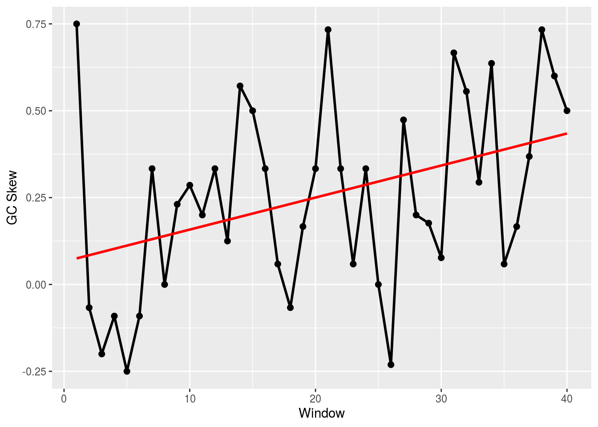
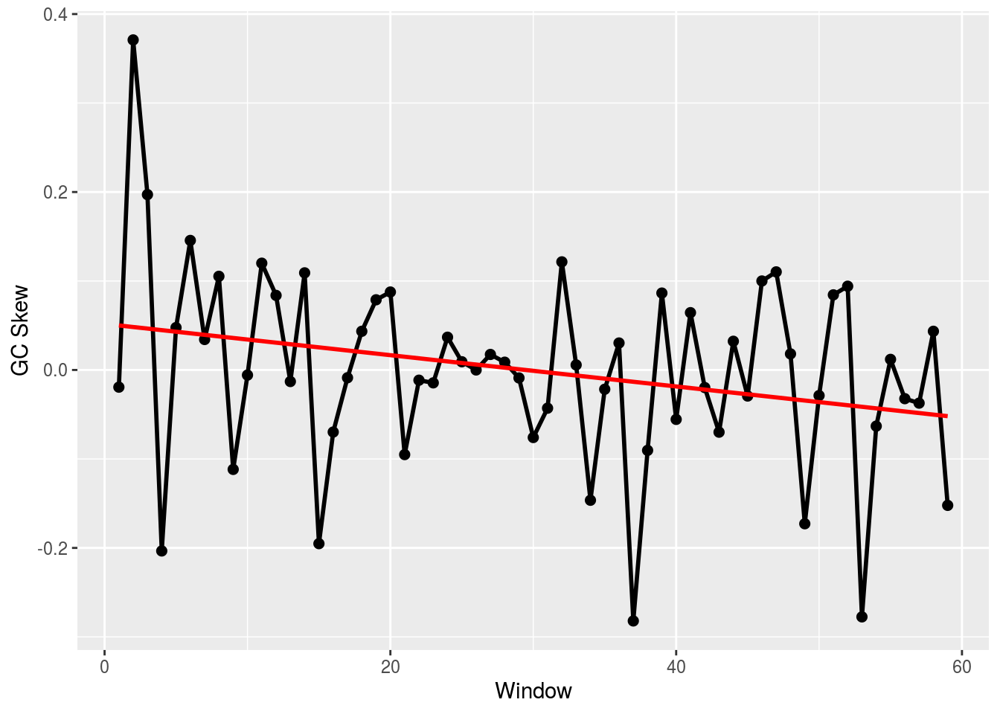
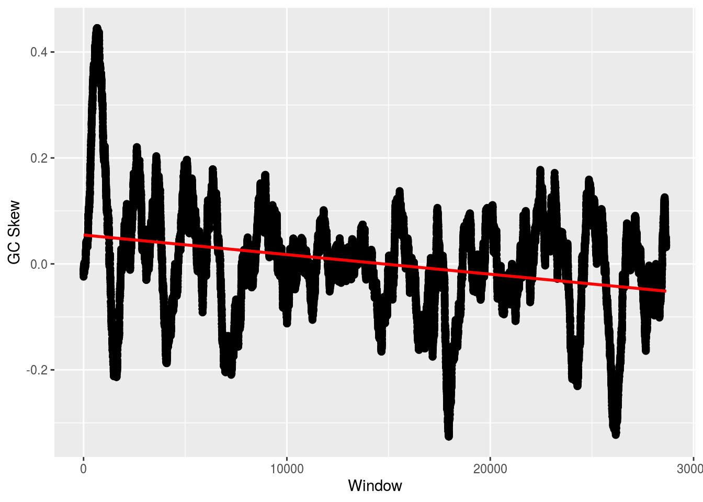

# Bioconductor {#biocond}


```r
library(Biostrings)
library(tidyverse)
library(reutils)
library(XML)
library(BSgenome)
library(BSgenome.Athaliana.TAIR.04232008)

source('https://gist.githubusercontent.com/sw1/8870a124624f31585d5c15be72fcfc21/raw/162b0c542482d481f79b0160071114eb38cb568e/r_bioinformatics_functions.R')
```


### Loading FASTA Files

A FASTA file is a file containing multiple nucleotide or amino acid sequences, each with their own identifier, formatted as a header that starts with '>'. A file essentially looks like


```r
>Sequence_1
GGCGAT
>Sequence_2
AAATCG
```

and so on. The structure of the content of the file is important, not necessarily the file extension. You can have a FASTA file with a .txt extension, no extension, or the common .fna extension. The trick is to know how these files are formatted to identify them. (Note that wikipedia tends to have the best information on bioinformatics file types, quality scoring, etc.)

The other file type worth noting is FAST**Q**, which, in addition to sequence information, also contains a quality score for each position in the sequence that measures how likely that nucleotide or protein is correct. FASTQ files look somewhat different than FASTA:


```r
@Sequence_1
GATTTGGGGTTCAAAGCAGTATCGATCAAATAGTAAATCCATTTGTTCAACTCACAGTTT
+
!''*((((***+))%%%++)(%%%%).1***-+*''))**55CCF>>>>>>CCCCCCC65
@Sequence_2
GATTTGGGGTTCAAAGCAGTATCGATCAAATAGTAAATCCATTTGTTCAACTCACAGTTT
+
9C;=;=<9@4868>9:67AA<9>65<=>59-+*''))**55CCFMNO>>>>>>FFFFC65
```

Again, for a given sequence, line 1 has the header, but unlike the FASTA file, FASTQ headers begin with '@'. Line 2 is the actual sequence, followed by '+' on line 3. The quality score is then found on line 4 and will be the same length as the sequence on line 1. 

Let's load a FASTA file. We'll use a simple Bioconductor function. 


```r
fasta <- readDNAStringSet('https://gist.githubusercontent.com/sw1/8870a124624f31585d5c15be72fcfc21/raw/f1fb586160d12c34f29532c731066fd8912a0e0c/example.fasta',format='fasta')
fasta
```

```
##   A DNAStringSet instance of length 8
##     width seq                                               names               
## [1]   893 TGGTAGAACGTGTGGGCTCGAGA...TCCCTAGTTAGCGAGGTCCATAA Sequence_9715
## [2]   860 TACTGCTTGTACAAGCCTCATCT...TAATAGACGTTGTACCGGGGGAA Sequence_5667
## [3]   815 TATGTGTTTCATTTAGGACCTCG...GTTCCATAAAACGGTCAAGCAGT Sequence_2989
## [4]   912 TGGTGCCGAGGCTCGAGTGTACG...GGTATGGGAAATTCAACAAACAC Sequence_2049
## [5]   806 CTAGCAATGGCAAATTAGATGTA...ACTTGAACAGAAAATCAACCGGA Sequence_5456
## [6]   834 AAACGAGAACGTGGAGATTTGCC...CAGTCGGGAGTACTAACTGATTT Sequence_1118
## [7]   818 CAGAAAGCATGAGTCTCGCCCTG...AGCTTACGCCTATTTTCCCCAGT Sequence_7043
## [8]   878 CGCCGCACTATCCACGTTAAAAG...TCTAAGTAGTACCTAACAGAACA Sequence_0123
```

For FASTQ, it's essentially the same except we change 'fasta' to 'fastq' for the format argument:


```r
fastq <- readDNAStringSet('https://gist.githubusercontent.com/sw1/8870a124624f31585d5c15be72fcfc21/raw/f1fb586160d12c34f29532c731066fd8912a0e0c/example.fastq',format='fastq')
fastq
```

```
##   A DNAStringSet instance of length 250
##       width seq                                             names               
##   [1]    31 TTTCCGGGGCACATAATCTTCAGCCGGGCGC                 Sequence_2:UMI_AT...
##   [2]    31 TATCCTTGCAATACTCTCCGAACGGGAGAGC                 Sequence_8:UMI_CT...
##   [3]    31 GCAGTTTAAGATCATTTTATTGAAGAGCAAG                 Sequence_12:UMI_G...
##   [4]    31 GGCATTGCAAAATTTATTACACCCCCAGATC                 Sequence_21:UMI_A...
##   [5]    31 CCCCCTTAAATAGCTGTTTATTTGGCCCCAG                 Sequence_29:UMI_G...
##   ...   ... ...
## [246]    31 GCTGTAGGAACAGCAGTCTTGGTGGTTAGCA                 Sequence_819:UMI_...
## [247]    31 CCATTATAATAGCCATCTTTATTTGTAAAAA                 Sequence_823:UMI_...
## [248]    31 AGCTTTGCAACCATACTCCCCCCGGAACCCA                 Sequence_824:UMI_...
## [249]    31 GCCCCCCCCCAAATCGGAAAAACACACCCCC                 Sequence_828:UMI_...
## [250]    31 AGGGTGGGGGATCACATTTATTGTATTGAGG                 Sequence_834:UMI_...
```

### Creating Sequence Sets

Let's approach a FASTA problem from a different direction now. We'll create a DNA string set from a bunch of individual sequences, then write the set to a FASTA file.

Run the following command to add three new variables to your environment: **s1**, **s2**, and **s3**. Each represents a different DNA sequence or 'read.'


```r
problem_createsequencesets()
```

```
## Added s1, s2, and s3 to environment.
```

We're going to create a DNAStringSet object, which can then be saved as a FASTA file. First, we have to combine the sequences into a vector and then pass this vector into **DNAStringSet()**.


```r
S <- c(s1,s2,s3)
SS <- DNAStringSet(S)
```

Recall that FASTA files have header names. Let's create header names for these three sequences. We can manually do it like so


```r
names(SS) <- c('sequence_1','sequence_2','sequence_3')
```

but this will be far from ideal if we had, say, 100,000 sequences. Instead, we're going to use a function called **paste()**, which basically pastes together vectors of text, element-wise:


```r
DOG <- c('dog1','dog2','dog3')
CAT <- c('cat1','cat2','cat3')

paste(DOG,CAT)
```

```
## [1] "dog1 cat1" "dog2 cat2" "dog3 cat3"
```

```r
paste(DOG,CAT,sep='-')
```

```
## [1] "dog1-cat1" "dog2-cat2" "dog3-cat3"
```

```r
paste(DOG,CAT,sep='_')
```

```
## [1] "dog1_cat1" "dog2_cat2" "dog3_cat3"
```

```r
paste(DOG,CAT,sep='')
```

```
## [1] "dog1cat1" "dog2cat2" "dog3cat3"
```

```r
paste('dog','cat',1:3,sep='')
```

```
## [1] "dogcat1" "dogcat2" "dogcat3"
```

```r
paste('dog','cat',1:3,sep='_')
```

```
## [1] "dog_cat_1" "dog_cat_2" "dog_cat_3"
```

```r
paste('dog_','cat',1:3,sep='')
```

```
## [1] "dog_cat1" "dog_cat2" "dog_cat3"
```

This is how we'll create our header names. We can grab the number of total sequences in our set using length(), which will let us create a vector to number our sequences. We'll create a header name that includes each sequence number, the word sequence, along with a user name. We'll also pass in the date using the **date()** function.


```r
seq_names <- paste('sequence_',1:length(SS),' | User_12 | ',date(), sep='')
seq_names
```

```
## [1] "sequence_1 | User_12 | Fri Feb 28 19:10:31 2020"
## [2] "sequence_2 | User_12 | Fri Feb 28 19:10:31 2020"
## [3] "sequence_3 | User_12 | Fri Feb 28 19:10:31 2020"
```

Now, we'll rename the sequences in the set with these names:


```r
names(SS) <- seq_names
```

Finally, we can save our sequence set as a FASTA file:


```r
output_name <- 'seq_set_out.fasta'
writeXStringSet(SS,file=output_name,format="fasta")
```

### Sample Metadata

Often, the sequences we're working with have corresponding metadata. These metadata can range from information about the specific sequence (e.g., the type of sequencer used) to information about the organism from which the sequence was acquired (e.g., species, treatment, age). The way in which we can link our sequence reads in the FASTA file to the metadata is via the header name.

Load the following sequence set:


```r
FASTA <- readDNAStringSet('https://gist.githubusercontent.com/sw1/8870a124624f31585d5c15be72fcfc21/raw/10bc2f50d1c739827ea2ba4edb146b36a6a4c14a/problems_metadata.fasta',format='fasta')
```

To place the metadata, named **META**, into your environement, run the following:


```r
problem_metadata(FASTA)
```

```
## Added META to environment.
```

We'll henceforth refer to the rows as 'samples.' If we want to know which samples were sequenced at the Philadelphia sequencing center, we can type


```r
which(META$Center == 'Philadelphia')
```

```
## [1]  86  88  89  91  92  99 100
```

If we wanted to find the sequence with the header name 'Rosalind_6333', we can do


```r
FASTA['Sequence_6333']
```

```
##   A DNAStringSet instance of length 1
##     width seq                                               names               
## [1]  1000 TTCGCAGTATCCAGGTACAGGGG...TCGGACGATGACAGTGGACATGT Sequence_6333
```

And if we wanted to get the sequences corresponding to rows 12, 15, and 78 in the metadata file:


```r
header_names <- META$ID[c(12,15,78)]
FASTA[header_names]
```

```
##   A DNAStringSet instance of length 3
##     width seq                                               names               
## [1]  1000 TTGCAGGGTGGGCATGGTGGTAG...GTCAGCGATTAACATGTTGGCTA Sequence_1385
## [2]  1000 CACTGAGGCGAATGAATATAAAA...GCCGAATAGCTACAACAGACACT Sequence_7797
## [3]  1000 ATTGGTTTTGAAGCGACAGCGTT...TTCAGATCCGGTCCATAGAAATT Sequence_8314
```

## Creating GC Functions

The goal here will be (a) to demonstrate how to write a function and (b) better understand some useful GC quantification techniques.

We'll create a function that can calcualte the GC content in a given sequence. We'll also give this function an additional parameter that allows it to calculate the GC content at a specific codon position.


```r
gc_calc <- function(x) (x['g']+x['c'])/sum(x)

gc <- function(s,pos){
  
  s <- stringr::str_to_lower(s)
  s <- unlist(strsplit(s,''))
  
  if (!missing(pos)) s <- s[seq(pos,length(s),3)]
  counts <- table(s)
  
  gc_calc(counts)
  
}
```

Now, we'll create a function to calculate the GC skew. This function will calcuate the skew for the entire sequence or successive windows in the sequence of some given size.


```r
gc_skew_calc <- function(x) {counts <- table(x); (counts['g']-counts['c'])/(counts['g']+counts['c'])}

gc_skew <- function(s,win){
  
  s <- stringr::str_to_lower(s)
  s <- unlist(strsplit(s,''))
  
  if (missing(win)) {
    gc <- gc_skew_calc(s)
  }else{
    start <- seq(1,length(s),win)
    gc <- NULL
    for (i in start){
      gc <- c(gc, gc_skew_calc(s[(i):(i+win-1)]))
    }
  }
  
  gc
  
}
```

First, we can look at the GC content in some random sequences:


```r
generate_random_dna_gc_s(len=1000,seed=5)
```

```
## Added s to environment (seed=5).
```

```r
gc(s)
```

```
##     g 
## 0.559
```

```r
gc(s,1)
```

```
##            g 
## 0.5628742515
```

```r
gc(s,2)
```

```
##            g 
## 0.5405405405
```

```r
gc(s,3)
```

```
##            g 
## 0.5735735736
```

And then we can check the skew:


```r
generate_random_dna_skew_s(len=1000,w=1,seed=5)
```

```
## Added s to environment (seed=5).
```

```r
gc_skew(s)
```

```
##            g 
## 0.2573402418
```

```r
gc_skew(s,100)
```

```
##              g              g              g              g              g 
##  0.04545454545 -0.01818181818  0.26315789474  0.37704918033  0.10714285714 
##              g              g              g              g              g 
##  0.35593220339  0.14754098361  0.36666666667  0.26315789474  0.53623188406
```

```r
plot_skew(gc_skew(s,25))
```



## NCBI ESearch

This will look very familiar to the Python tutorial from earlier, but with more of an "R flavor." Let's look for 3 cds entries.


```r
ids1 <- esearch("CFTR AND human[Organism] AND complete",db='nucleotide',retmax=15,sort='relevance')
ids2 <- esearch("PKD1 AND human[Organism] AND complete",db='nucleotide',retmax=15,sort='relevance')
ids3 <- esearch("DMPK AND human[Organism] AND complete",db='nucleotide',retmax=15,sort='relevance')
```

We can parse a particular entry into a dataframe:


```r
ids_df <- reutils::content(esummary(ids1),'parsed')
```

We can also look at the text entries for each gene:


```r
efetch(ids1[1], rettype = "fasta", retmode = "text")
```

```
## Object of class 'efetch' 
## >AH006034.2 Homo sapiens cystic fibrosis transmembrane conductance regulator (CFTR) gene, complete cds
## CCACCCTTGGAGTTCACTCACCTAAACCTCAAACTAATAAAGCTTGGTTCTTTTCTCCGACACGCAAAGG
## AAGCGCTAAGGTAAATGCATCAGACCCACACTGCCGCGGAACTTTTCGGCTCTCTAAGGCTGTATTTTGA
## TATACGAAAGGCACATTTTCCTTCCCTTTTCAAAATGCACCTTGCAAACGTAACAGGGACCCGACTAGGA
## TCATCGGGAAAAGGAGGAGGAGGAGGAAGGCAGGCTCCGGGGAAGCTGGTGGCAGCGGGTCCTGGGTCTG
## GCGGACCCTGACGCGAAGGAGGGTCTAGGAAGCTCTCCGGGGAGCCGTTCTCCCGCCGGTGGCTTCTTCT
## GTCCTCCAGCGTTGCCAACTGGACCTAAAGAGAGGCCGCGACTGTCGCCCACCTGCGGGATGGGCCTGGT
## GCTGGGCGGTAAGGACACGGACCTGGAAGGAGCGCGCGCGAGGGAGGGAGGCTGGGAGTCAGAATCGGGA
## AAGGGAGGTGCGGGGCGGCGAGGGAGCGAAGGAGGAGAGGAGGAAGGAGCGGGAGGGGTGCTGGCGGGGG
## TGCGTAGTGGGTGGAGAAAGCCGCTAGAGCAAATTTGGGGCCGGACCAGGCAGCACTCGGCTTTTAACCT
## GGGCAGTGAAGGCGGGGGAAAGAGCAAAAGGAAGGGGTGGTGTGCGGAGTAGGGGTGGGTGGGGGGAATT
## GGAAGCCAAATGACATCACAGCAGGTCAGAGAAAAAGGGTTGAGCGGCAGGCACCCAGAGTAGTAGGTCT
## ...
## EFetch query using the 'nucleotide' database.
## Query url: 'https://eutils.ncbi.nlm.nih.gov/entrez/eutils/efetch.fcgi?=efe...'
## Retrieval type: 'fasta', retrieval mode: 'text'
```

```r
efetch(ids2[4], rettype = "fasta", retmode = "text")
```

```
## Object of class 'efetch' 
## >AH006528.2 Homo sapiens polycystic kidney disease 1 protein (PKD1) gene, complete cds
## GCACTGCAGCGCCAGCGTCCGAGCGGGCGGCCGAGCTCCCGGAGCGGCCTGGCCCCGAGCCCCGAGCGGG
## CGTCGCTCAGCAGCAGGTCGCGGCCGCGCAGCCCCATCCAGCCCCGCGCCCGCCATGCCGTCCGCGGGCC
## CCGCCTGAGCTGCGGTCTCCGCGCGCGGGCGGGCCTGGGGACGGCGGGGCCATGCGCGCGCTGCCCTAAC
## GATGCCGCCCGCCGCGCCCGCCCGCCTGGCGCTGGCCCTGGGCCTGGGCCTGTGGCTCGGGGCGCTGGCG
## GGGGGCCCCGGGCGCGGCTGCGGGCCCTGCGAGCCCCCCTGCCTCTGCGGCCCAGCGCCCGGCGCCGCCT
## GCCGCGTCAACTGCTCGGGCCGCGGGCTGCGGACGCTCGGTCCCGCGCTGCGCATCCCCGCGGACGCCAC
## AGCGCTGTGAGTAGCGGGCCCAGCGGCACCCGGGAGAGGCCGCGGGACGGGCGGGCGTGGGCGCGTTCCC
## TGGCCCGGGACGGGAAGCAGGACGCGGGCCAGGACGCTCCCAGGGCGAGGCTCCGGCGCGGCACGGCGGC
## CCTGCTAAATAAGGAACGCCTGGAGCCGCGGTTGGCACGGCCCCGGGGAGCCGAAAAACCCCGGGTCTGG
## AGACAGACGTCCCACCCGGGGGCTCTGCAGACGCCAGCGGGGGCGGGGCGCGGAGGCCGCGCTCAGCTGG
## GAGGACAAACAGTCGCTAATTGGAGAGGAATTGGGATGCGGCCTGGGGCTGCGGGGTACCCGGAGAGGTG
## ...
## EFetch query using the 'nucleotide' database.
## Query url: 'https://eutils.ncbi.nlm.nih.gov/entrez/eutils/efetch.fcgi?=efe...'
## Retrieval type: 'fasta', retrieval mode: 'text'
```

```r
efetch(ids3[5], rettype = "fasta", retmode = "text")
```

```
## Warning: HTTP error: Status 429; Too Many Requests
```

```
## Object of class 'efetch' 
## [1] "HTTP error: Status 429; Too Many Requests"
## EFetch query using the 'nucleotide' database.
## Query url: 'https://eutils.ncbi.nlm.nih.gov/entrez/eutils/efetch.fcgi?=efe...'
## Retrieval type: 'fasta', retrieval mode: 'text'
```

These look good, so let's combine the UIDs into a vector:


```r
ids <- c(ids1[1],ids2[4],ids3[5])
```

Now, we can extract important information, such as the sequence, by switching to XML mode:


```r
FASTA <- efetch(ids,db='nucleotide', rettype = "fasta", retmode = "xml")
```

```
## Warning: HTTP error: Status 429; Too Many Requests
```

```r
SEQS <- FASTA$xmlValue('//TSeq_sequence')
```

But there is actually a much better way, consistent with the FASTA tutorial above:


```r
tmp <- tempfile()
FASTA <- efetch(ids,db='nucleotide', rettype = "fasta", retmode = "text", outfile=tmp)
FASTA <- readDNAStringSet(tmp)
```


Now, let's calculate the GC content, which is easy using a bioconductor functoin (we'll skip over our functoin from before):


```r
letterFrequency(FASTA,'GC',as.prob=TRUE)
```

```
##               G|C
## [1,] 0.3225755543
## [2,] 0.6391795013
## [3,] 0.5959700336
```

If we want the GC skew, we can use our function from before. That will give us the same GC skew result that we got from BioPython:


```r
skew <- gc_skew(FASTA[[2]],500)
plot_skew(skew)
```



But, we can use a function in Bioconductor. The difference betweent his function and our implementation (and hence BioPython's) is the way the window is defined. BioPython's were not overlapping; here they are.


```r
skew <- lapply(seq_along(FASTA), function(i,w) {
  numer <- letterFrequencyInSlidingView(FASTA[[i]],'G',view.width=w) -
    letterFrequencyInSlidingView(FASTA[[i]],'C',view.width=w)
  denom <- letterFrequencyInSlidingView(FASTA[[i]],'GC',view.width=w)
  numer/denom
},w=500)

plot_skew(skew[[2]])
```



## CDS


```r
ID <- esearch("Galdieria sulphuraria[Organism] AND whole genome",db='nucleotide',retmax=5,sort='relevance')
rec <- efetch(ID[1],db='nucleotide', rettype = "gb", retmode = "xml")
prec <- reutils::content(rec,as='text')
prec <- xmlParse(prec)
prec <- xmlToList(prec)

features <- prec$GBSeq$`GBSeq_feature-table`
cds_idx <- which(sapply(features,function(x) x[[1]]) == 'CDS')
features <- features[cds_idx]

features <- lapply(features,cleanup_feat_table)
na.omit(sapply(features,function(x) ifelse(grepl('ATPase',x['product']),x['protein_id'],NA)))
```

```
## named list()
```

## Whole Genomes

A nice thing about Bioconductor is how easy it is to access genomic information. Bioconductor has a pacakge called 'BSgenome' that contains complete genomes of a ton of organisms. Simply look:


```r
available.genomes() 
```

```
##  [1] "BSgenome.Alyrata.JGI.v1"                  
##  [2] "BSgenome.Amellifera.BeeBase.assembly4"    
##  [3] "BSgenome.Amellifera.UCSC.apiMel2"         
##  [4] "BSgenome.Amellifera.UCSC.apiMel2.masked"  
##  [5] "BSgenome.Aofficinalis.NCBI.V1"            
##  [6] "BSgenome.Athaliana.TAIR.04232008"         
##  [7] "BSgenome.Athaliana.TAIR.TAIR9"            
##  [8] "BSgenome.Btaurus.UCSC.bosTau3"            
##  [9] "BSgenome.Btaurus.UCSC.bosTau3.masked"     
## [10] "BSgenome.Btaurus.UCSC.bosTau4"            
## [11] "BSgenome.Btaurus.UCSC.bosTau4.masked"     
## [12] "BSgenome.Btaurus.UCSC.bosTau6"            
## [13] "BSgenome.Btaurus.UCSC.bosTau6.masked"     
## [14] "BSgenome.Btaurus.UCSC.bosTau8"            
## [15] "BSgenome.Btaurus.UCSC.bosTau9"            
## [16] "BSgenome.Carietinum.NCBI.v1"              
## [17] "BSgenome.Celegans.UCSC.ce10"              
## [18] "BSgenome.Celegans.UCSC.ce11"              
## [19] "BSgenome.Celegans.UCSC.ce2"               
## [20] "BSgenome.Celegans.UCSC.ce6"               
## [21] "BSgenome.Cfamiliaris.UCSC.canFam2"        
## [22] "BSgenome.Cfamiliaris.UCSC.canFam2.masked" 
## [23] "BSgenome.Cfamiliaris.UCSC.canFam3"        
## [24] "BSgenome.Cfamiliaris.UCSC.canFam3.masked" 
## [25] "BSgenome.Cjacchus.UCSC.calJac3"           
## [26] "BSgenome.Dmelanogaster.UCSC.dm2"          
## [27] "BSgenome.Dmelanogaster.UCSC.dm2.masked"   
## [28] "BSgenome.Dmelanogaster.UCSC.dm3"          
## [29] "BSgenome.Dmelanogaster.UCSC.dm3.masked"   
## [30] "BSgenome.Dmelanogaster.UCSC.dm6"          
## [31] "BSgenome.Drerio.UCSC.danRer10"            
## [32] "BSgenome.Drerio.UCSC.danRer11"            
## [33] "BSgenome.Drerio.UCSC.danRer5"             
## [34] "BSgenome.Drerio.UCSC.danRer5.masked"      
## [35] "BSgenome.Drerio.UCSC.danRer6"             
## [36] "BSgenome.Drerio.UCSC.danRer6.masked"      
## [37] "BSgenome.Drerio.UCSC.danRer7"             
## [38] "BSgenome.Drerio.UCSC.danRer7.masked"      
## [39] "BSgenome.Ecoli.NCBI.20080805"             
## [40] "BSgenome.Gaculeatus.UCSC.gasAcu1"         
## [41] "BSgenome.Gaculeatus.UCSC.gasAcu1.masked"  
## [42] "BSgenome.Ggallus.UCSC.galGal3"            
## [43] "BSgenome.Ggallus.UCSC.galGal3.masked"     
## [44] "BSgenome.Ggallus.UCSC.galGal4"            
## [45] "BSgenome.Ggallus.UCSC.galGal4.masked"     
## [46] "BSgenome.Ggallus.UCSC.galGal5"            
## [47] "BSgenome.Ggallus.UCSC.galGal6"            
## [48] "BSgenome.Hsapiens.1000genomes.hs37d5"     
## [49] "BSgenome.Hsapiens.NCBI.GRCh38"            
## [50] "BSgenome.Hsapiens.UCSC.hg17"              
## [51] "BSgenome.Hsapiens.UCSC.hg17.masked"       
## [52] "BSgenome.Hsapiens.UCSC.hg18"              
## [53] "BSgenome.Hsapiens.UCSC.hg18.masked"       
## [54] "BSgenome.Hsapiens.UCSC.hg19"              
## [55] "BSgenome.Hsapiens.UCSC.hg19.masked"       
## [56] "BSgenome.Hsapiens.UCSC.hg38"              
## [57] "BSgenome.Hsapiens.UCSC.hg38.masked"       
## [58] "BSgenome.Mdomestica.UCSC.monDom5"         
## [59] "BSgenome.Mfascicularis.NCBI.5.0"          
## [60] "BSgenome.Mfuro.UCSC.musFur1"              
## [61] "BSgenome.Mmulatta.UCSC.rheMac10"          
## [62] "BSgenome.Mmulatta.UCSC.rheMac2"           
## [63] "BSgenome.Mmulatta.UCSC.rheMac2.masked"    
## [64] "BSgenome.Mmulatta.UCSC.rheMac3"           
## [65] "BSgenome.Mmulatta.UCSC.rheMac3.masked"    
## [66] "BSgenome.Mmulatta.UCSC.rheMac8"           
## [67] "BSgenome.Mmusculus.UCSC.mm10"             
## [68] "BSgenome.Mmusculus.UCSC.mm10.masked"      
## [69] "BSgenome.Mmusculus.UCSC.mm8"              
## [70] "BSgenome.Mmusculus.UCSC.mm8.masked"       
## [71] "BSgenome.Mmusculus.UCSC.mm9"              
## [72] "BSgenome.Mmusculus.UCSC.mm9.masked"       
## [73] "BSgenome.Osativa.MSU.MSU7"                
## [74] "BSgenome.Ptroglodytes.UCSC.panTro2"       
## [75] "BSgenome.Ptroglodytes.UCSC.panTro2.masked"
## [76] "BSgenome.Ptroglodytes.UCSC.panTro3"       
## [77] "BSgenome.Ptroglodytes.UCSC.panTro3.masked"
## [78] "BSgenome.Ptroglodytes.UCSC.panTro5"       
## [79] "BSgenome.Ptroglodytes.UCSC.panTro6"       
## [80] "BSgenome.Rnorvegicus.UCSC.rn4"            
## [81] "BSgenome.Rnorvegicus.UCSC.rn4.masked"     
## [82] "BSgenome.Rnorvegicus.UCSC.rn5"            
## [83] "BSgenome.Rnorvegicus.UCSC.rn5.masked"     
## [84] "BSgenome.Rnorvegicus.UCSC.rn6"            
## [85] "BSgenome.Scerevisiae.UCSC.sacCer1"        
## [86] "BSgenome.Scerevisiae.UCSC.sacCer2"        
## [87] "BSgenome.Scerevisiae.UCSC.sacCer3"        
## [88] "BSgenome.Sscrofa.UCSC.susScr11"           
## [89] "BSgenome.Sscrofa.UCSC.susScr3"            
## [90] "BSgenome.Sscrofa.UCSC.susScr3.masked"     
## [91] "BSgenome.Tgondii.ToxoDB.7.0"              
## [92] "BSgenome.Tguttata.UCSC.taeGut1"           
## [93] "BSgenome.Tguttata.UCSC.taeGut1.masked"    
## [94] "BSgenome.Tguttata.UCSC.taeGut2"           
## [95] "BSgenome.Vvinifera.URGI.IGGP12Xv0"        
## [96] "BSgenome.Vvinifera.URGI.IGGP12Xv2"        
## [97] "BSgenome.Vvinifera.URGI.IGGP8X"
```

We can install a specific genomes and parse them quite easily:


```r
load_library(BSgenome.Athaliana.TAIR.04232008)
```

For example, to calculate the GC content of each chromosome in either genome, we can do the following:


```r
params <- new('BSParams',
              X=Athaliana,
              FUN = function(x) letterFrequency(x,'GC',as.prob=TRUE),
              exclude=c('M','C'))
unlist(bsapply(params))
```

```
##     chr1.G|C     chr2.G|C     chr3.G|C     chr4.G|C     chr5.G|C 
## 0.3567394241 0.3584669531 0.3630477097 0.3619816947 0.3590229191
```
