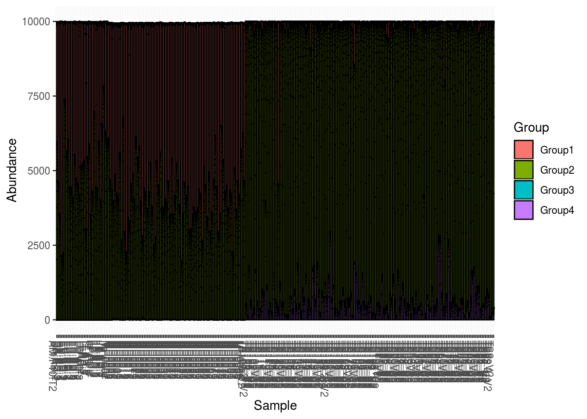
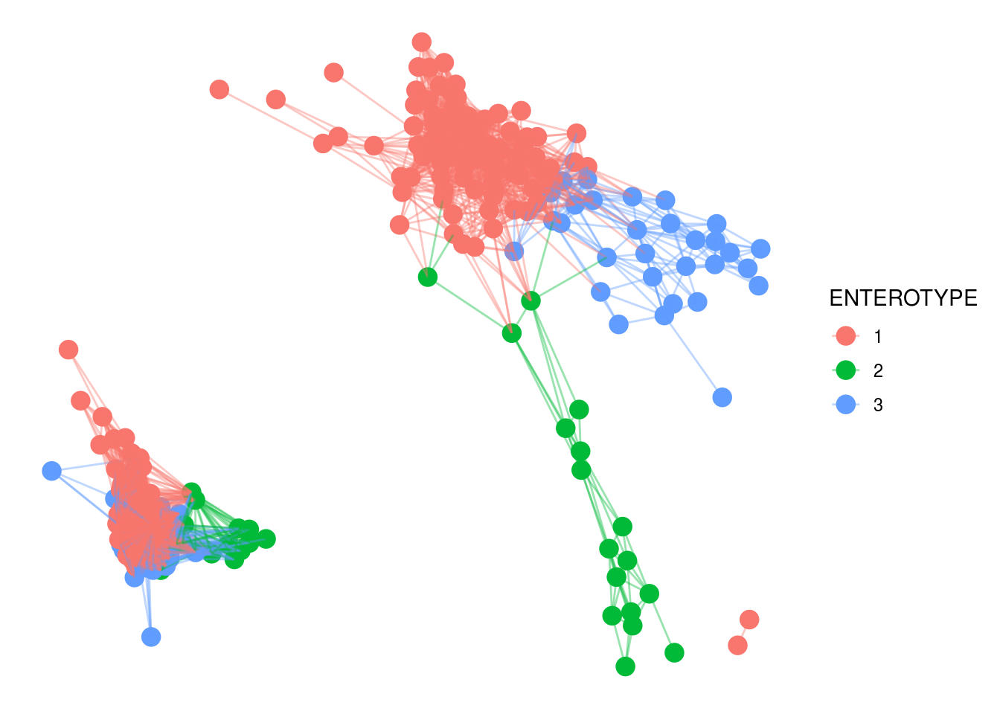

# Phyloseq {#phyloseq}

For downstream metagenomic analysis, you cannot go wrong with Phyloseq. It's an excellent tool for importing and analyzing metagenomic data, and acts as a wrapper for a considerable number of well known tools and packages ranging from vegan to DESeq2. Moreover, it's well equipt for importing data you'd generate by using, say, QIIME, and works with its own set of structures, which really comes helps prevent potential indexing issues and the like.


```r
library(phyloseq)
library(tidyverse)
library(ape)
library(DESeq2)
```

Let's begin by loading four pieces of data, an OTU table of taxonomic abundances (counts), taxonomy information with the taxa that a given OTU likely belongs to, sample metadata, and a phylogenetic tree.


```r
OTU <- read.csv('https://gist.githubusercontent.com/sw1/8870a124624f31585d5c15be72fcfc21/raw/1b05f24f189f14ea9902ac3867aca40c80ac6db3/otu_table.csv')
TAX <- read.csv('https://gist.githubusercontent.com/sw1/8870a124624f31585d5c15be72fcfc21/raw/1b05f24f189f14ea9902ac3867aca40c80ac6db3/tax_table.csv')
SAMP <- read.csv('https://gist.githubusercontent.com/sw1/8870a124624f31585d5c15be72fcfc21/raw/052dfdc3df97589f6405d79889c9b3b651eb1967/sample_metadata.csv')
TREE <- read.tree('https://gist.githubusercontent.com/sw1/8870a124624f31585d5c15be72fcfc21/raw/052dfdc3df97589f6405d79889c9b3b651eb1967/tree.tree')
```

In most circumstances, we'd work on this as is, but the nice thing about phyloseq is that we can place these into a phyloseq container, allowing us to manipulate the four objects simultaneously. Imagine if we decided to filter some OTUs based on the leaves of our tree. We'd then may want to then remove these OTUs from our taxonomy. Also, removing a subset of OTUs may result in some samples with 0 total OTU counts, which justifies removing them as well. This can lead to indexing issues where we accidentally shuffle our tables. Using phyloseq, all of this is done in tandem, preventing said issues.

Let's create that container. We need to coerse each objects into phyloseq-friendly objects, so note the functions wrapping each object. Also note that our row and column names *must* be consistent throughout (i.e., named the same and in the same order). And lastly, the taxonomy table has to be a matrix.


```r
all(colnames(OTU) == SAMP$Sample_ID)
```

```
## [1] TRUE
```

```r
rownames(SAMP) <- SAMP$Sample_ID

TAX <- as.matrix(TAX)
rownames(TAX) <- paste0('otu',1:nrow(TAX))
rownames(OTU) <- rownames(TAX)

taxa_names(TREE) <- rownames(TAX)
```

And now, create the phyloseq container:


```r
PS <- phyloseq(otu_table(OTU,taxa_are_rows=TRUE),tax_table(TAX),sample_data(SAMP),phy_tree(TREE))
```

First, we'll filter any samples without enterotype information and then conver enterotype to a factor:


```r
PS1 <- prune_samples(!is.na(sample_data(PS)$Enterotype),PS)
sample_data(PS1)$ENTEROTYPE <- as.factor(sample_data(PS1)$Enterotype)
```

Now, we'll remove any OTUs with 0 counts across samples:


```r
PS1 <- filter_taxa(PS1,function(x) sum(x) > 0,prune = TRUE)
```

This leaves us with the following objects:


```r
PS1
```

```
## phyloseq-class experiment-level object
## otu_table()   OTU Table:         [ 342 taxa and 271 samples ]
## sample_data() Sample Data:       [ 271 samples by 10 sample variables ]
## tax_table()   Taxonomy Table:    [ 342 taxa by 2 taxonomic ranks ]
## phy_tree()    Phylogenetic Tree: [ 342 tips and 341 internal nodes ]
```

From here, we can do quite a bit, so I'm not going to go through absolutely everything. But, we can start with some figures. We can plot some metagenomic summary statistics:


```r
plot_richness(PS1,x='ENTEROTYPE',color='ENTEROTYPE')
```

```
## Warning: Removed 1359 rows containing missing values (geom_errorbar).
```


And then some figures to show abundance in different ways:


```r
plot_tree(PS1,color='ENTEROTYPE')
```


```r
plot_bar(PS1,fill='Group')
```



And a heatmap, but using subsetted data:


```r
PS2 <- prune_taxa(names(sort(taxa_sums(PS1),decreasing=TRUE))[1:50],PS1)
plot_heatmap(PS2,sample.order='ENTEROTYPE',method='MDS',distance='bray')
```

```
## Warning: Transformation introduced infinite values in discrete y-axis
```


Ordination is quite easy as well.


```r
ORD <- ordinate(PS1,method='MDS',distance='bray')
plot_ordination(PS1,ORD,color='ENTEROTYPE') + geom_point(size=5)
```


And networks


```r
NET <- make_network(PS1,max.dist=.3,distance='bray')
plot_network(NET,PS1,color='ENTEROTYPE',label=NULL)
```

```
## Warning: attributes are not identical across measure variables; they will be
## dropped
```



And lastly, let's say we wanted to perform a differential abundance analysis between genders using DESeq2:


```r
PS3 <- prune_samples(!is.na(sample_data(PS)$Gender),PS)
PS3 <- filter_taxa(PS3,function(x) sum(x) > 0,prune = TRUE)

diagdds <- phyloseq_to_deseq2(PS3, ~ Gender)
```

```
## converting counts to integer mode
```

```r
diagdds <- DESeq(diagdds, test='Wald', fitType='parametric')
```

```
## estimating size factors
```

```
## estimating dispersions
```

```
## gene-wise dispersion estimates
```

```
## mean-dispersion relationship
```

```
## final dispersion estimates
```

```
## fitting model and testing
```

```
## -- replacing outliers and refitting for 40 genes
## -- DESeq argument 'minReplicatesForReplace' = 7 
## -- original counts are preserved in counts(dds)
```

```
## estimating dispersions
```

```
## fitting model and testing
```

```r
res <- results(diagdds, cooksCutoff = FALSE)
res
```

```
## log2 fold change (MLE): Gender M vs F 
## Wald test p-value: Gender M vs F 
## DataFrame with 135 rows and 6 columns
##                  baseMean      log2FoldChange             lfcSE
##                 <numeric>           <numeric>         <numeric>
## otu1      4828.4506120415   0.245290778934588 0.274237524136042
## otu5    0.408423815044056  -0.763578551311355  1.79402732847231
## otu8   0.0792034228989187 -0.0356169619939926  2.98069121886303
## otu9   0.0320327532464582 -0.0814917834894285  2.98139846283725
## otu29   0.264845130897552   0.300955738130655  1.94223006989263
## ...                   ...                 ...               ...
## otu245   157.499213859763  0.0699225946302586 0.771481998887212
## otu246 0.0555641881033384  0.0556347017417495  2.98128159912465
## otu247   8.66211938696038    0.21953394551718 0.554061558082688
## otu248   5.17914838549527    0.97428692011149 0.580195818970534
## otu249  0.370083654698921  -0.103761272249879  1.25671122049443
##                       stat             pvalue              padj
##                  <numeric>          <numeric>         <numeric>
## otu1     0.894446446405729  0.371083071088348 0.999308335917726
## otu5    -0.425622586229818  0.670382879571334 0.999308335917726
## otu8    -0.011949229013926  0.990466121537832 0.999308335917726
## otu9   -0.0273334089707274  0.978193810311412 0.999308335917726
## otu29    0.154953701312683  0.876857817345056 0.999308335917726
## ...                    ...                ...               ...
## otu245  0.0906341233251264   0.92778331701462 0.999308335917726
## otu246  0.0186613373785572  0.985111271182231 0.999308335917726
## otu247   0.396226632789451  0.691937845592669 0.999308335917726
## otu248    1.67923809213277 0.0931056508804161 0.999308335917726
## otu249 -0.0825657243746543  0.934196856171995 0.999308335917726
```
