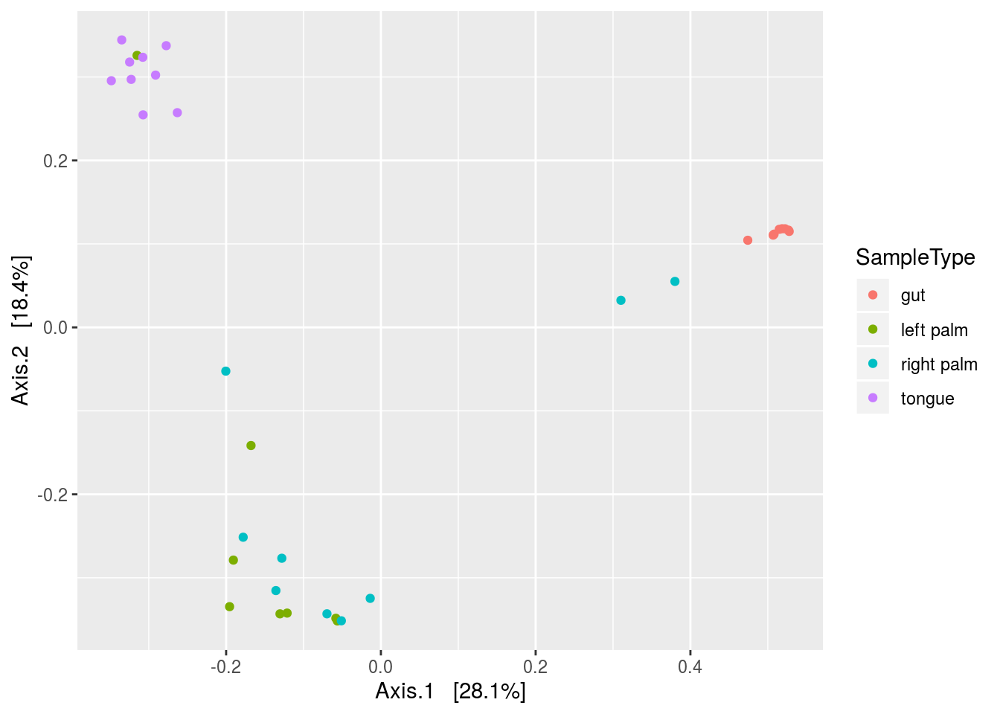

# Qiime {#qiime}


```r
library(tidyverse)
library(Biostrings)
```

First we need to use some qiime functions via the command line, so we'll save them as variable names.


```r
validate_mapping_file <- '/data/sw1/anaconda3/envs/qiime1/bin/validate_mapping_file.py'
split_libraries_fastq <- '/data/sw1/anaconda3/envs/qiime1/bin/split_libraries_fastq.py'
count_seqs <- '/data/sw1/anaconda3/envs/qiime1/bin/count_seqs.py'
extract_barcodes <- '/data/sw1/anaconda3/envs/qiime1/bin/extract_barcodes.py'
pick_closed_reference_otus <- '/data/sw1/anaconda3/envs/qiime1/bin/pick_closed_reference_otus.py'
core_diversity_analyses <- '/data/sw1/anaconda3/envs/qiime1/bin/core_diversity_analyses.py'
make_emperor <- '/data/sw1/anaconda3/envs/qiime1/bin/make_emperor.py'
biom <- '/data/sw1/anaconda3/envs/qiime1/bin/biom'
```

## OTU Picking

This will be an introduction to QIIME. We'll start by going command by command, and then at the end will be a submission script for proteus. This should give you two flavors of running QIIME, one from within R, should you choose to install QIIME locally, and one via Proteus.

We're going to use the dataset from the QIIME illumina tutorial, moving pictures, simply because it's small and reliable. If you choose to install QIIME and worth through this locally, you can download the dataset by running the following command in bash, or you can simply go to the link and download it manually as well. 


```r
svn checkout https://github.com/sw1/Bioinformatics/trunk/Data/moving_pictures}
```


Once it's downloaded, set the directly to a variable:


```r
data_dir <- 'data/data_moving_pictures'
```

Now, we have a large FASTQ file with a ton of sequences:


```r
FASTQ <- readDNAStringSet(file.path(data_dir,'forward_reads.fastq.gz'),format='fastq')
FASTQ
```

```
##   A DNAStringSet instance of length 302581
##          width seq                                          names               
##      [1]   152 TACGNAGGATCCGAGCGTTAT...GGCAGGGGGGGATTGGTGTG HWI-EAS440_0386:1...
##      [2]   152 CCCCNCAGCGGCAAAAATTAA...TGATGATTCCACTGCAACAA HWI-EAS440_0386:1...
##      [3]   152 TACGNAGGATCCGAGCGTTAT...GGCAGGGGGGGGGTTGGGGG HWI-EAS440_0386:1...
##      [4]   152 TACGNAGGATCCGAGCGTTAT...GGCAGGGGGGAGTTTGGGGG HWI-EAS440_0386:1...
##      [5]   152 TACGNAGGATCCGAGCGTTAT...GGCAGGCGGGATTCGTGGTG HWI-EAS440_0386:1...
##      ...   ... ...
## [302577]   152 NTGGCTGTTGGTTTCTCTGTG...TTCAGAATCAGAATGAGCCG HWI-EAS440_0386:6...
## [302578]   152 NACGTAGGTGGCAAGCGTTGT...GAAAGTGGAATTCCTAGTGA HWI-EAS440_0386:6...
## [302579]   152 NACGTAGGGTGCGAGCGTTAA...GGGAGGTAGAATTACACGTG HWI-EAS440_0386:6...
## [302580]   152 NACGTAGGGTGCGAGCGTTAA...GGGAGGTAGAACTCCACGTG HWI-EAS440_0386:6...
## [302581]   152 NACGTAGGTGGCAAGCGTTGT...GAGAGGTGGATTCATAGGAG HWI-EAS440_0386:6...
```

Note the sequence header names; they have an interesting format, for examples


```r
HWI-EAS440_0386:1:23:17547:1423#0/1
```

If you look at the figure below, you can see a detailed explaination of what this all means if you are interested, but it is information from illumina sequencing. Basically, when we sequence samples using illumina, we sequence multiple samples in a single flowcell lane to save money. These headers have some of that lane information encoded in them.


Because we are mixing samples within a lane, we need a way to keep track of the samples, such that we know which sequence belongs to Frank and which belongs to Emily, despite many of their sequences sharing a lane. The way we keep track is through barcoding, where we add a short nucleotide sequence to the adapters used in PCR amplification. We therefore create sequence libraries, with each library receiving its own barcode, perform sequencing, and then parse these libraries using our barcodes to reassign sequences to our original samples.

Look at the metadata mapping file below. This contains all of the relevant sample information, as well as information associated with sequencing, particularly barcode information. 


```r
MAP <- read_delim(file.path(data_dir,'map.tsv'),'\t')
```

```
## Parsed with column specification:
## cols(
##   `#SampleID` = col_character(),
##   BarcodeSequence = col_character(),
##   LinkerPrimerSequence = col_character(),
##   SampleType = col_character(),
##   Year = col_double(),
##   Month = col_double(),
##   Day = col_double(),
##   Subject = col_double(),
##   ReportedAntibioticUsage = col_character(),
##   DaysSinceExperimentStart = col_double(),
##   Description = col_character()
## )
```

```r
MAP[1:5,1:5]
```

```
## # A tibble: 5 x 5
##   `#SampleID` BarcodeSequence LinkerPrimerSequence SampleType  Year
##   <chr>       <chr>           <chr>                <chr>      <dbl>
## 1 L1S8        AGCTGACTAGTC    GTGCCAGCMGCCGCGGTAA  gut         2008
## 2 L1S140      ATGGCAGCTCTA    GTGCCAGCMGCCGCGGTAA  gut         2008
## 3 L1S57       ACACACTATGGC    GTGCCAGCMGCCGCGGTAA  gut         2009
## 4 L1S208      CTGAGATACGCG    GTGCCAGCMGCCGCGGTAA  gut         2009
## 5 L1S76       ACTACGTGTGGT    GTGCCAGCMGCCGCGGTAA  gut         2009
```

We can see that each sample receives its own unique barcode:


```r
nrow(MAP[,1:2]) == nrow(unique(MAP[,1:2]))
```

```
## [1] TRUE
```

Now take a look at the barcode file:


```r
BARCODE <- readDNAStringSet(file.path(data_dir,'barcodes.fastq.gz'),format='fastq')
BARCODE
```

```
##   A DNAStringSet instance of length 302581
##          width seq                                          names               
##      [1]    12 ATGCAGCTCAGT                                 HWI-EAS440_0386:1...
##      [2]    12 CCCCTCAGCGGC                                 HWI-EAS440_0386:1...
##      [3]    12 GACGAGTCAGTC                                 HWI-EAS440_0386:1...
##      [4]    12 AGCAGTCGCGAT                                 HWI-EAS440_0386:1...
##      [5]    12 AGCACACCTACA                                 HWI-EAS440_0386:1...
##      ...   ... ...
## [302577]    12 ATGGCTGTTGGT                                 HWI-EAS440_0386:6...
## [302578]    12 ACACACTATGGC                                 HWI-EAS440_0386:6...
## [302579]    12 CAGCGGTGACAT                                 HWI-EAS440_0386:6...
## [302580]    12 GATCTTCAGTAC                                 HWI-EAS440_0386:6...
## [302581]    12 GACAGCGTTGAC                                 HWI-EAS440_0386:6...
```

We can see that each barcode is assigned one of the header names we saw before. What we need to do now is break up this large fastq file that contains all of our sequence information into a new large file that has headers with unique *sample IDs* for each sequence, for example, Emily_1, Emily_2, and Emily_3 for 3 sequences belonging to Emily. We can easily do this in QIIME, but we first need to ensure that our mapping file is formatted correctly; otherwise, QIIME will not run. We can do that with the following command:


```r
system2(validate_mapping_file,args=c('-m',file.path(data_dir,'map.tsv')))
```

Now, let's make some bad mapping files to see what happens. First, let's simply remove the hashtag in the first column name:


```r
MAP_bad1 <- MAP
colnames(MAP_bad1)[1] <- 'SampleID'

tmp <- tempfile()
write_delim(MAP_bad1,path=tmp,delim='\t')
system2(validate_mapping_file,args=c('-m',tmp))
```

Now, look what happens if we don't have a description column as the last column:


```r
MAP_bad2 <- MAP
MAP_bad2 <- MAP_bad2[,-ncol(MAP_bad2)]

tmp <- tempfile()
write_delim(MAP_bad2,path=tmp,delim='\t')
system2(validate_mapping_file,args=c('-m',tmp))
```

And lastly, what if we used separate with commas instead of tabs:


```r
MAP_bad3 <- MAP

tmp <- tempfile()
write_delim(MAP_bad3,path=tmp,delim=',')
system2(validate_mapping_file,args=c('-m',tmp))
```

Given that we have a good mapping file, let's actually demultiplex our data. The following QIIME command performs demultiplexing and also the subsequent quality filtering. It also tosses out sequences that have poor matches to a given barcode. All of these parameters we can adjust.


```r
out <- tempfile()
system2(validate_mapping_file,args=c('-m',tmp,
                                     '-o',file.path(data_dir,'map_out')))

system2(split_libraries_fastq,args=c('-o',file.path(data_dir,'fastq_out_1'),
                                     '-i',file.path(data_dir,'forward_reads.fastq.gz'),
                                     '-b',file.path(data_dir,'barcodes.fastq.gz'),
                                     '-m',file.path(data_dir,'map.tsv')))
```

Now, there are a few noteable filtering arguments:

* phred_quality_threshold 
* max_bad_run_length
* min_per_read_length_fraction

Phred score is defined as follows:

$$ 
Q=-10\log_{10}P 
$$
where P is the probability of a base-call error; hence,

$$
P=10^{-Q/10}
$$

The default **phred_quality_threshold** Q is 3, implying $P=10^{-3/10}=.5$, or the probability of an incorrectly called base is about 50%. Setting it at 3 will flag any base call if it has a probability of being an error above this threshold. For the entire sequence, it will then look at **max_bad_run_length**, which checks how many *consecutive* flagged base calls are present. If this number is above a given threshold (the default is 3), then the sequence is truncated at that position. Finally, it checks **min_per_read_length_fraction**. This tosses any sequences that are shorter than a given length after truncation (the default is a length shorter than 75% of the original, unaltered read).

There is also a setting called **phred offset**, which you typically need not worry about (it's automatically set), but is worth knowing what it represents:


I'd argue that something along the lines of Q=20 or greater makes more sense. Here, we'll truncate at consecutive stretches of base calls where each call has 1% probability of being an error.


```r
system2(split_libraries_fastq,args=c('-o',file.path(data_dir,'fastq_out_2'),
                                     '-i',file.path(data_dir,'forward_reads.fastq.gz'),
                                     '-b',file.path(data_dir,'barcodes.fastq.gz'),
                                     '-m',file.path(data_dir,'map.tsv'),
                                     '-q','20'))
```

We'll now perform OTU picking on our filtered, demultiplexed sequences. There are a ton of parameters we can adjust: http://qiime.org/scripts/pick_otus.html. To keep it somewhat simple, we'll perform a particular kind of OTU picking called 'closed.' There are 3 OTU picking strategies: closed, open, and de novo. 

Closed reference OTU picking is fast because it simply clusters sequences into OTUs based on reference sequences found in a database. If a sequence doesn't match above a given similiary threshold to the database sequence, it is tossed away. It should probably be obvious if a given sequence isn't found in the reference database, it too will be removed. De novo, on the other hand, can deal with novel sequences since it doesn't use a lookup database. Instead, it clusters sequences by aligning them against one another, with sequences above a given similarity threshold clustered into OTUs. Lastly, open reference OTU picking first performed closed reference OTU picking, and then performs de novo on sequences that failed to match reference sequences in the lookup database.

To perform closed reference OTU picking, we need to specify our reference database (we'll use GreenGenes) by setting the location of our reference sequences, our reference taxonomy. We also need to specify our picking parameters, which in this example, will consist of the OTU picking method (sortmerna), the number of threads for paralellization, and the similarity threshold (.97) for our sequences when we compare them to the GreenGenes database.


```r
ref_seqs <- '/data/sw1/anaconda2/lib/python2.7/site-packages/qiime_default_reference/gg_13_8_otus/rep_set/97_otus.fasta'
ref_tax <- '/data/sw1/anaconda2/lib/python2.7/site-packages/qiime_default_reference/gg_13_8_otus/taxonomy/97_otu_taxonomy.txt'

params <- tempfile(fileext='.txt')
write_lines(c('pick_otus:otu_picking_method sortmerna',
              'pick_otus:threads 4',
              'pick_otus:similarity: 0.97'),path=params)
```

And now we run the closed reference otu picking command:


```r
system2(pick_closed_reference_otus,args=c('-i',file.path(data_dir,'fastq_out_2','seqs.fna'),
                                          '-o',file.path(data_dir,'fastq_out_2','picked_otus_sortmerna'),
                                          '-r',ref_seqs,
                                          '-t',ref_tax,
                                          '-p',params))
```

This was all done in R, which is probably unnecessary for proteus. You can submit an Rscript, but since there is no real looping and need for immediate downstream analysis, it's better off just submitting a bash script. We'll remove the system2 functions and the like, add the submission parameters, and write the following script for proteus:


```r
#!/bin/bash
#$ -S /bin/bash
#$ -cwd
#$ -j y
#$ -M user_name@email.edu
#$ -l h_rt=01:00:00
#$ -P namePrj
#$ -pe shm 16
#$ -l mem_free=12G
#$ -l h_vmem=16G
#$ -q all.q

. /etc/profile.d/modules.sh
module load shared
module load proteus
module load sge/univa
module load gcc/4.8.1
module load qiime/gcc/64/1.9.1

export ref_seqs=/mnt/HA/opt/qiime/gcc/64/1.9.1/lib/python2.7/site-packages/qiime_default_reference/gg_13_8_otus/rep_set/97_otus.fasta
export ref_tax=/mnt/HA/opt/qiime/gcc/64/1.9.1/lib/python2.7/site-packages/qiime_default_reference/gg_13_8_otus/taxonomy/97_otu_taxonomy.txt

data_dir=/home/user_name/genStats/moving_pictures
work_dir=/scratch/user_name/moving_pictures

mkdir -p $work_dir

cp $data_dir/* $work_dir

out_dir=$work_dir/fastq_out
seqs=$work_dir/forward_reads.fastq.gz
bc=$work_dir/barcodes.fastq.gz
map=$work_dir/map.tsv

split_libraries_fastq.py -o $out_dir -i $seqs -b $bc -m $map -q 20

params=$work_dir/sortmerna_pick_params.txt

printf "pick_otus:otu_picking_method sortmerna\npick_otus:threads 16\npick_otus:similarity 0.97" > $params

pick_closed_reference_otus.py -i $out_dir/seqs.fna -o $out_dir/picked_otus -r $ref_seqs -t $ref_tax -p $params

mv $out_dir $data_dir
rm -r $work_dir/*
  
exit 0
```

## Summarizing Our Results

Now that we have our OTU table, in biom format, we can summarize our results using some QIIME commands. First, let's look at the mapping file to see what sample features we'd like to focus on:


```r
View(MAP)
```

Now, we'll write a submission script to get analyses output.


```r
#!/bin/bash
#$ -S /bin/bash
#$ -cwd
#$ -j y
#$ -M user_name@email.edu
#$ -l h_rt=01:00:00
#$ -P namePrj
#$ -l mem_free=12G
#$ -l h_vmem=16G
#$ -q all.q

. /etc/profile.d/modules.sh
module load shared
module load proteus
module load sge/univa
module load gcc/4.8.1
module load qiime/gcc/64/1.9.1

export ref_seqs=/mnt/HA/opt/qiime/gcc/64/1.9.1/lib/python2.7/site-packages/qiime_default_reference/gg_13_8_otus/rep_set/97_otus.fasta
export ref_tax=/mnt/HA/opt/qiime/gcc/64/1.9.1/lib/python2.7/site-packages/qiime_default_reference/gg_13_8_otus/taxonomy/97_otu_taxonomy.txt

data_dir=/home/user_name/genStats/moving_pictures
work_dir=/scratch/user_name/moving_pictures

mkdir -p $work_dir

cp $data_dir/fastq_out/picked_otus/97_otus.tree $work_dir
cp $data_dir/fastq_out/picked_otus/otu_table.biom $work_dir
cp $data_dir/map.tsv $work_dir

otus=$work_dir/otu_table.biom
tree=$work_dir/97_otus.tree
map=$work_dir/map.tsv

analysis_dir=$work_dir/analysis

mkdir -p $analysis_dir

biom summarize-table -i $otus > $analysis_dir/sampling_depth.dat

core_diversity_analyses.py -o $analysis_dir/diversity -i $otus -m $map -t $tree -c SampleType -e 1000 --recover_from_failure

mv $analysis_dir $data_dir
rm -r $work_dir/*
  
exit 0
```

Or we can calculate the metrics more directly:


```r
#!/bin/bash
#$ -S /bin/bash
#$ -cwd
#$ -j y
#$ -M user_name@email.edu
#$ -l h_rt=01:00:00
#$ -P namePrj
#$ -l mem_free=12G
#$ -l h_vmem=16G
#$ -q all.q

. /etc/profile.d/modules.sh
module load shared
module load proteus
module load sge/univa
module load gcc/4.8.1
module load qiime/gcc/64/1.9.1

data_dir=/home/user_name/genStats/moving_pictures
work_dir=/scratch/user_name/moving_pictures/

mkdir -p $work_dir

cp $data_dir/fastq_out/picked_otus/97_otus.tree $work_dir
cp $data_dir/fastq_out/picked_otus/otu_table.biom $work_dir
cp $data_dir/map.tsv $work_dir

otus=$work_dir/otu_table.biom
tree=$work_dir/97_otus.tree
map=$work_dir/map.tsv


met_dir=$work_dir/metrics


alpha_diversity.py -i $otus -t $tree -o $met_dir/alpha.txt

beta_diversity.py -i $otus -o $met_dir/beta -t $tree -m unweighted_unifrac
beta_diversity.py -i $otus -o $met_dir/beta -t $tree -m weighted_unifrac

principal_coordinates.py -i $met_dir/beta -o $met_dir/pcoa

make_2d_plots.py -i $met_dir/pcoa/pcoa_unweighted_unifrac_otu_table.txt -m $map -b SampleType -o $met_dir/pcoa/figures
make_2d_plots.py -i $met_dir/pcoa/pcoa_weighted_unifrac_otu_table.txt -m $map -b SampleType -o $met_dir/pcoa/figures

transform_coordinate_matrices.py -i $met_dir/pcoa/pcoa_unweighted_unifrac_otu_table.txt,$met_dir/pcoa/pcoa_weighted_unifrac_otu_table.txt -r 999 -o $met_dir/procrustes/

make_emperor.py -c -i $met_dir/procrustes -o $met_dir/procrustes/figures -m $map --custom_axes DaysSinceExperimentStart

mv $met_dir $data_dir

exit 0
```

## Loading QIIME Results into Phyloseq

We have a ton of output from QIIME, but we could have just as easily loaded the biom table into R, specifically phyloseq. We can do this like so:


```r
library(phyloseq)
```

```
## 
## Attaching package: 'phyloseq'
```

```
## The following object is masked from 'package:IRanges':
## 
##     distance
```

```r
biom_path <- file.path(data_dir,'fastq_out_2','picked_otus_sortmerna','otu_table.biom')
tree_path <- file.path(data_dir,'fastq_out_2','picked_otus_sortmerna','97_otus.tree')

BIOM <- import_biom(biom_path)
```

```
## Warning in strsplit(conditionMessage(e), "\n"): input string 1 is invalid in
## this locale
```

```r
META <- as.data.frame(MAP)
rownames(META) <- META$`#SampleID`
PS <- merge_phyloseq(BIOM,sample_data(META))
PS
```

```
## phyloseq-class experiment-level object
## otu_table()   OTU Table:         [ 3409 taxa and 34 samples ]
## sample_data() Sample Data:       [ 34 samples by 11 sample variables ]
## tax_table()   Taxonomy Table:    [ 3409 taxa by 7 taxonomic ranks ]
```

And then perform similar analyses:


```r
plot_ordination(PS,ordinate(PS,method='MDS',distance='bray'),type='samples',color='SampleType')
```


