# Microbiome Data Analysis {#microbiome}

\usepackage{amsmath} \usepacakge{amssymb}


## Loading and Exploring the Guerroro Negro Data

Metagenome sequence information was downloaded by the NCBI link provided in the the tutorial summary page on learn. The OTUs were then clustered and classified, resulting in a read table ("table") and a taxa table ("utax"). 

To load the tables, we'll do the following


```r
counts <- GN16SData$otuTable
tax <- tibble(tax=rownames(counts)) %>% 
  separate(tax,c('Kingdom','Phylum','Class','Order','Family','Genus','Species','Subspecies'),sep=';') %>%
  data.frame(stringsAsFactors=FALSE)
tax[is.na(tax)] <- ''
rownames(counts) <- sapply(1:nrow(counts),function(x) paste0('OTU_',x,collapse=''))
rownames(tax) <- sapply(1:nrow(counts),function(x) paste0('OTU_',x,collapse=''))

depth <- as.numeric(gsub('^GNmat\\.(.*?)mm$','\\1',colnames(counts)))
zone <- if_else(depth < 2,'A',if_else(depth >= 6,'C','B'))
```

Knowing what every command means is probably beyond the scope of this tutorial. We simply want two clean tables with the OTU numbers set as the row names. 

Counts is a table of OTU counts for each mat, so rows 1 (OTU 4973) and 2 (OTU 41) from column 1 had 1 and 14 occurrences, respectively.


```r
counts[1,1] ## row 1, column 1
```

```
## [1] 17
```

```r
counts[2,1] ## row 2, column 1
```

```
## [1] 0
```

Note the sparsity of the count table, which could pose problems in traditional statistical methods.


```r
mean(counts == 0)
```

```
## [1] 0.476699
```

The taxa table shows the taxonomic breakdown (Kingdom - Phylum - ... - Species) for each OTU. 


```r
head(tax)
```

```
##        Kingdom        Phylum         Class       Order  Family
## OTU_1 Bacteria Acidobacteria Acidobacteria Subgroup 21        
## OTU_2 Bacteria Acidobacteria Acidobacteria Subgroup 25        
## OTU_3 Bacteria Acidobacteria Acidobacteria  Subgroup 3 PAUC26f
## OTU_4 Bacteria Acidobacteria Acidobacteria  Subgroup 3 PAUC26f
## OTU_5 Bacteria Acidobacteria Acidobacteria  Subgroup 9        
## OTU_6 Bacteria Acidobacteria    Holophagae BP-U1C-1g10        
##                                    Genus Species Subspecies
## OTU_1                                                      
## OTU_2                                                      
## OTU_3                                                      
## OTU_4 uncultured Acidobacteria bacterium                   
## OTU_5                                                      
## OTU_6
```

Note that it's not possible to classify every OTU taxonomically, so you will see similar taxons for different OTUs. These should still be considered different. For example, look at OTUs 8 and 9:


```r
tax["OTU_8",]
```

```
##        Kingdom        Phylum      Class       Order Family Genus Species
## OTU_8 Bacteria Acidobacteria Holophagae Subgroup 23  NKB17              
##       Subspecies
## OTU_8
```

```r
tax["OTU_9",]
```

```
##        Kingdom        Phylum       Class Order Family Genus Species Subspecies
## OTU_9 Bacteria Acidobacteria Subgroup 22
```

They have the same taxonomic names, but, again, they should be considered unique OTUs.

## Statistical Analysis

The goal is to cover Canonical Correspondence Analysis (CCA) and Redundancy Analysis (RDA). These are extensions of "simpler" algorithms, Correspondence Analysis (CA) and Principal Component Analysis (PCA), respectively, so it's best to cover those first.

### PCA

PCA is an unsupervised learning algorithm to essentially cluster unlabeled data. The trick is through dimensionality reduction, we will end up with principal components that explain as much variation as possible to make latent groups more separable. This process is driven by reducing the squared orthogonal projection distance. This is a similar problem to minimizing sums of squares in linear regression.

Given a unit vector $u$ and a data vector $x$, to minimize the projection residuals, we must minimize the following:

$$
\begin{align}
  \text{MSE}(u) &= \frac{1}{n}\sum_{i}(||x_i||^2-(x_{}^{T} u)^2)\\
                &= \frac{1}{n}\sum_{i}||x_i||^2 - \frac{1}{n}\sum_{i}(x_{i}^{T} u)^2
\end{align}
$$

As the right side of the second term gets large, the mean squared error of the projection residuals gets small. If we assume $||u||=1$, then the length of the $x^{(i)}$ projection onto $u$ is $x^{(i)T}u$:

$$
\text{proj}_{u}(x)=\frac{x^{T}u}{||u||}=x^{T}u
$$

The plan is then to choose a vector $u$ that maximizes

$$
\frac{1}{n}\sum_{i}(x^{(i)T}u)^2\\
\text{s.t. }||u||=1
$$

We can rearrange the equation, so it will make a little more sense:

$$
\begin{align}
  \frac{1}{n} \sum_{i}(x^{(i)T}u)^2 &= \frac{1}{n}\sum_{i}(u^{T}x)(u^{T}x)\\
                                  &= u^{T}(\frac{1}{n}\sum_{i}xx^{T})u\\
                                  &= u^{T}\Sigma u
\end{align}
$$

Now the maximization requires a Lagrange multiplier:

$$
\begin{align}
  \text{argmax }u^{T}\Sigma u &= \mathcal{L}(u,\lambda) \text{     s.t. }||u||=1\\
                             &= u^{T}\Sigma u-\lambda(u^{T}u-1)\\\\
  \therefore \nabla_{u}\mathcal{L} &= \Sigma u - \lambda u\\\\
\end{align}
$$

Which we set to $0$ and solve:

$$
\begin{align}
  \Sigma u - \lambda u &= 0\\
                            \Sigma u &= \lambda u   
\end{align}
$$

Let's rearrange this one last time:

$$
u^{T}\Sigma u = \lambda
$$

We can think of the left side as the variation. Remember, the goal is to maximize this to give us the greatest separation. There's a few things that should be mentioned here. First, $\Sigma$ is the covariance matrix in this problem (or correlation matrix, assuming scaling beforehand), $u$ is an eigenvector, and $\lambda$ is the associated eigenvalue. By finding the eigenvalues and choosing those that are largest, we effectively will maximize the left side, the variation.

Assuming we have a matrix $X$ of centered, rescaled data, PCA proceeds as follows. We first calculate the correlation matrix of $X$ and then compute its eigenvalues and eigenvectors. We then find the largest eigenvalue $\lambda_{1}$ and rescale $X$ with its corresponding eigenvector $u_{1}$, resulting in the first principal component. We repeat this process using the second largest eigenvalue $\lambda_{2}$, rescaling the data using $u_{2}$ to acquire the second principal component. These two vectors can be regressed against one another, effectively reducing the dimentionality of $X$ to $\mathbb{R}^{2}$. We can proceed to calculate the remaining principal components, regressing different combinations to find patterns. One indirect assumption in PCA (and therefore will be quite important for RDA) is that the covariance (correlation) matrix is calculated via the Pearson method, which assumes a linear association between two variables. Our data of interest could very well be related, but not linearly, posing problems for computing the correlations, which in turn leads to problems in the PCA. Considering OTU data tables are often zero-inflated, it shouldn't be surprising that the linearity assumption could be violated.

Let's quickly run through some sample data (where the labels are known), performing PCA "manually," to show you what's happening. Then, we'll rerun the analysis with the same sample data but with a base PCA command in R called princomp(). Finally, we'll run PCA on the Guerrero Negro matrix.

#### PCA Example with Labeled Data

Let's say we are given weight lifting data. The PCA won't know this, but we know the labels beforehand, which basically breakdown into three groups: (1) average sized men, (2) very tall men, and (3) average sized women. The recorded information ("features") are height, weight, and amount of weight moved (say, for benching). 

First, we have to generate the data:


```r
set.seed(4131)
x1 <- c(rnorm(100,68,5),rnorm(100,78,5),rnorm(100,63,4))        ## height
x2 <- c(rnorm(100,215,40),rnorm(100,200,20),rnorm(100,125,15))  ## weight
x3 <- c(rnorm(100,280,50),rnorm(100,180,15),rnorm(100,95,15))   ## exercise
label <- rep(c("Compact Guys","Tall Guys","Women"),each=100)    ## labels
```

Now, scale and center the data $(x_{i}-\bar x)/\sigma_{i}$:


```r
x1 <- scale(x1)
x2 <- scale(x2)
x3 <- scale(x3)
```

Form the data matrix $X$ and the covariance matrix $\Sigma$:


```r
x <- cbind(x1,x2,x3)
colnames <- c("Average Guys","Tall Guys","Women")
E <- cov(x)
```

This was mentioned above in passing, but just to prove it, because we scaled the data, we are essentially working with the correlation matrix:


```r
cor(x)
```

```
##           [,1]      [,2]      [,3]
## [1,] 1.0000000 0.4360384 0.2365420
## [2,] 0.4360384 1.0000000 0.7292495
## [3,] 0.2365420 0.7292495 1.0000000
```

```r
cov(x)
```

```
##           [,1]      [,2]      [,3]
## [1,] 1.0000000 0.4360384 0.2365420
## [2,] 0.4360384 1.0000000 0.7292495
## [3,] 0.2365420 0.7292495 1.0000000
```

Perform an eigendecomposition of $\Sigma$ by solving $\text{det}(\Sigma - \lambda I)=0$:


```r
evd <- eigen(E)
```

This results in a list of 3 eigenvalues and 3 eigenvectors


```r
print(evd)
```

```
## eigen() decomposition
## $values
## [1] 1.9662182 0.7956439 0.2381379
## 
## $vectors
##            [,1]       [,2]       [,3]
## [1,] -0.4456653 -0.8665488  0.2246679
## [2,] -0.6586780  0.1474612 -0.7378336
## [3,] -0.6062390  0.4768106  0.6364950
```

Rescale the data $X$ using the eigenvectors


```r
ev1 <- evd$vectors[,1]    ## eigenvector 1, corresponding to the largest eigenvalue thus most variation
ev2 <- evd$vectors[,2]    ## eigenvector 2
ev3 <- evd$vectors[,3]    ## eigenvector 3

pc1 <- x %*% ev1
pc2 <- x %*% ev2
pc3 <- x %*% ev3
```

Regress the first two principal components:


```r
df <- data.frame(cbind(pc1,pc2),label)
names(df) <- c('PC1','PC2','Group')
ggplot(df,aes(x=PC1,y=PC2,colour=Group)) + geom_point(alpha=1)
```

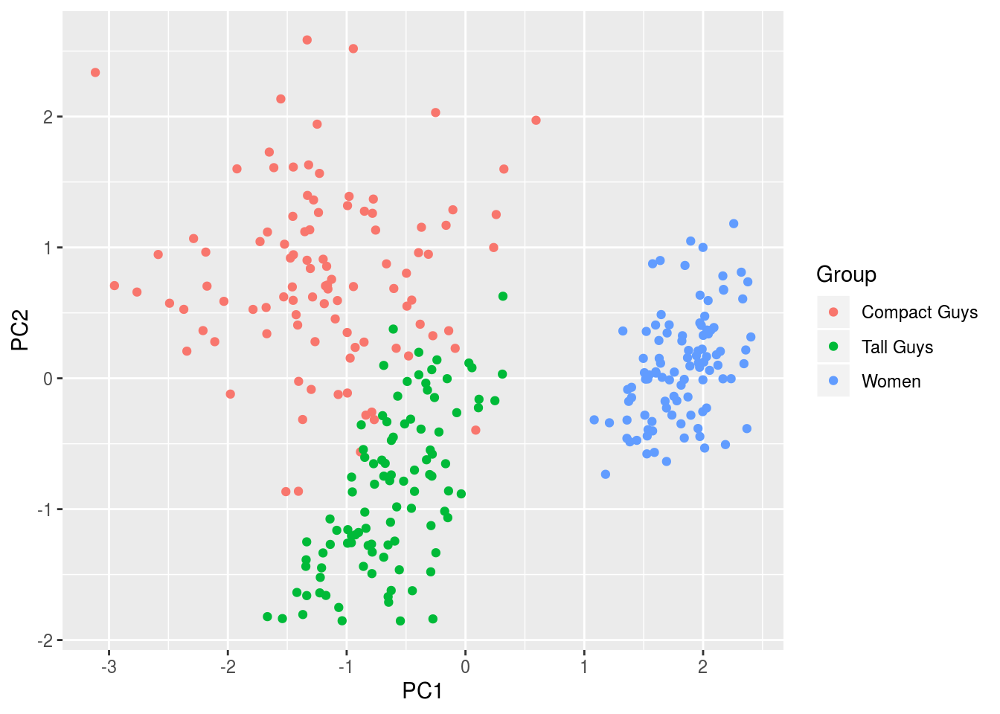

The figure shows clear separation between men and women, and clustering of all three groups. Had we not know the labels to colorcode the output, we would at least been able to confidently separate the data into two groups, men and women.

Now, let's see what the base PCA command gives us.


```r
out <- princomp(x)

df <- data.frame(cbind(out$scores[,1],out$scores[,2]),label)
names(df) <- c('PC1','PC2','Group')
ggplot(df,aes(x=PC1,y=PC2,colour=Group)) + geom_point(alpha=1)
```


Not surprisingly, it's the same figure, albeit rotated because of differences in sign from the respective outputs:


```r
cbind(ev1,ev2,ev3)
```

```
##             ev1        ev2        ev3
## [1,] -0.4456653 -0.8665488  0.2246679
## [2,] -0.6586780  0.1474612 -0.7378336
## [3,] -0.6062390  0.4768106  0.6364950
```

```r
out$loadings
```

```
## 
## Loadings:
##      Comp.1 Comp.2 Comp.3
## [1,]  0.446  0.867  0.225
## [2,]  0.659 -0.147 -0.738
## [3,]  0.606 -0.477  0.636
## 
##                Comp.1 Comp.2 Comp.3
## SS loadings     1.000  1.000  1.000
## Proportion Var  0.333  0.333  0.333
## Cumulative Var  0.333  0.667  1.000
```

We should look at one other figure, one that shows the variation as a function of the principal components. While not incredibly useful here because we are only working with three features, given other situations, being able to quickly identify which components explain the majority of the variation will help hone in on important components for regression and the like.


```r
plot(out,type="l")
```

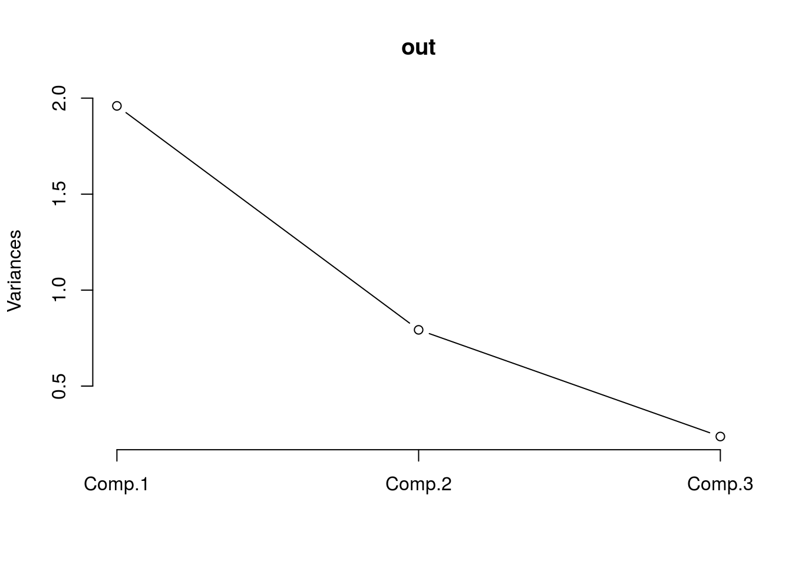

We can see that most of the variance is accounted for by the first two components, which is consistent with the fact that the groups were indeed separable in the figure. 

Here's a figure of the third component plotted against the second to show how the separability is far less pronounced since these two explain far less variation than PC1.


```r
df <- data.frame(cbind(out$scores[,2],out$scores[,3]),label)
names(df) <- c('PC2','PC3','Group')
ggplot(df,aes(x=PC2,y=PC3,colour=Group)) + geom_point(alpha=1)
```


#### PCA with Guerroro Negro Data

If you no longer have the GN data loaded, go ahead and redo that. We need the "counts" matrix. Let's go ahead and perform PCA. We will will center the data, but abstain from rescaling the data because we are working with counts.


```r
cen.counts <- counts - mean(counts)
gn.out <- princomp(cen.counts)
```

If you print output, you'll notice that there are 10 PCs now since there were 10 mats (columns).


```r
head(gn.out$scores)
```

```
##          Comp.1   Comp.2    Comp.3     Comp.4     Comp.5      Comp.6     Comp.7
## OTU_1 -24.10579 30.65369 21.304671 -4.8520464 -6.5525493 -20.2214730 12.7670072
## OTU_2 -66.23146 18.34410  7.000803 -0.7268435  1.4621818   2.0476116 -1.8187592
## OTU_3 -64.57958 18.37032  8.211154 -1.9224696  0.4742431  -0.7159185 -0.4629319
## OTU_4 -66.23146 18.34410  7.000803 -0.7268435  1.4621818   2.0476116 -1.8187592
## OTU_5 -62.30987 19.99805  9.428531 -2.0385229  1.2811694  -1.0441444 -2.0007094
## OTU_6 -66.18372 17.57568  6.466316 -0.2582377  1.1171936   2.6468088 -2.6923849
##           Comp.8   Comp.9    Comp.10
## OTU_1 -0.7624848 1.593170  0.6960046
## OTU_2 -0.2682508 2.042739 -0.6984811
## OTU_3 -0.9452909 2.643072 -1.0240168
## OTU_4 -0.2682508 2.042739 -0.6984811
## OTU_5 -0.8321114 2.450719 -0.2960276
## OTU_6 -0.8707250 2.550741 -0.4993186
```

Considering there are so many, figuring out how many explain most of the variance would be beneficial.


```r
plot(gn.out,type="l",main="Explained Variance")
```

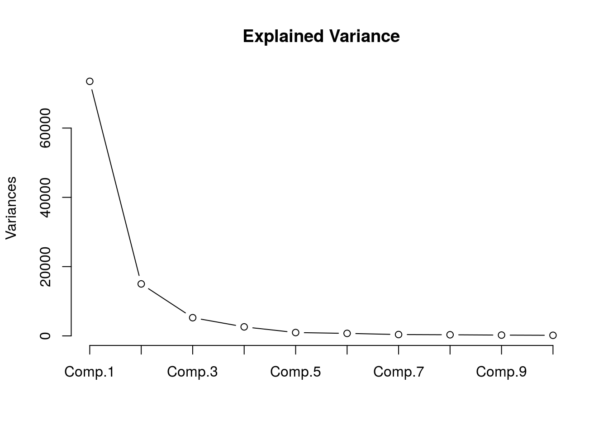

```r
summary(gn.out)
```

```
## Importance of components:
##                             Comp.1      Comp.2      Comp.3      Comp.4
## Standard deviation     271.0884625 122.5042408 72.51082720 51.03068959
## Proportion of Variance   0.7409823   0.1513171  0.05301411  0.02625721
## Cumulative Proportion    0.7409823   0.8922994  0.94531350  0.97157071
##                              Comp.5       Comp.6       Comp.7       Comp.8
## Standard deviation     31.107169019 26.981018606 19.822764254 18.072669171
## Proportion of Variance  0.009756785  0.007340108  0.003961997  0.003293293
## Cumulative Proportion   0.981327494  0.988667602  0.992629599  0.995922892
##                              Comp.9      Comp.10
## Standard deviation     15.234734815 13.124832323
## Proportion of Variance  0.002340214  0.001736894
## Cumulative Proportion   0.998263106  1.000000000
```

We can see that the first 6 PCs explain more than 95% of the variance. Let's plot the first two components.


```r
df <- data.frame(cbind(gn.out$scores[,1],gn.out$scores[,2]),rownames(cen.counts),tax[,2])
names(df) <- c('PC1','PC2','OTU','Phylum')
ggplot(df,aes(x=PC1,y=PC2,label=OTU)) + geom_text(size=3,position="jitter")
```

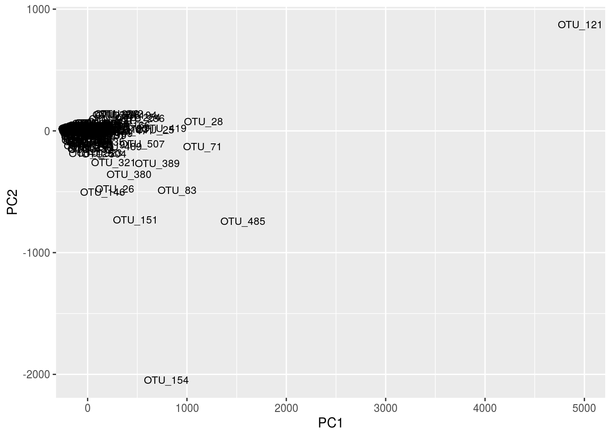

```r
ggplot(df,aes(x=PC1,y=PC2,label=Phylum)) + geom_text(size=3,position="jitter")
```

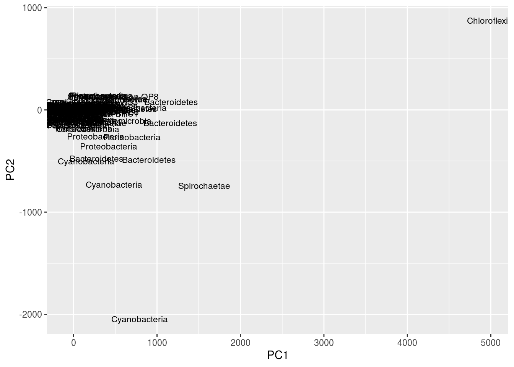

Given the number of OTUs, this figure is difficult to read. One thing to note is that the taxa information we loaded from before can be quite useful. Notice in the second plot, instead of using OTU labels, we used phylum labels. We could potentially see clusters of the same phyla, then look at their OTUs and mat location, and draw interesting conclusions. 

Let's quickly zoom in:


```r
ggplot(df,aes(x=PC1,y=PC2,label=Phylum)) + geom_text(size=3,position="jitter") +xlim(-50,20) +ylim(-25,25)
```

```
## Warning: Removed 472 rows containing missing values (geom_text).
```


Note the peculiar shape of the distribution; it's curved, "horseshoe-like." This is a serious problem resulting from secondary gradients in the data; hence, the figure cannot be trusted. A detailed explanation of this artifact is below in the "arch effect" section ("arch effect" is simply the term for essentially the same problem in CA).

Despite this analysis being flawed, we can still explore some of the output for PCA. Here are the loadings for the PCA results. These values tell us, for each PC, how much variance is explained by a variable.


```r
gn.out$loadings
```

```
## 
## Loadings:
##               Comp.1 Comp.2 Comp.3 Comp.4 Comp.5 Comp.6 Comp.7 Comp.8 Comp.9
## GNmat.10.22mm  0.388  0.180         0.132         0.350  0.380         0.343
## GNmat.1.2mm    0.195 -0.571        -0.153 -0.400  0.158        -0.212  0.572
## GNmat.6.10mm   0.401  0.150         0.268 -0.138  0.353  0.321 -0.379 -0.387
## GNmat.22.34mm  0.498  0.259  0.401 -0.167  0.195  0.166 -0.618  0.143       
## GNmat.34.49mm  0.364  0.149  0.290 -0.261 -0.147 -0.730  0.352 -0.116       
## GNmat.2.3mm    0.229 -0.216 -0.327 -0.643 -0.201  0.159         0.114 -0.468
## GNmat.4.5mm    0.281        -0.337  0.378 -0.349 -0.193         0.692       
## GNmat.3.4mm    0.263 -0.142 -0.512 -0.127  0.708 -0.134  0.108         0.230
## GNmat.0.1mm    0.150 -0.679  0.411  0.301  0.292                0.141 -0.358
## GNmat.5.6mm    0.217        -0.296  0.360        -0.289 -0.469 -0.507       
##               Comp.10
## GNmat.10.22mm  0.630 
## GNmat.1.2mm   -0.226 
## GNmat.6.10mm  -0.443 
## GNmat.22.34mm -0.168 
## GNmat.34.49mm        
## GNmat.2.3mm    0.285 
## GNmat.4.5mm   -0.153 
## GNmat.3.4mm   -0.219 
## GNmat.0.1mm    0.118 
## GNmat.5.6mm    0.401 
## 
##                Comp.1 Comp.2 Comp.3 Comp.4 Comp.5 Comp.6 Comp.7 Comp.8 Comp.9
## SS loadings       1.0    1.0    1.0    1.0    1.0    1.0    1.0    1.0    1.0
## Proportion Var    0.1    0.1    0.1    0.1    0.1    0.1    0.1    0.1    0.1
## Cumulative Var    0.1    0.2    0.3    0.4    0.5    0.6    0.7    0.8    0.9
##                Comp.10
## SS loadings        1.0
## Proportion Var     0.1
## Cumulative Var     1.0
```

A biplot will show the same distribution of points we've been looking at in the above PCA plots where we regress components against each other, but it also plots information about these loadings.


```r
biplot(gn.out)
```


What we care about here are those red lines. You can interpret their orientation the same way you'd interpret regression lines. Notice in the printout of the loadings above, mats 5 and 6 explain very little variation for PC2; we would expect a nearly zero slope with respect to PC2, something easily identifiable in the biplot.

Other useful information we can gather is based on which mats pair with one another. If mats explain a similar amount of information for both PCs, then one would expect that their "lines" would be nearly identically positioned. We can extrapolate from this that, say, mats 1 and 2 are likely similar, whereas mats 1 and 9, which are at right angles, are quite different.

### RDA

Because we got PCA out of the way, we've basically covered the second step in Redundancy Analysis (RDA). The term "redundancy" in this context can be thought of as a synonym for "explained variation." The procedure is quite simple. Assume we are working with the same data matrix, "counts." Now, say we have some explanatory variables that are capable of explaining some of the variation across mats. We actually loaded two of these in earlier: depth and zone. In our case, multiple regression would be performed using these two variables, with a particular OTU as the response. The fitted values from the best fit line would then replace the original response values in our matrix. Regressions are performed for every OTU. Essentially, each column is being smoothed based on the linear relationships between OTUs and the explanatory variables. This new "smoothed" matrix is then thrown into PCA. The reason this is called a "redundancy" analysis may make more sense now. Say two OTUs have very similar best fit lines after their respective regressions; the fitted values would then be the same and we can then consider these OTUs to be redundant -- i.e., they explain the same information. It should also be noted that the linearity assumption presents itself twice in RDA: first, the regressions themselves assume a linear association between variables, and second, as mentioned before, the covariances calculated for the PCA covariance matrix too assume a linear association between variables. Zero-inflated data could very well pose a problem.

We'll start by demonstrating exactly how this new matrix is generated. Because we're performing a linear regression, and we care about accurate estimates, the typical regression assumptions apply. While this can be tedious for large datasets, it's nevertheless good practice to deal with normality and outlier issues. If you are familiar with generalized linear models, you may be concerned about the sparsity of the matrix, which would severely affect the accuracy of said predictions, and hence are considering some zero-inflated implementation. While this is beyond the scope of this tutorial, the sparsity is certainly a concern.

First, let's transpose the matrix to make our responses column vectors.


```r
cen.counts <- t(cen.counts)
```

The overall regression model  will be

$$
\begin{align}
  \hat{Counts}_{\dot j} = \beta_{1}Depth + \beta_{2}Zone + \beta_{3}Depth\times Zone\\
\end{align}
$$

Note that $\hat{Counts}_{\dot j}$ is the column vector $j$ in the matrix $\hat Counts$. Also, notice that we have added an interaction term. Let's work with only column 3 and just the explanatory variable depth. We're going to center and scale depth as well.


```r
cen.depth <- scale(depth)

m1 <- lm(cen.counts[,3] ~ cen.depth)
fit1 <- fitted(m1)

plot(cen.depth,cen.counts[,3],pch=19,ylab="counts")
points(cen.depth,fit1,type="l",col="red",lwd=3)
```


Here, we would replace the raw values in column 3 of the matrix with the values from the best fit line. For comparison, here are the raw and fitted values:


```r
rbind("raw"=cen.counts[,3],"fit"=fit1)
```

```
##     GNmat.10.22mm GNmat.1.2mm GNmat.6.10mm GNmat.22.34mm GNmat.34.49mm
## raw     -21.90563   -20.90563    -21.90563     -21.90563     -16.90563
## fit     -21.17410   -22.16691    -21.62758     -19.84008     -18.50276
##     GNmat.2.3mm GNmat.4.5mm GNmat.3.4mm GNmat.0.1mm GNmat.5.6mm
## raw   -21.90563   -21.90563   -21.90563   -21.90563   -21.90563
## fit   -22.04583   -21.80369   -21.92476   -22.28798   -21.68261
```

The plotting can be tricky, so it's probably easiest to jump right into using the rda() function from vegan, so let's run rda on our matrix. Note that I'm setting zone to a factor. Most functions do this automatically, but it's nevertheless good practice. In case you are unsure, you can think of a factor the way you would in statistics, a categorical variable composed of levels. (I'm simply renaming them here so the figures later on will be easier to read because the names will be shorter.)


```r
Zone <- factor(zone)
Depth <- cen.depth
gn.rda <- rda(cen.counts ~ Depth*Zone) 
print(gn.rda)
```

```
## Call: rda(formula = cen.counts ~ Depth * Zone)
## 
##                 Inertia Proportion Rank
## Total         1.850e+06  1.000e+00     
## Constrained   1.653e+06  8.935e-01    5
## Unconstrained 1.970e+05  1.065e-01    4
## Inertia is variance 
## 
## Eigenvalues for constrained axes:
##    RDA1    RDA2    RDA3    RDA4    RDA5 
## 1126900  308575  140383   51510   25627 
## 
## Eigenvalues for unconstrained axes:
##   PC1   PC2   PC3   PC4 
## 95397 48394 38098 15143
```

Focus in on the proportion of constrained and unconstrained variance. RDA is a "constrained" ordination model, so the proportion of constrained variance is the amount of variance explained by our explanatory variables, depth and zone. We can see that this amounts to about 81% of the variance. Note that this is analogous to an $R^2$ value in regression models. We can obtain an adjusted $R^2$ via the following command:


```r
RsquareAdj(gn.rda)$adj.r.squared
```

```
## [1] 0.7603705
```

There's also a way to compare our model to chance:


```r
anova(gn.rda)
```

```
## Permutation test for rda under reduced model
## Permutation: free
## Number of permutations: 999
## 
## Model: rda(formula = cen.counts ~ Depth * Zone)
##          Df Variance      F Pr(>F)    
## Model     5  1652996 6.7116  0.001 ***
## Residual  4   197032                  
## ---
## Signif. codes:  0 '***' 0.001 '**' 0.01 '*' 0.05 '.' 0.1 ' ' 1
```

This performs a permutation test, where the unconstrained data matrix is randomized by row. Given the small p-value, we can assume that the constraining variables, and hence our model, performed better than the permuted matrix. Between the amount of constrained variance and the significance of the permutation test, there's quite a bit of evidence that these variables help explain the distribution of OTUs across mats.

Lastly, we'll plot the results.


```r
plot(gn.rda,scaling=2,type="n")
points(gn.rda,"sp",col="darkgreen",pch=19)
text(gn.rda,display="sites",cex=.6)
text(gn.rda,display="cn",cex=.8,col="blue")
```

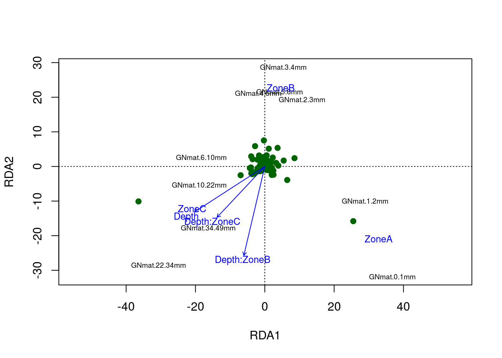

The figure tells quite a bit. Note that zone A clusters with the more superficial mats, which should be expected. This relationship is found among the other zones and mats. The interaction levels differ from one another, where zone B's behavior with respect to depth differs the most from zone A's. Still, if you recall that odd shape in the PCA; well, it's present in the RDA model as well. Notice the shape of the mats. 

### CA

Before we begin with CCA, we have to first understand CA. Recall that RDA is simply an extension of PCA, where we perform multivariate regression followed by PCA and eigenvalue decomposition of a covariance matrix. CCA is similar in that it involves *weighted* linear regression and CA, an eigenvalue decomposition of a *Chi-squared distance* matrix.

Chi-squared distance is defined as follows:

$$
\begin{align}
  \chi_{ij}^{2} &= \frac{(Obs_{ij}-\mathbb{E}_{ij})^2}{\mathbb{E}_{ij}}\\
      \chi_{ij} &= \frac{Obs_{ij}-\mathbb{E}_{ij}}{\sqrt{\mathbb{E}_{ij}}}\\
\end{align}
$$

where $Obs_{ij}$ is the observed cell *frequency* for element $(i,j)$ and $\mathbb{E}_{ij}$ is the expected *frequency* for element $(i,j)$. One thing that should be stressed here, unlike the Pearson correlation used in PCA (and therefore RDA), the chi squared distance **does not** assume a linear relationship between variables. 

To be consistent with various packages and Legendre and Legendre, let's make the species (OTUs) and sites (mats) into the columns and rows, respectively.

While Legendre and Lenendre assume $|r|>|c|$, we want to compare our results with vegan's cca() results, so we'll have to transpose the matrix, setting the mats and OTUs as the rows and columns, respectively.


```r
counts <- t(counts)
counts[1:5,1:5]
```

```
##               OTU_1 OTU_2 OTU_3 OTU_4 OTU_5
## GNmat.10.22mm    17     0     0     0     1
## GNmat.1.2mm       1     0     1     0     0
## GNmat.6.10mm     14     0     0     0     0
## GNmat.22.34mm    16     0     0     0     3
## GNmat.34.49mm    46     1     5     1     6
```

We begin by calculated the Chi-squared distance of our count matrix, but hopefully you noticed that the distance deals with frequencies. Let's first convert our count matrix to a frequency matrix which we'll call $O_{ij}$.


```r
Oij <- as.matrix(counts/sum(counts))  ## counts to frequencies
```

Now, the $\mathbb{E}_{ij}$ is simply the outer product of this matrix's column and row sums. Note that the row sums will be used for weighting by OTU abundance ("OTU weight") ; whereas, the column sums will be used for weighting by mat abundance ("mat weight"). This come in handy later because they will be our weights for visualization (and recall CCA uses *weighted* regression):


```r
pi <- rowSums(Oij)  ## OTU weight
pj <- colSums(Oij)  ## mat weight
Eij <- outer(pi,pj)
```

We now can compare the Chi-squared distances, which we'll call $\bar Q$:


```r
Qbar <- (Oij-Eij)/sqrt(Eij)
```

You can imagine we are at the step in PCA where we have just computed the covariance matrix. If you recall, we would now perform an eigenvalue decomposition. The same holds true here for CA, but with our Chi-squared matrix. Because an eigenvalue decomposition requires a square matrix, we can just perform a singular value decomposition with the svd() function. (Tangent: there are two PCA function in R base, prcomp() and princomp(), which perform singular value decomposition and eigenvalue decomposition, respectively, with similar results.)


```r
Qbar <- svd(Qbar)
```

The svd factorizes $\bar Q = U \Sigma V$, where $U$ and $V$ are the left and right eigenvectors, respectively. We use these weights to adjust of the positions of the points in $\bar Q$ for visualization. As we'll see, CA (and CCA) can be plotted on two different scales; therefore, we need two separate adjustments of $\bar Q$ for two separate sets of positions in space.

$U$ is adjusted with the diagonal of the inverse of the row weight, $p_{i}$, and $V$ with the diagonal of the inverse of the column weight, $p_{j}$. These weighted matrices will be called $\hat V$ and $V$.


```r
Vhat <- diag(1/sqrt(pi)) %*% Qbar$u
V <- diag(1/sqrt(pj)) %*% Qbar$v
```

Finally, we calculate $F$ and $\hat F$:


```r
FF <- diag(1/pi) %*% Oij %*% V
FFhat <- diag(1/pj) %*% t(Oij) %*% Vhat
```

We now have two sets of spatial positions for two scalings: 

* scaling 1 involves plotting the second versus the first eigenvector from $\hat V$ and the second versus the first eigenvector from $\hat F$ on the same figure.
* scaling 2 involves plotting the second versus the first eigenvector from $V$ and the second versus the first eigenvector from $F$ on the same figure.


```r
df <- data.frame("x" = c(FF[,1],V[,1],Vhat[,1],FFhat[,1]), 
                 "y" = c(FF[,2],V[,2],Vhat[,2],FFhat[,2]), 
                 "points" = c(rep(1:2,c(dim(FF)[1],dim(V)[1])),rep(1:2,c(dim(Vhat)[1],dim(FFhat)[1]))),
                 "scaling" = rep(1:2,c(dim(FF)[1]+dim(V)[1],dim(Vhat)[1]+dim(FFhat)[1])),
                 "names" = rep(c(rownames(counts),colnames(counts)),2))
df$points <- factor(df$points)
df$scaling <- factor(df$scaling)
ggplot(df,aes(x,y,colour=points,size=points)) + 
  facet_wrap(~ scaling) + geom_point(alpha=.3) +
  scale_size_manual(values=c(1,3)) + scale_colour_manual(values=c("black","red")) +
  geom_text(data=subset(df,points=="1"),aes(label=names),size=4) +
  theme(legend.position = "none") 
```

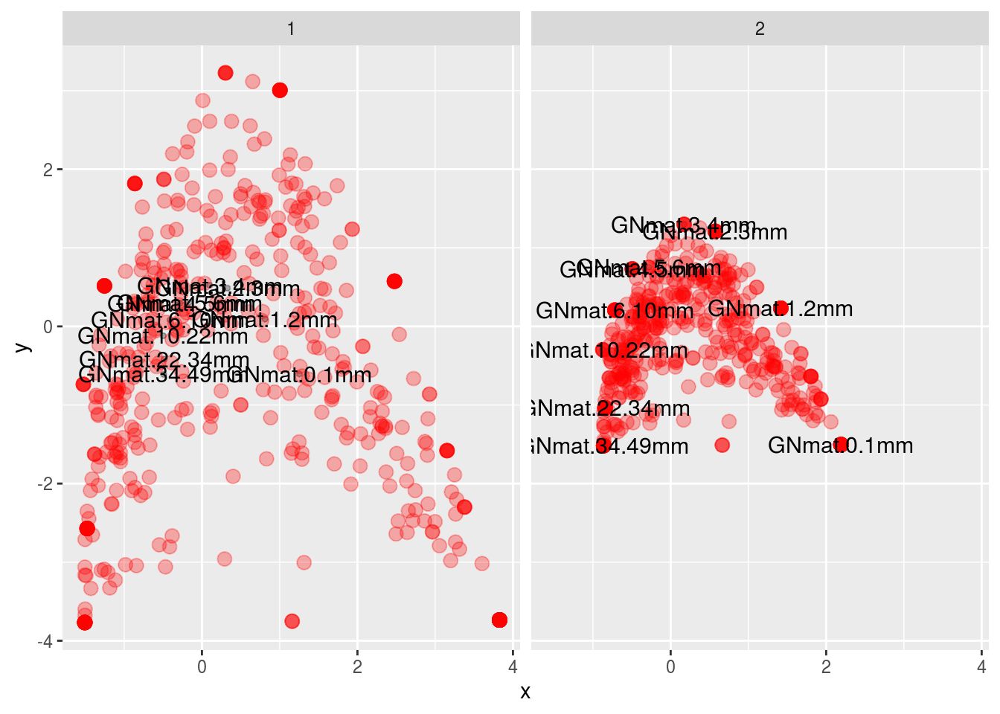

Which is the same as what vegan gives us (except prettier):


```r
m1 <- cca(counts)

par(mfrow=c(2,1))
plot(m1,scaling=1)
text(m1, "sites", col="black")
plot(m1,scaling=2)
text(m1, "sites", col="black")
```


It might be difficult to appreciate what the scaling is doing, but look at scaling 1. Here we first use the $F$ matrix to plot the mat centroids ("center"). This matrix $F$ preserves the Chi-squared distance between mats, so this figure is a spatially accurate representation of the relationship among sites. The positions of the centroids are weighted (and thus determined) by the relative frequencies of each OTU (i.e., each column). Finally, we superimpose the $V$ matrix (the OTU coordinates) on top. The OTUs in the vicinity of a particular mat are more likely to be found in that mat.

For scaling 2, we first plot $\hat F$, which are the centroids of the OTU data (which are positioned by weighting them with the relative frequencies of each mat), and then superimpose $\hat V$, the coordinates for mats. This scaling is therefore an accurate spatial representation of the relationship among OTUs. Like scaling 1, any species in the vicinity of a specific mat is more likely to be found in that mat.

Clearly, the gradient for the mats we've seen so far is also present in the CA plots. Something we could try is to color code the OTUs based on taxa. This will allow us to appreciate scaling 2 more since we can visualize the relationship among OTUs. Let's just work with Archaea, only using scaling 2:


```r
df <- data.frame("x" = c(FF[,1],V[,1],Vhat[,1],FFhat[,1]), 
                 "y" = c(FF[,2],V[,2],Vhat[,2],FFhat[,2]), 
                 "points" = c(rep(1:2,c(dim(FF)[1],dim(V)[1])),rep(1:2,c(dim(Vhat)[1],dim(FFhat)[1]))),
                 "scaling" = rep(1:2,c(dim(FF)[1]+dim(V)[1],dim(Vhat)[1]+dim(FFhat)[1])),
                 "names" = rep(c(rownames(counts),colnames(counts)),2),
                 "kingdom" = c(tax[,1],rep("Site",10),tax[,1],rep("Site",10)),
                 "phylum" = c(tax[,2],rep("Site",10),tax[,2],rep("Site",10)),
                 "class" = c(tax[,3],rep("Site",10),tax[,3],rep("Site",10)))
df.scale2 <- subset(df, scaling==2)
ggplot(subset(df.scale2,kingdom=="Bacteria"),
       aes(x,y,colour=kingdom,alpha=kingdom,size=kingdom)) + 
  geom_point(colour="gray",alpha=.7) +
  geom_point(data=subset(df.scale2,kingdom=="Archaea"),
            aes(colour=phylum),size=4,alpha=1) +
  geom_text(data=subset(df.scale2,points=="1"),
            aes(label=names),size=4,colour="red",alpha=.6) +
  guides(size=FALSE,alpha=FALSE)
```

```
## Warning: Using size for a discrete variable is not advised.
```

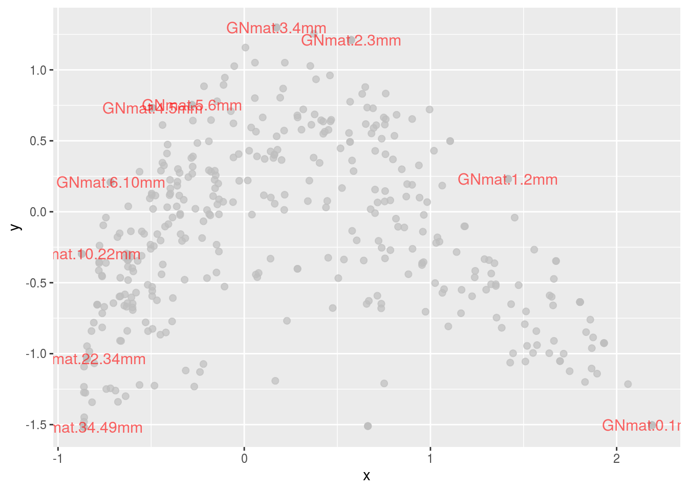

The green and blue dots represent the two Archaea phyla in the data set. There doesn't seem to be much of a pattern, but let's see what those are as a function of class (one taxa level lower).


```r
ggplot(subset(df.scale2,kingdom=="Bacteria"),
       aes(x,y,colour=kingdom,alpha=kingdom,size=kingdom)) + 
  geom_point(colour="gray",alpha=.7) +
  geom_point(data=subset(df.scale2,kingdom=="Archaea"),
             aes(colour=class),size=4,alpha=1,
             position=position_jitter(w=.075,h=.075)) +
  geom_text(data=subset(df.scale2,points=="1"),
            aes(label=names),size=4,colour="red",alpha=.6) +
  guides(size=FALSE,alpha=FALSE)
```

```
## Warning: Using size for a discrete variable is not advised.
```


Note that the points are jittered to ease distinguishing them. There now seems to be an interesting trend: Halobacteria species are found more in the center; whereas, Methanomicrobia, Thermococci, and Thermoplasmata are located at the extremes (i.e., superficial or deep mats). 

Lastly, lets just colorcode all of the OTUs based on Phylum.


```r
ggplot(df.scale2,aes(x,y,colour=phylum)) + geom_point(alpha=.5) +
  geom_text(data=subset(df.scale2,points=="1"),
            aes(label=names),size=4,colour="black") +
  guides(size=FALSE, colour=guide_legend(ncol=3))
```


There doesn't seem to be much of a pattern. 

#### Arch effect

If you look at the pattern of the figures we've been working with, you may have noticed it's shape. It tends to look like an arch. This is due to our mats being correlated with one another. This should be of no surprise considering the whole system is built as a gradient, so mats 1 and 2 would be far more related than mats 1 and 9. This gradient manifests itself in the matrix and hence the analysis can't help but join correlated sites to one another.

To demonstrate this, consider the the following simple matrix:


```r
comm <- matrix(0,nrow=10,ncol=10)
rownames(comm) <- paste("site",1:dim(comm)[1])
colnames(comm) <- paste("sp",1:dim(comm)[2])
for (i in 1:10){
  left <- rep(0,i-1)
  right <- rep(0,10-i)
  comm[i,] <- c(left,1,right)
}

levelplot(comm,
          panel = function(...){
            panel.levelplot(...)
            panel.abline(h=seq(.5,9.5,1))
            panel.abline(v=seq(.5,9.5,1))
          },colorkey=FALSE)
```

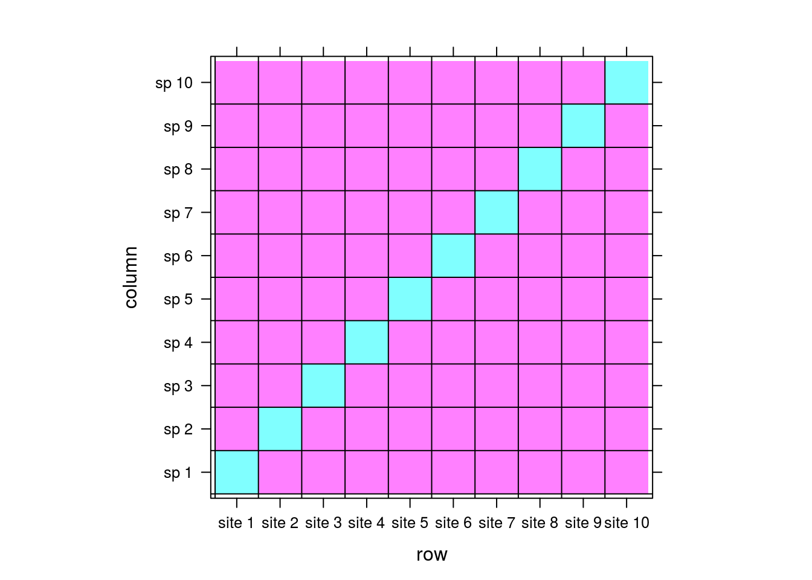

Let pink and cyan be 0 and 1s, respectively. For this matrix, there would be no correlation between sites; each site is associated with its own unique species with no overlap. There is no implicit way for the matrix to "know" that site 1 could be similar to site 2 because there is no information in the matrix reflecting that. By extension, there should be no pattern between sites when we perform CA.


```r
arch1 <- cca(comm)
plot(arch1,scaling=1)
```


It might be difficult to tell, but the site text is superimposed onto the species text, so as we saw in the matrix, each site is associated with its own species, and there is no pattern between sites because there are no overlapping species.

Now, take a look at this matrix:


```r
comm <- matrix(0,nrow=8,ncol=10)
rownames(comm) <- paste("site",1:dim(comm)[1])
colnames(comm) <- paste("sp",1:dim(comm)[2])
for (i in 1:8){
  left <- rep(0,i-1)
  right <- rep(0,10-2-i)
  comm[i,] <- c(left,rep(1,3),right)
}

levelplot(comm,
          panel = function(...){
            panel.levelplot(...)
            panel.abline(h=seq(.5,9.5,1))
            panel.abline(v=seq(.5,7.5,1))
          },colorkey=FALSE)
```

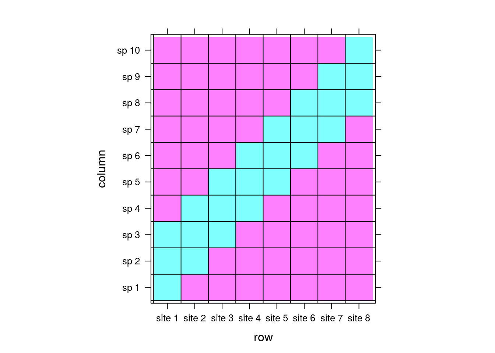

Now there are shared species among sites: site 1 shares species 2 and 3 with site 2, site 2 shares species 3 and 4 with site 3, and so on. The sites are therefore correlated and CA will do its best to maintain the pattern we're seeing between sites: site 1 will be near site 2, site 2 near site 3, etc. Let's look at the result from CA.


```r
arch2 <- cca(comm)
plot(arch2,scaling=1)
```


To no surprise, the gradient is preserved, but what causes the arch? This is an artifact from forcing the data into two dimensions. There are a few things going on here. Notice that the first ordination axis, alone, accurately separates the data:


```r
summary(arch2)$sites
```

```
##               CA1        CA2        CA3        CA4        CA5        CA6
## site 1  1.4052206  1.3715075 -1.2840067 -1.0537453  0.4472136 -0.4203353
## site 2  1.1582833  0.4443882  0.5582954  1.4545015 -1.3416408  0.7393822
## site 3  0.7807006 -0.5386597  1.2288611  0.3885801  1.3416408  0.2835610
## site 4  0.2724727 -1.2772361  0.7276904 -0.7893363 -0.4472136 -1.7877990
## site 5 -0.2724727 -1.2772361 -0.7276904 -0.7893363  0.4472136  1.7877990
## site 6 -0.7807006 -0.5386597 -1.2288611  0.3885801 -1.3416408 -0.2835610
## site 7 -1.1582833  0.4443882 -0.5582954  1.4545015  1.3416408 -0.7393822
## site 8 -1.4052206  1.3715075  1.2840067 -1.0537453 -0.4472136  0.4203353
```

```r
plot(summary(arch2)$sites[,1],rep(0,8),type="n",ylab="",xlab="CA1")
text(summary(arch2)$sites[,1],rep(0,8),rownames(comm))
```

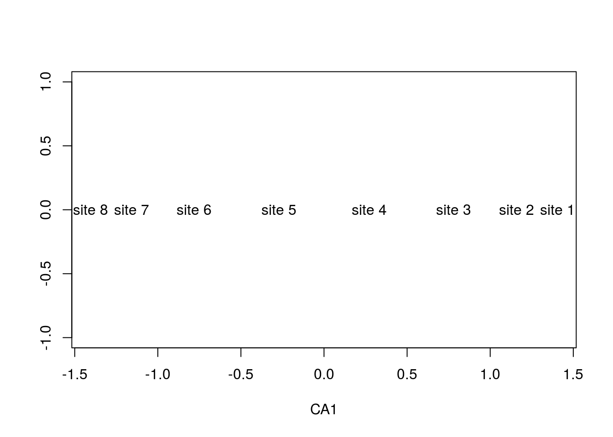

CA attempts to maximize the variation (i.e., separation) between sites, which the first axis accomplishes completely, The second axis nevertheless tries, but must remain uncorrelated with the first. Because the sites are completely separated, there are no remaining gradients to drive the second axis. The only candidate left for the second axis is a folded version of the first axis; the folding allows the two axes to no longer be linearly correlated, satisfying that aforementioned constraint, and after folding, it explains over half the variance explained by the first axis (which shouldn't be surprising considering it's essentially the first axis): 


```r
summary(arch2)$cont
```

```
## $importance
## Importance of components:
##                          CA1    CA2    CA3     CA4     CA5     CA6     CA7
## Eigenvalue            0.9018 0.6575 0.3840 0.18672 0.11111 0.04754 0.04470
## Proportion Explained  0.3865 0.2818 0.1646 0.08002 0.04762 0.02037 0.01916
## Cumulative Proportion 0.3865 0.6683 0.8328 0.91285 0.96047 0.98084 1.00000
```

You can gain appreciation for the folding if you simply plot the two axes on top of one another:


```r
plot(summary(arch2)$sites[,1],type="b",lwd=2,ylab="CA Axes")
points(summary(arch2)$sites[,2],type="b",lwd=2,col="red",ylab="CA Axes")
```

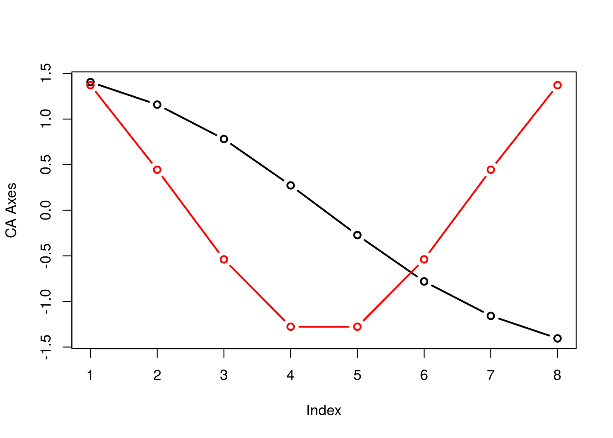

The underlying issue with the arch effect is that CA2 is not interpretable, rendering these arch shaped figures flawed. Just look at the shifts in spacing between sites and species in $\mathbb{R}^1$ and $\mathbb{R}^2$.


```r
par(mfrow=c(2,1))
plot(summary(arch2)$species[,1],rep(0,10),type="n",ylab="CA1",ylim=range(-2,2),xlab="")
text(summary(arch2)$sites[,1],rep(0,8),rownames(comm))
text(summary(arch2)$species[,1],rep(0,10),colnames(comm),col="red")
plot(arch2,scaling=2)
```

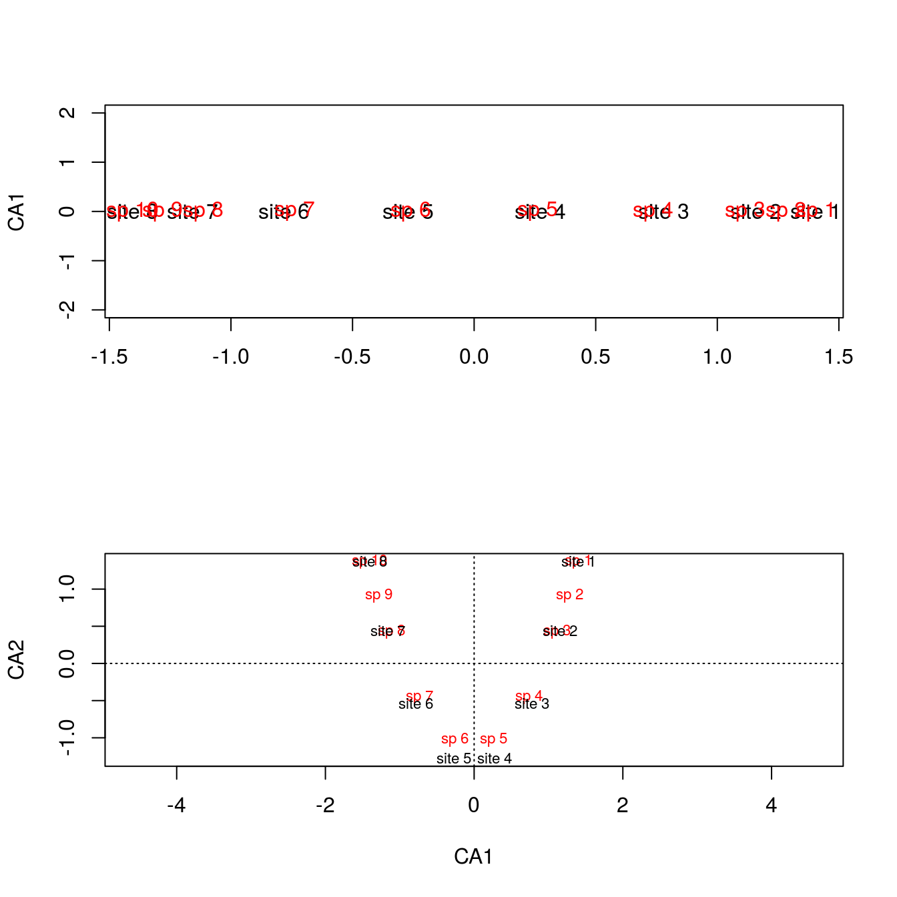

The separation at the extremes is different when regressed against CA2, and considering it's an artifact, the shift in separation is not to be trusted.

#### DCA

One solution to the arch effect is to perform a detrended CA (DCA), which can also alleviate some of the compression between points at the end of the gradient. We'll use the decorana() function:


```r
arch3 <- decorana(comm)
plot(arch3)
```


And let's compare this to the CA figures in $\mathbb{R}^1$ and $\mathbb{R}^2$


```r
levelplot(comm,
          panel = function(...){
            panel.levelplot(...)
            panel.abline(h=seq(.5,9.5,1))
            panel.abline(v=seq(.5,7.5,1))
          },colorkey=FALSE)
```


```r
par(mfrow=c(3,1))
plot(summary(arch2)$species[,1],rep(0,10),
     type="n",ylab="CA1",ylim=range(-2,2),xlab="",main="CA 1D")
text(summary(arch2)$sites[,1],rep(0,8),rownames(comm))
text(summary(arch2)$species[,1],rep(0,10),colnames(comm),col="red")
plot(arch2,scaling=2,main="CA 2D")
plot(arch3,main="DCA")
```


If you take a look at the matrix, you can see that species 1 and 10 are exclusive to sites 1 and 8, respectively. This is a feature that neither of our previous methods picked up, but DCA did. Moreover, it makes the most sense for site 1 to be centered among species 1, 2, and 3, and 10 between 8, 9, and 10, which DCA clearly accomplished.

DCA is basically first running CA, allowing the first axis to bend into the second axis, and then divides the first axis into segments. For each segment, the corresponding segment mean for the second axis is forced to 0. With a zero mean in each segment, the overall mean of axis 2 is now zero, forcing the "arch" into a straight line. By straitening the second axis, any compression at the ends is also alleviated.

Let's quickly run DCA on our real data.


```r
gn.dca <- decorana(counts,iweigh=1)
```

Note that I have "iweigh" set to 1. This downweights rare species, since CA is sensitive to these outliers.


```r
plot(gn.dca,display="species",type="n")
points(gn.dca,display="species",col="black",pch=3)
points(gn.dca,display="sites",col="red",pch=19)
```


```r
out <- summary(gn.dca,scaling=1)
```

```
## 
## Call:
## decorana(veg = counts, iweigh = 1) 
## 
## Detrended correspondence analysis with 26 segments.
## Rescaling of axes with 4 iterations.
## Downweighting of rare species from fraction 1/5.
## 
##                   DCA1    DCA2    DCA3     DCA4
## Eigenvalues     0.3069 0.08541 0.06107 0.066908
## Decorana values 0.3254 0.05762 0.01047 0.001119
## Axis lengths    1.9024 0.95188 0.81913 0.737697
```

```r
df <- data.frame("DCA1"=c(out$spec.scores[,1],out$site.scores[,1]),
                 "DCA2"=c(out$spec.scores[,2],out$site.scores[,2]),
                 "points" = rep(1:2,c(dim(counts)[2],dim(counts)[1])),
                 "kingdom" = c(tax[,1],rep("site",dim(counts)[1])),
                 "phylum" = c(tax[,2],rep("site",dim(counts)[1])),
                 "order" = c(tax[,3],rep("site",dim(counts)[1])),
                 "family" = c(tax[,4],rep("site",dim(counts)[1])),
                 "names" = c(colnames(counts),rownames(counts))
                  )
df$points <- factor(df$points)

df.sp <- subset(df,points == "1" & kingdom != "Archaea")
ggplot(df.sp,aes(DCA1,DCA2)) + geom_point(colour="black",alpha=.2) +
    geom_text(data=subset(df,points == "2"),aes(label=names),size=5) +
    geom_point(data=subset(df,kingdom=="Archaea"),
            aes(colour=phylum),size=4,alpha=1) 
```


### CCA

Canonical Correspondence Analysis (CCA) involves similar steps seen in RDA. We first measure the distances between rows (mats) and columns (OTUs) in our matrix using Chi squared distance. Weighted linear regression is performed on the Chi squared matrix versus a set of explanatory variables (e.g., Depth and Zone), replacing the original distances with the fitted distances, just like RDA. Note that the weights are the same weights used in CA -- i.e.,  the row sums (a vector of the total abundances for each mat). Finally, we project the matrix via eigenvalue decomposition (or SVD). 


Let's first start with the computation performed by CCA and note the similarities with CA and RDA. CCA begins with calculating the Chi squared distance matrix $\bar Q$ seen in CA. Let's quickly recalculate $\bar Q$:


```r
Oij <- as.matrix(counts/sum(counts))  ## counts to frequencies
pi <- rowSums(Oij)  ## OTU weight
pj <- colSums(Oij)  ## mat weight
Eij <- outer(pi,pj) ## expected value for each element in Oij
Qbar <- (Oij-Eij)/sqrt(Eij) ## Chi sqaured distance matrix
```

So that much is identical to CA and is equivalent to calculating the covariance matrix in RDA. Now, like RDA, we perform linear regression, but this time it will be **weighted** linear regression. We'll take it easy for now and only use one of our two explanatory variables, so we'll be regressing each OTU's set of mat values against the explanatory variable depth. First, we'll adjust depth with our weights:


```r
xw <- sum(depth*pi)         ## note pi from above, the OTU weigh
xw <- (depth-xw)*sqrt(pi)   ## weighted depth
```

The weights are adjusting depth by the square root of the abundance of OTUs for each of their respective mats:


```r
par(mfrow=c(1,2))
plot(depth,pch=19,ylim=range(min(xw,depth),max(xw,depth)),xlab="",ylab="Depth",main="Depth")
points(xw,pch=19,col="red")
plot(sqrt(pi),pch=19,ylim=range(0,.5),
     col="red",xlab="",ylab=expression(paste(sqrt(Mat~~Weight))),
     main=expression(paste("OTU Weight (",sqrt(p[i]),")")))
```

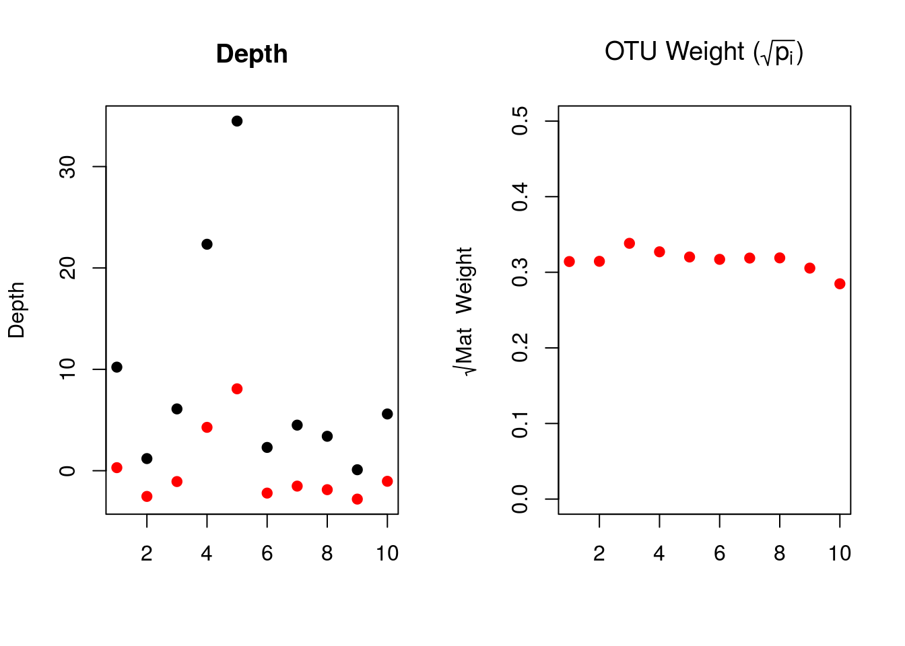

The left plot shows the raw depths (black) and the weighted depths (red). Because the OTU weights for each mat are quite similar, we are effectively rescaling the raw depths to 30% of their original values. While our set of data isn't a great example, one can imagine how these weights could influence the explanatory variables if the site (mat) proportion varied drastically.

Now we can perform our regression:


```r
yhat <- fitted(lm(Qbar ~ 0 + xw))
```

In case you're curious, here's the simple and weighted regression lines for OTU 43 (column 3, same regression shown for RDA).


```r
simp <- fitted(lm(Qbar[,3] ~ 0 + depth))
plot(xw,Qbar[,3],pch=19,xlab="",ylab="OTU Freq.")
points(xw,yhat[,3],type="l",col="red",lwd=3)
points(xw,simp,type="l",col="blue",lwd=3)
points(xw,pi,col="gray",pch=3)
legend(-4,.1,c("Weighted","Unweighted"),col=c("red","blue"),lty=c(1,1))
```


It might see as if that extreme value is having more of an effect, but what you should focus on is that the weighted regression line fits the first 7 values much better; hence, the line is more so a function of them as opposed to the latter 3.

The next step in CCA is what you'd expect if you remembered what came after regression in RDA: we now perform a singular value decomposition (remember, the matrix isn't square, hence SVD over EVD).


```r
yout <- svd(yhat)
```

Vegan performs the following normalizations, so we'll do the same to compare our results:


```r
m3.man <- list()
m3.man$eig <- yout$d[1]^2
m3.man$u <- yout$u[,1]*(1/sqrt(pi))
m3.man$v <-  yout$v[,1]*(1/sqrt(pj))
m3.man$wa <- (Qbar %*% yout$v[,1])*(1/sqrt(pi))*(1/yout$d[1])
```

Now, lets compare our results to vegan's:


```r
m3.veg <- cca(counts ~ depth)

cbind(m3.man$eig,m3.veg$CCA$eig)
```

```
##          [,1]     [,2]
## CCA1 0.204745 0.204745
```

```r
head(cbind(m3.man$u, m3.veg$CCA$u))
```

```
##                                  CCA1
## GNmat.10.22mm -0.09210092 -0.09210092
## GNmat.1.2mm    0.76472726  0.76472726
## GNmat.6.10mm   0.29926628  0.29926628
## GNmat.22.34mm -1.24340441 -1.24340441
## GNmat.34.49mm -2.39755767 -2.39755767
## GNmat.2.3mm    0.66023602  0.66023602
```

```r
head(cbind(m3.man$v, m3.veg$CCA$v))
```

```
##                      CCA1
## OTU_1 -2.196639 -2.196639
## OTU_2 -5.298616 -5.298616
## OTU_3 -4.133838 -4.133838
## OTU_4 -5.298616 -5.298616
## OTU_5 -3.588426 -3.588426
## OTU_6  1.228199  1.228199
```

```r
head(cbind(m3.man$wa, m3.veg$CCA$wa))
```

```
##                                CCA1
## GNmat.10.22mm -0.8346479 -0.8346479
## GNmat.1.2mm    1.3763977  1.3763977
## GNmat.6.10mm  -0.3939395 -0.3939395
## GNmat.22.34mm -1.3700096 -1.3700096
## GNmat.34.49mm -1.9558609 -1.9558609
## GNmat.2.3mm    0.8231456  0.8231456
```

And that's the math behind CCA. Because we only used one explanatory variable, we only have one component to work with. Vegan, by default, plots this component (CCA1) against the first (normalized) component from CA. Because of the normalization procedure, our CA1 from earlier will not match vegan's, so it's probably better to go ahead and add our second explanatory variable. We could have manually calculated the components for the full model, but because zone is categorical, we'd have to work with dummy variables, which can make it seem far more confusing than it needs to be. 

Let's build our full model, run it in vegan, and plot the results. We'll use an interaction term like our RDA model; hence, the overall regression model will be the same:

$$
\begin{align}
  \hat{Counts}_{\dot j} = \beta_{1}Depth + \beta_{2}Zone + \beta_{3}Depth\times Zone\\
\end{align}
$$


```r
gn.cca <- cca(counts ~ Depth*Zone)
```

We can perform the same analyses as we did for RDA. For example, here is the permutation test against the null model:


```r
anova(gn.cca)
```

```
## Permutation test for cca under reduced model
## Permutation: free
## Number of permutations: 999
## 
## Model: cca(formula = counts ~ Depth * Zone)
##          Df ChiSquare      F Pr(>F)    
## Model     5   0.64731 4.6984  0.001 ***
## Residual  4   0.11022                  
## ---
## Signif. codes:  0 '***' 0.001 '**' 0.01 '*' 0.05 '.' 0.1 ' ' 1
```

And the model output:


```r
print(gn.cca)
```

```
## Call: cca(formula = counts ~ Depth * Zone)
## 
##               Inertia Proportion Rank
## Total          0.7575     1.0000     
## Constrained    0.6473     0.8545    5
## Unconstrained  0.1102     0.1455    4
## Inertia is scaled Chi-square 
## 
## Eigenvalues for constrained axes:
##   CCA1   CCA2   CCA3   CCA4   CCA5 
## 0.3223 0.1601 0.1021 0.0386 0.0242 
## 
## Eigenvalues for unconstrained axes:
##     CA1     CA2     CA3     CA4 
## 0.03775 0.03652 0.02490 0.01105
```

The constrained variance is much greater than unconstrained, implying our independent variables did a good job of accounting for the variation. Let's plot the figure:


```r
plot(gn.cca,scaling=2,type="n")
points(gn.cca,"sp",col="darkgreen",pch=3)
text(gn.cca,display="sites",cex=1)
text(gn.cca,display="cn",cex=.8,col="blue")
```

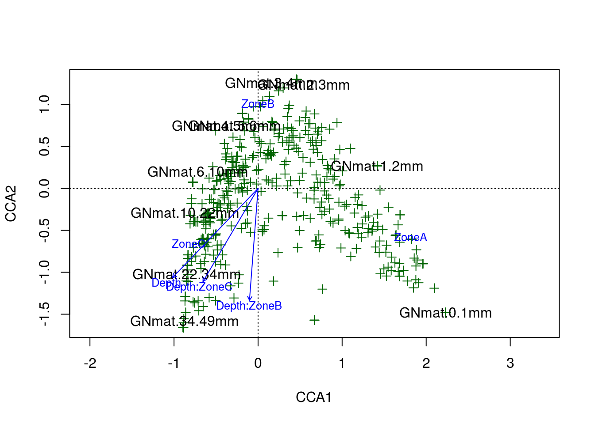

And there is the amazing arch effect. Per the R documentation for CCA, the arch effect should be corrected for by the model *unless* the constraints (explanatory variables) are curvilinear with one another. Considering our two constraints, depth and zone, likely explain the same information (the variation in OTU abundance with respect to depth into the system), a curvilinear relationship should not be surprising. Ultimately, the poor fits to our data boils down to a lack of adequate constraints.

Here are the RDA and CCA models plotted side by side:


```r
par(mfrow=c(1,2))
plot(gn.rda,scaling=2,type="n")
points(gn.rda,"sp",col="darkgreen",pch=19)
text(gn.rda,display="sites",cex=.6)
text(gn.rda,display="cn",cex=.8,col="blue")
plot(gn.cca,scaling=2,type="n")
points(gn.cca,"sp",col="darkgreen",pch=3)
text(gn.cca,display="sites",cex=1)
text(gn.cca,display="cn",cex=.8,col="blue")
```

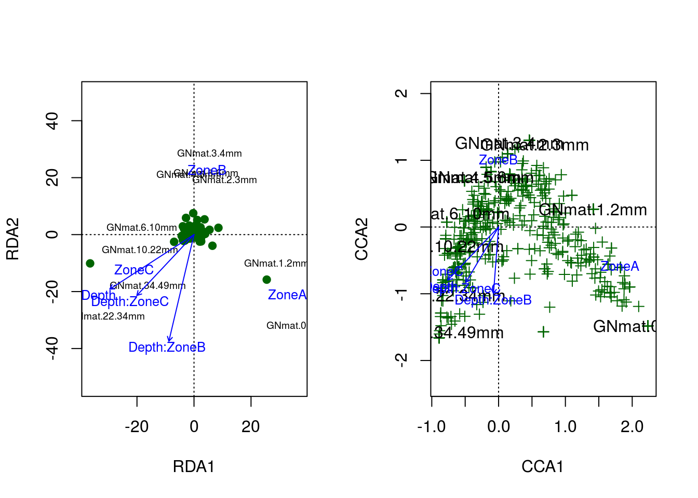

Although we didn't introduce the arch effect until after our RDA run, it's quite clear that both models suffer from this artifact.

### PCoA

This last section will quickly try to tie together the above analyses to a unsupervised clustering method you may have heard of: Principal **Coordinate** Analysis (PCoA, cf. PCA). You can think of PCoA as a more general ordination method that can involve various distance metrics. If one uses Euclidean distance, then the ordination is equivalent to PCA; on the other hand, if the distance metric is Chi-squared distance, then the ordination is essentially the same as CA. 

Let's compare. Note that we'll use a smaller matrix to speed up the computation


```r
counts <- t(counts)

pcoa.counts <- counts[1:500,]
pcoa.euc <- pco(dist(pcoa.counts,"euclidean"))
pcoa.pca <- prcomp(pcoa.counts)

par(mfrow=c(1,2))
plot(pcoa.euc$points[,1],pcoa.euc$points[,2],
     pch=3,xlab="PC1",ylab="PC2",main="PCoA: Euclidean")
plot(pcoa.pca$x[,1],pcoa.pca$x[,2],
     pch=3,xlab="PC1",ylab="PC2",main="PCA")
```

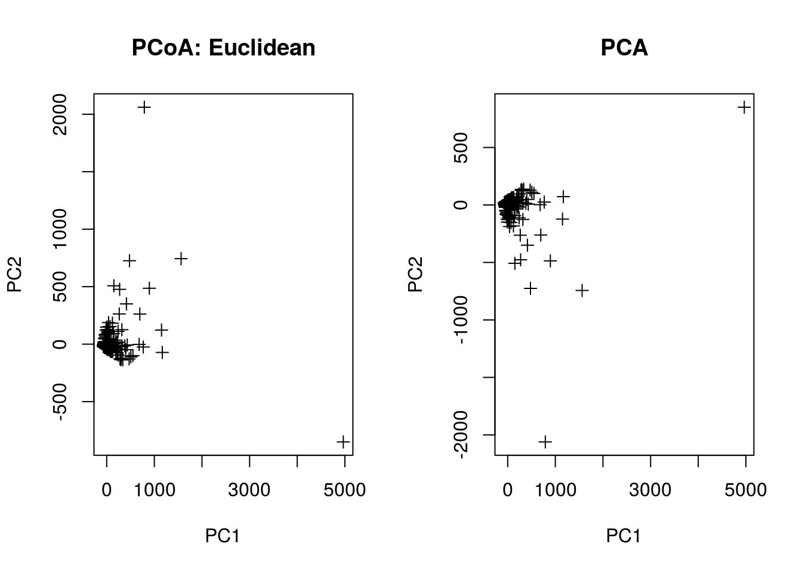

```r
pcoa.chi <- pco(dsvdis(pcoa.counts,index="chisq"))
pcoa.ca <- scores(cca(pcoa.counts),scaling=1)
plot(pcoa.chi$points[,1],pcoa.chi$points[,2],
     pch=3,xlab="PC1",ylab="PC2",main="PCoA: Chi-Squared",
     xlim=range(-2,2),ylim=range(-2,2))
plot(-pcoa.ca$sites[,1],-pcoa.ca$sites[,2],
     pch=3,xlab="PC1",ylab="PC2",main="CA",
     xlim=range(-2,2),ylim=range(-2,2))
```


The are many other distance metrics that can be used; a more popular one is Bray-Curtis.


```r
pcoa.bc <- pco(dsvdis(pcoa.counts,index="bray/curtis"))
plot(pcoa.bc$points[,1],pcoa.bc$points[,2],
     pch=3,xlab="PC1",ylab="PC2",main="PCoA: Bray-Curtis",
     xlim=range(-2,2),ylim=range(-2,2))
```

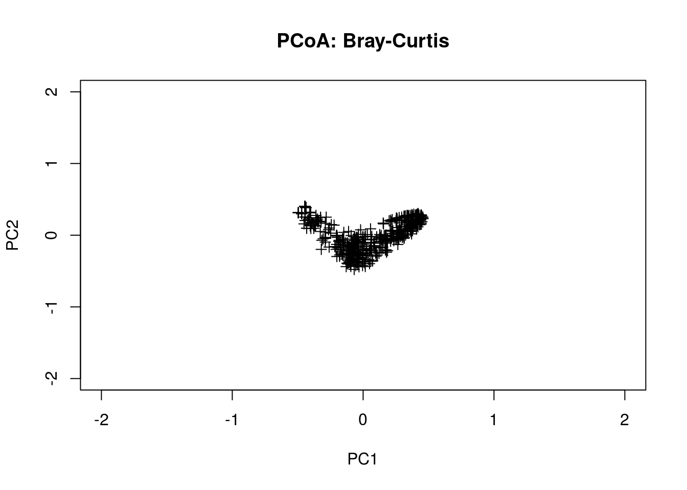
